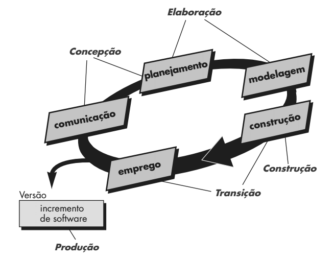
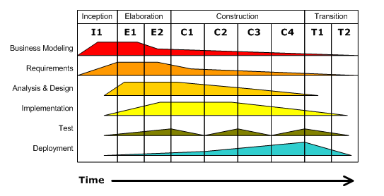

# Análise Orientada a Objeto

> Conceito

- [UML](#uml "UML")
  - [Classes](#classes "Classes")
  - [Objetos](#objetos "Objetos")
  - [Herança](#heran%C3%A7a "Herança")
  - [Polimorfismo](#polimorfismo "Polimorfismo")
  - [Encapsulamento](#encapsulamento "Encapsulamento")

- [Características da UML](#caracter%C3%ADsticas-da-uml "Características da UML")

- [Objetivos da UML](#objetivos-da-uml "Objetivos da UML")

- [Modelos](#modelos "Modelos")

- [Fluxo de Desenvolvimento](#fluxo-de-desenvolvimento "Fluxo de Desenvolvimento")

  > Conceito

- [Diagramas UML](#diagramas-uml "Diagramas UML")

- [Processo Unificado](#processo-unificado "Processo Unificado")

  - [Concepção](#concep%C3%A7%C3%A3o "Concepção")
  - [Elaboração](#elabora%C3%A7%C3%A3o "Elaboração")
  - [Construção](#constru%C3%A7%C3%A3o "Construção")
  - [Transição](#transi%C3%A7%C3%A3o "Transição")

- [Características](#caracter%C3%ADsticas "Características")

- [Fases do processo unificado](#fases-do-processo-unificado "Fases do processo unificado")

- [Flux de Trabalho](#flux-de-trabalho "Flux de Trabalho")

  - [Concatenação das fazes dos respectivos diagramas](#concatena%C3%A7%C3%A3o-das-fazes-dos-respectivos-diagramas "Concatenação das fazes dos respectivos diagramas")

---

## UML

A UML (Unified Modeling Language - Linguagem de Modelagem Unificada) é uma linguagem visual utilizada para modelar sistemas de software, incluindo sua estrutura, comportamento e interações. Na Análise Orientada a Objetos, a UML é frequentemente usada para representar classes, objetos, herança, associações, estados e outros elementos relacionados à orientação a objetos. Ela fornece um conjunto de diagramas padronizados, como diagramas de classes, diagramas de sequência, diagramas de atividades, entre outros, que auxiliam na compreensão e comunicação das diferentes partes de um sistema de software.

### Classes

Em Análise Orientada a Objetos, as classes são elementos fundamentais para a modelagem de sistemas. Uma classe representa um tipo de objeto, definindo seus atributos (dados que o objeto possui) e métodos (ações que o objeto pode realizar). Por exemplo, se estamos modelando um sistema de biblioteca, podemos ter a classe "Livro" com atributos como título, autor e número de páginas, e métodos como emprestar() e devolver(). 

As classes são a base para a criação de objetos, que são instâncias dessas classes. Por exemplo, a partir da classe "Livro", podemos criar vários objetos representando livros específicos, cada um com seus próprios valores para os atributos.

Além disso, as classes podem estabelecer relações entre si, como a herança (quando uma classe herda características de outra) e a associação (quando uma classe está relacionada a outra de alguma forma). Essas relações ajudam a modelar a estrutura e o comportamento do sistema de forma mais completa e organizada.

### Objetos

Em Análise Orientada a Objetos, um objeto é uma instância concreta de uma classe. Em outras palavras, um objeto é criado a partir de uma classe e possui seus próprios valores para os atributos definidos na classe. Por exemplo, se temos a classe "Carro" com os atributos "marca", "modelo" e "ano", podemos criar um objeto específico que representa um carro da marca "Toyota", modelo "Corolla" e ano "2022".

Os objetos têm duas características principais: estado e comportamento. O estado de um objeto é definido pelos valores de seus atributos em um determinado momento. Já o comportamento de um objeto é definido pelos métodos que ele possui, ou seja, as ações que o objeto pode realizar.

Por exemplo, um objeto da classe "Carro" pode ter o estado definido pelos valores de seus atributos (marca, modelo, ano) e pode ter comportamentos como ligar o motor, acelerar, frear, entre outros.

Os objetos são essenciais na modelagem orientada a objetos, pois permitem representar entidades do mundo real de forma mais próxima, facilitando o desenvolvimento e a compreensão de sistemas complexos.

### Herança

A herança é um conceito fundamental na programação orientada a objetos que permite que uma classe herde características (atributos e métodos) de outra classe. A classe que herda é chamada de subclasse ou classe filha, e a classe da qual ela herda é chamada de superclasse ou classe pai.

A herança permite a reutilização de código, uma vez que a subclasse herda automaticamente todos os atributos e métodos da superclasse, podendo também adicionar novos atributos e métodos específicos. Isso facilita a criação de hierarquias de classes, onde classes mais específicas (subclasses) podem herdar de classes mais genéricas (superclasses).

Por exemplo, imagine as classes "Animal" e "Cachorro". A classe "Animal" pode ter atributos e métodos genéricos que se aplicam a todos os animais, enquanto a classe "Cachorro" pode herdar essas características da classe "Animal" e adicionar atributos e métodos específicos de cachorros, como latir() e abanarRabo().

A herança também ajuda a promover a modularidade e a manutenção do código, pois as alterações feitas na superclasse são automaticamente refletidas em todas as suas subclasses. No entanto, é importante usar a herança de forma cuidadosa para evitar hierarquias de classes muito profundas ou complexas, o que pode tornar o código difícil de entender e manter.

### Polimorfismo

Polimorfismo é outro conceito importante da programação orientada a objetos, que se relaciona à capacidade de objetos de classes diferentes responderem da mesma forma a mensagens ou chamadas de métodos semelhantes. O polimorfismo permite que um método de uma classe base seja sobrescrito em uma classe derivada para executar um comportamento específico da classe derivada.

Existem dois tipos de polimorfismo: estático e dinâmico. O polimorfismo estático, também conhecido como sobrecarga de método, ocorre quando várias operações têm o mesmo nome, mas diferentes parâmetros. O compilador decide qual método chamar com base nos parâmetros passados.

Já o polimorfismo dinâmico, ou sobrescrita de método, ocorre quando um método de uma superclasse é sobrescrito em uma subclasse com a mesma assinatura. Nesse caso, a decisão sobre qual método chamar é feita em tempo de execução, com base no tipo real do objeto.

Por exemplo, considere as classes "Animal" e "Cachorro" mencionadas anteriormente. Se ambas tiverem um método chamado "emitirSom()", a classe "Cachorro" pode sobrescrever esse método para emitir o som específico de um cachorro, enquanto a classe "Animal" pode ter uma implementação genérica desse método. Quando um objeto do tipo "Cachorro" chama o método "emitirSom()", o método da classe "Cachorro" será executado devido ao polimorfismo dinâmico.

O polimorfismo é útil porque permite escrever código mais genérico e flexível, que pode lidar com diferentes tipos de objetos de forma uniforme, facilitando a extensão e a manutenção do código.

### Encapsulamento

O encapsulamento é um dos princípios fundamentais da programação orientada a objetos e consiste em esconder os detalhes de implementação de um objeto e expor apenas a interface através da qual outros objetos podem interagir com ele. Isso significa que os atributos de um objeto devem ser declarados como privados e só podem ser acessados e modificados por métodos públicos da classe.

Ao encapsular os atributos de um objeto, garante-se que seu estado interno só pode ser alterado de maneira controlada, através dos métodos públicos. Isso ajuda a prevenir inconsistências no estado do objeto e a manter a integridade dos dados.

Além disso, o encapsulamento promove a reutilização do código, uma vez que os detalhes internos de implementação de um objeto podem ser alterados sem afetar outros objetos que interagem com ele, desde que a interface pública permaneça a mesma.

Por exemplo, considerando a classe "ContaBancaria", podemos encapsular o atributo "saldo" como privado e fornecer métodos públicos como "depositar()" e "sacar()" para acessar e modificar o saldo da conta. Dessa forma, evitamos que o saldo seja alterado diretamente sem controle.

Em resumo, o encapsulamento é uma técnica importante para garantir a segurança, a integridade e a reutilização do código em programação orientada a objetos, ao esconder os detalhes de implementação e expor apenas uma interface controlada para interação com objetos.

## Características da UML

A UML (Unified Modeling Language) possui várias características que a tornam uma linguagem de modelagem poderosa e amplamente utilizada na engenharia de software. Algumas das principais características da UML incluem:

1. **Padrão de Fato**: A UML é um padrão de fato amplamente reconhecido e utilizado na indústria de desenvolvimento de software. Ele fornece uma linguagem comum para os desenvolvedores comunicarem e documentarem projetos de software.

2. **Visual e Gráfica**: A UML utiliza diagramas gráficos para representar diferentes aspectos de um sistema de software. Isso torna mais fácil para os desenvolvedores visualizarem e compreenderem a estrutura e o comportamento do sistema.

3. **Modelagem Orientada a Objetos**: A UML é especialmente adequada para modelar sistemas orientados a objetos, permitindo que os desenvolvedores representem classes, objetos, herança, associações e outras construções de orientação a objetos.

4. **Flexibilidade**: A UML é uma linguagem flexível que pode ser aplicada a diferentes tipos de sistemas de software, desde sistemas simples até sistemas complexos e distribuídos.

5. **Suporte a Diversos Diagramas**: A UML suporta uma variedade de diagramas para representar diferentes aspectos de um sistema, como diagramas de classes, diagramas de sequência, diagramas de atividades, diagramas de componentes, entre outros.

6. **Padronização**: A UML é padronizada pela Object Management Group (OMG), o que significa que é mantida e atualizada por um órgão de padronização reconhecido internacionalmente.

7. **Facilita a Comunicação**: A UML fornece uma linguagem comum para os desenvolvedores comunicarem e colaborarem em projetos de software, facilitando a comunicação entre membros da equipe e partes interessadas.

8. **Auxilia no Planejamento e Documentação**: A UML é útil para auxiliar no planejamento, projeto e documentação de sistemas de software, ajudando a garantir que os requisitos do sistema sejam capturados de forma clara e precisa.

## Objetivos da UML

Os objetivos da UML (Unified Modeling Language) incluem:

1. **Visualização**: Fornecer um conjunto de diagramas visuais que representam diferentes aspectos de um sistema de software, tornando mais fácil para os desenvolvedores entenderem a estrutura e o comportamento do sistema.

2. **Especificação**: Permitir a especificação detalhada de requisitos, estrutura, comportamento e interações de um sistema de software, facilitando a comunicação entre os desenvolvedores e as partes interessadas.

3. **Construção**: Auxiliar na construção do sistema, fornecendo um guia para a implementação, teste e manutenção do software.

4. **Documentação**: Servir como uma ferramenta de documentação para o sistema de software, ajudando a manter um registro claro e preciso do design e da implementação do sistema.

5. **Modelagem de Negócios**: Permitir a modelagem de processos de negócios e requisitos de negócios, ajudando a alinhar o software com os objetivos e necessidades do negócio.

6. **Reutilização**: Promover a reutilização de componentes de software, permitindo que os desenvolvedores usem modelos existentes como base para novos sistemas.

7. **Interoperabilidade**: Facilitar a interoperabilidade entre sistemas de software, fornecendo uma linguagem comum para a especificação de interfaces e protocolos.

8. **Padronização**: Servir como um padrão de fato para a modelagem de sistemas de software, permitindo que desenvolvedores de diferentes organizações e países comuniquem e colaborem de forma eficaz.

## Modelos

Em UML, modelos são representações abstratas de um sistema de software que ajudam os desenvolvedores a entender, projetar e comunicar aspectos do sistema. Eles descrevem diferentes perspectivas do sistema, como estrutura, comportamento, interações e requisitos.

Os modelos na UML são representados por meio de diagramas, que são gráficos que mostram visualmente as diferentes partes do sistema e como elas se relacionam. Existem vários tipos de diagramas na UML, cada um focado em uma aspecto específico do sistema. Alguns dos diagramas mais comuns incluem:

1. **Diagrama de Classes**: Mostra a estrutura estática do sistema, incluindo as classes do sistema, seus atributos, métodos e relacionamentos.

2. **Diagrama de Sequência**: Mostra como objetos interagem em uma determinada sequência de mensagens, representando o comportamento dinâmico do sistema.

3. **Diagrama de Casos de Uso**: Descreve as interações entre um sistema e seus atores externos, mostrando os diferentes casos de uso do sistema.

4. **Diagrama de Estado**: Representa os diferentes estados de um objeto e as transições entre esses estados.

5. **Diagrama de Atividades**: Mostra o fluxo de atividades em um sistema, representando processos, decisões e ramificações.

6. **Diagrama de Componentes**: Descreve os componentes físicos do sistema e suas dependências.

7. **Diagrama de Implantação**: Mostra a disposição física dos artefatos de software em hardware.

Esses diagramas são usados em conjunto para fornecer uma visão abrangente do sistema, ajudando os desenvolvedores a entenderem melhor os requisitos, a estrutura e o comportamento do software, bem como a comunicar essas informações de forma clara e eficaz com outros membros da equipe e partes interessadas.

## Fluxo de Desenvolvimento

O fluxo de desenvolvimento em UML refere-se ao processo de criação de um sistema de software utilizando a linguagem de modelagem unificada (UML) como ferramenta principal. Esse fluxo geralmente segue várias etapas, desde a análise dos requisitos até a implementação e teste do sistema. Aqui estão as principais etapas do fluxo de desenvolvimento em UML:

1. **Análise de Requisitos**: Nesta fase, os requisitos do sistema são coletados e analisados. Isso envolve a identificação dos stakeholders, a definição dos objetivos do sistema e a documentação dos requisitos funcionais e não funcionais.

2. **Modelagem de Negócios**: A modelagem de negócios envolve a criação de diagramas de casos de uso e diagramas de atividades para representar as interações entre o sistema e seus usuários, bem como os processos de negócios envolvidos.

3. **Análise e Design**: Nesta fase, os requisitos são analisados mais detalhadamente e são criados modelos conceituais, como diagramas de classes e diagramas de sequência, para representar a estrutura e o comportamento do sistema.

4. **Implementação**: Durante a implementação, os modelos UML são traduzidos em código de programação. Esta fase também pode envolver a criação de diagramas de componentes e diagramas de implantação para representar a arquitetura física do sistema.

5. **Teste**: Após a implementação, o sistema é testado para garantir que ele atenda aos requisitos e funcione conforme o esperado. Isso pode envolver testes unitários, testes de integração e testes de aceitação.

6. **Manutenção**: A manutenção envolve a correção de bugs, a implementação de novos recursos e a atualização do sistema para atender às mudanças nos requisitos ou no ambiente de negócios.

Essas etapas representam um fluxo geral de desenvolvimento em UML, mas é importante notar que o desenvolvimento de software é um processo iterativo e muitas vezes as etapas se sobrepõem ou se repetem à medida que o sistema é refinado e aprimorado.

---

## Diagramas UML

Os diagramas UML são representações gráficas que permitem visualizar, especificar, construir e documentar os artefatos de um sistema de software usando a Linguagem de Modelagem Unificada (UML). A UML oferece diversos tipos de diagramas, cada um com um propósito específico e utilizado em diferentes etapas do desenvolvimento de software. Aqui estão alguns dos principais diagramas UML:

1. **Diagrama de Casos de Uso**: Representa as interações entre um sistema e seus atores externos, mostrando os diferentes casos de uso do sistema e como os usuários interagem com ele.

   > Este diagrama é usado para representar as interações entre um sistema e  seus atores externos. Os atores são entidades externas que interagem com o sistema, enquanto os casos de uso são as diferentes formas de uso do  sistema pelos atores. Este diagrama ajuda a identificar e definir os  requisitos funcionais do sistema.

2. **Diagrama de Classes**: Mostra a estrutura estática do sistema, incluindo as classes do sistema, seus atributos, métodos e relacionamentos.

   > O diagrama de classes mostra a estrutura estática do sistema, incluindo  as classes do sistema, seus atributos, métodos e relacionamentos. É uma  ferramenta importante para modelar a estrutura do sistema e suas  entidades.

3. **Diagrama de Sequência**: Descreve a interação entre objetos ao longo do tempo, mostrando a ordem das mensagens trocadas entre os objetos.

   > Este diagrama descreve a interação entre objetos ao longo do tempo,  mostrando a ordem das mensagens trocadas entre os objetos. É útil para  visualizar o comportamento dinâmico do sistema em cenários específicos.

4. **Diagrama de Estados**: Representa os diferentes estados de um objeto e as transições entre esses estados em resposta a eventos.

   > O diagrama de estados representa os diferentes estados de um objeto e as transições entre esses estados em resposta a eventos. É útil para  modelar o comportamento de objetos que mudam de estado ao longo do  tempo.

5. **Diagrama de Atividades**: Mostra o fluxo de atividades em um processo ou sistema, representando processos, decisões e ramificações.

   > Este diagrama mostra o fluxo de atividades em um processo ou sistema,  representando processos, decisões e ramificações. É útil para modelar a  lógica de negócios de um sistema.

6. **Diagrama de Componentes**: Descreve os componentes físicos do sistema e suas dependências.

   > O diagrama de componentes descreve os componentes físicos do sistema e  suas dependências. É útil para modelar a arquitetura física do sistema e seus artefatos.

7. **Diagrama de Implantação**: Mostra a disposição física dos artefatos de software em hardware, representando a arquitetura física do sistema.

   > Este diagrama mostra a disposição física dos artefatos de software em  hardware, representando a arquitetura física do sistema. É útil para  entender como o sistema será implantado em um ambiente de produção.

8. **Diagrama de Pacotes**: Representa a estrutura de pacotes do sistema, mostrando como os artefatos estão agrupados em pacotes.

   > O diagrama de pacotes representa a estrutura de pacotes do sistema,  mostrando como os artefatos estão agrupados em pacotes. É útil para  organizar e visualizar a estrutura do sistema em termos de módulos ou  pacotes.

Esses são apenas alguns dos principais diagramas UML. Cada diagrama tem seu próprio propósito e é utilizado para representar diferentes aspectos do sistema de software, auxiliando no entendimento, na comunicação e no desenvolvimento do sistema.

> Esses diagramas são ferramentas poderosas para modelar diferentes  aspectos de um sistema de software e são amplamente utilizados no  desenvolvimento de software orientado a objetos. Cada diagrama tem seu  próprio propósito e é útil em diferentes etapas do ciclo de vida do  desenvolvimento de software.

## Processo Unificado

O Processo Unificado (PU) é um framework de desenvolvimento de software baseado em modelos que combina elementos de vários métodos de desenvolvimento, sendo mais notavelmente influenciado pelo Rational Unified Process (RUP). Ele fornece uma abordagem iterativa e incremental para o desenvolvimento de software, enfatizando a colaboração entre os membros da equipe e a entrega de software de alta qualidade que atenda aos requisitos dos stakeholders.

O PU é composto por quatro fases principais, cada uma com suas próprias disciplinas:

1. **Concepção**: Nesta fase, o objetivo é entender os requisitos iniciais do sistema e definir sua arquitetura básica. As disciplinas incluem modelagem de negócios, requisitos, análise e design.

2. **Elaboração**: Durante esta fase, o objetivo é refinar a arquitetura do sistema e desenvolver um plano detalhado para a implementação. As disciplinas incluem análise, design, implementação, teste e gerenciamento de configuração.

3. **Construção**: Nesta fase, o objetivo é construir o sistema de acordo com o plano elaborado na fase anterior. As disciplinas incluem implementação, teste, integração e gerenciamento de configuração.

4. **Transição**: Durante esta fase, o sistema é entregue aos usuários finais e colocado em operação. As disciplinas incluem teste de aceitação, implantação, gerenciamento de configuração e gerenciamento de mudanças.

O PU enfatiza a importância da modelagem visual, da gestão de requisitos, da verificação contínua e da validação e do controle de mudanças. Ele também promove a reutilização de componentes e a melhoria contínua do processo de desenvolvimento.

O PU é conhecido por sua flexibilidade e adaptabilidade, permitindo que as equipes de desenvolvimento personalizem o processo de acordo com as necessidades específicas do projeto. Ele é amplamente utilizado na indústria de desenvolvimento de software e tem sido associado a melhorias significativas na qualidade e na eficiência do desenvolvimento de software.

### Concepção

A fase de Concepção no Processo Unificado (PU) é a primeira etapa do desenvolvimento de software, onde o foco principal é entender os requisitos iniciais do sistema e estabelecer uma base sólida para o projeto. Nesta fase, são identificados os stakeholders, as necessidades do usuário e os objetivos do sistema. A fase de Concepção geralmente inclui as seguintes atividades e disciplinas:

1. **Modelagem de Negócios**: Nesta atividade, são identificados os principais processos de negócios que o sistema deve suportar. Isso envolve a criação de modelos de negócios, como diagramas de fluxo de dados e diagramas de atividades, para entender os requisitos do sistema a partir de uma perspectiva de negócios.

2. **Levantamento de Requisitos**: Durante esta atividade, os requisitos funcionais e não funcionais do sistema são identificados e documentados. Isso inclui a realização de entrevistas com os stakeholders, a análise de documentos existentes e a elaboração de casos de uso para capturar os requisitos do sistema.

3. **Análise de Viabilidade**: É realizada uma análise preliminar para determinar a viabilidade do projeto. Isso inclui a avaliação dos recursos necessários, dos prazos e dos custos envolvidos no desenvolvimento do sistema.

4. **Arquitetura Inicial**: Nesta atividade, é desenvolvida uma arquitetura inicial do sistema. Isso envolve a identificação dos principais componentes do sistema, suas interações e a definição de uma estratégia de implementação.

5. **Plano de Projeto**: Um plano de projeto preliminar é desenvolvido, incluindo estimativas de prazo, custo e recursos necessários para o desenvolvimento do sistema.

6. **Gestão de Riscos**: Os principais riscos associados ao projeto são identificados e documentados, juntamente com planos de mitigação para lidar com esses riscos.

No final da fase de Concepção, espera-se ter uma compreensão clara dos requisitos do sistema, uma arquitetura inicial definida e um plano de projeto preliminar. Esses artefatos servem como base para as fases subsequentes do desenvolvimento do sistema no Processo Unificado.

### Elaboração

A fase de Elaboração no Processo Unificado (PU) é a segunda etapa do desenvolvimento de software, onde o foco principal é refinar a arquitetura do sistema e desenvolver um plano detalhado para a implementação. Nesta fase, são identificados e mitigados os principais riscos técnicos e de negócio do projeto. A fase de Elaboração geralmente inclui as seguintes atividades e disciplinas:

1. **Refinamento da Arquitetura**: Durante esta atividade, a arquitetura do sistema é refinada com base nos requisitos identificados na fase de Concepção. Isso inclui a definição dos principais componentes do sistema, suas interfaces e suas interações.

2. **Modelagem de Requisitos**: Os requisitos identificados na fase de Concepção são refinados e detalhados. Isso inclui a criação de modelos de casos de uso mais detalhados e a elaboração de modelos de dados para representar as informações manipuladas pelo sistema.

3. **Modelagem de Design**: São desenvolvidos modelos de design detalhados para os principais componentes do sistema. Isso inclui a criação de diagramas de classes, diagramas de sequência e diagramas de atividades para descrever o comportamento do sistema em mais detalhes.

4. **Desenvolvimento de Protótipos**: Em alguns casos, são desenvolvidos protótipos de software para validar conceitos e requisitos antes da implementação completa do sistema.

5. **Plano Detalhado do Projeto**: O plano de projeto é refinado com base na arquitetura e nos requisitos detalhados do sistema. Isso inclui a definição de marcos, entregas e recursos necessários para o projeto.

6. **Gestão de Riscos**: Os riscos identificados na fase de Concepção são revisados e atualizados, e novos riscos são identificados e mitigados.

No final da fase de Elaboração, espera-se ter uma arquitetura detalhada do sistema, requisitos refinados e um plano de projeto detalhado. Esses artefatos servem como base para a implementação e as fases subsequentes do desenvolvimento do sistema no Processo Unificado.

### Construção

A fase de Construção no Processo Unificado (PU) é a terceira etapa do desenvolvimento de software, onde o foco principal é construir o sistema de acordo com o plano detalhado desenvolvido nas fases anteriores. Nesta fase, são implementadas as funcionalidades do sistema e realizados testes para garantir a qualidade do software. A fase de Construção geralmente inclui as seguintes atividades e disciplinas:

1. **Implementação**: Durante esta atividade, o código fonte do sistema é desenvolvido com base nos modelos e especificações definidos nas fases anteriores. As melhores práticas de programação são seguidas para garantir a qualidade e a manutenibilidade do código.

2. **Teste Unitário**: Os componentes individuais do sistema são testados de forma isolada para garantir que funcionem conforme o esperado. Os testes unitários são desenvolvidos com base nos casos de teste definidos nas fases anteriores.

3. **Integração**: Os componentes do sistema são integrados para formar o sistema completo. São realizados testes de integração para garantir que os componentes se comuniquem corretamente e funcionem em conjunto.

4. **Teste de Sistema**: O sistema completo é testado para garantir que atenda aos requisitos definidos. São realizados testes de sistema para validar o comportamento do sistema como um todo.

5. **Revisões Técnicas**: São realizadas revisões técnicas do código e dos artefatos desenvolvidos para garantir a qualidade e a conformidade com os padrões estabelecidos.

6. **Gestão de Configuração**: A gestão de configuração é realizada para controlar e gerenciar as mudanças no código e nos artefatos do sistema.

Durante a fase de Construção, é importante manter um foco na qualidade do software e na conformidade com os requisitos definidos. São realizadas atividades de teste contínuo para identificar e corrigir defeitos o mais cedo possível no ciclo de vida do desenvolvimento de software. Ao final da fase de Construção, espera-se ter um sistema completo e testado, pronto para ser entregue aos usuários finais.

### Transição

A fase de Transição no Processo Unificado (PU) é a última etapa do desenvolvimento de software, onde o sistema é entregue aos usuários finais e colocado em operação. Nesta fase, são realizados os últimos testes e ajustes finais no sistema antes da entrega. A fase de Transição geralmente inclui as seguintes atividades e disciplinas:

1. **Teste de Aceitação**: O sistema é testado pelos usuários finais para garantir que atenda aos requisitos e expectativas definidos. São realizados testes de aceitação para validar o sistema em um ambiente real.

2. **Implantação**: O sistema é implantado em ambiente de produção. Isso inclui a instalação do software, a migração de dados e a configuração do sistema para uso pelos usuários finais.

3. **Treinamento**: Os usuários finais são treinados no uso do sistema. Isso inclui a realização de sessões de treinamento e a criação de documentação do usuário.

4. **Suporte**: São estabelecidos mecanismos de suporte para os usuários finais, incluindo a disponibilidade de helpdesk e a resolução de problemas emergentes.

5. **Avaliação pós-implantação**: Após a implantação do sistema, é realizada uma avaliação para garantir que o sistema atenda às expectativas e requisitos dos usuários finais.

6. **Encerramento do Projeto**: O projeto é formalmente encerrado, incluindo a entrega de todos os artefatos e documentação do projeto, e a avaliação do projeto é realizada para identificar lições aprendidas e áreas de melhoria para projetos futuros.

A fase de Transição é crítica para o sucesso do projeto, pois é nesta fase que o sistema é entregue aos usuários finais e deve atender às suas necessidades e expectativas. É importante garantir uma transição suave do desenvolvimento para a operação do sistema, minimizando interrupções e problemas para os usuários finais. Ao final da fase de Transição, o sistema deve estar totalmente operacional e pronto para uso pelos usuários finais.

### Características

Vamos detalhar cada uma das características do Processo Unificado (PU) que você mencionou:

1. **Iterativo e Incremental**: O PU é iterativo, o que significa que o desenvolvimento ocorre em ciclos repetidos, chamados de iterações. Cada iteração produz uma versão do sistema que é incrementada com novas funcionalidades e melhorias em relação à iteração anterior. Isso permite que os stakeholders vejam resultados tangíveis do desenvolvimento em um estágio inicial e forneçam feedback, o que ajuda a garantir que o sistema atenda às suas expectativas.

2. **Dirigido por uma Lista de Casos de Uso**: Os casos de uso são usados no PU para capturar os requisitos funcionais do sistema. Eles descrevem como os usuários interagem com o sistema para realizar tarefas específicas. A lista de casos de uso orienta o desenvolvimento, garantindo que o sistema seja projetado e implementado para atender aos requisitos dos usuários finais.

3. **Focado na Arquitetura do Sistema**: O PU coloca uma forte ênfase na arquitetura do sistema desde o início do projeto. A arquitetura é desenvolvida e refinada ao longo das fases de Concepção e Elaboração, garantindo que a base do sistema seja sólida e capaz de suportar os requisitos futuros. Isso ajuda a evitar problemas de arquitetura que podem surgir mais tarde no desenvolvimento.

4. **Orientado a Riscos**: O PU é orientado a riscos, o que significa que os riscos técnicos e de negócio são identificados e mitigados ao longo do processo de desenvolvimento. Isso é feito através da identificação precoce de riscos, do desenvolvimento de estratégias para lidar com esses riscos e do monitoramento contínuo dos riscos ao longo do projeto. O foco na mitigação de riscos ajuda a reduzir a probabilidade de problemas graves durante o desenvolvimento e a aumentar a probabilidade de sucesso do projeto.

Essas características fazem do PU um processo flexível e adaptável, adequado para projetos de software de diferentes tamanhos e complexidades. Ele permite que as equipes de desenvolvimento respondam às mudanças nos requisitos e nos ambientes de negócio, entregando software de alta qualidade de forma iterativa e incremental.

### Fases do processo unificado

### Flux de trabalho

Aqui está uma explicação sobre cada um dos itens em relação ao fluxo de trabalho em um projeto de desenvolvimento de software:

1. **Modelo de negócios**: Nesta etapa, é importante definir o modelo de negócios que guiará o projeto. Isso envolve identificar a necessidade de mercado, entender a viabilidade financeira do projeto, analisar a concorrência e definir a estratégia de como o produto ou serviço será monetizado.

2. **Requisitos**: Aqui, os requisitos do sistema são coletados, analisados e documentados. Isso inclui requisitos funcionais (o que o sistema deve fazer) e requisitos não funcionais (qualidades que o sistema deve possuir, como desempenho, usabilidade, etc.). Essa etapa é fundamental para garantir que o produto final atenda às necessidades do cliente.

3. **Análise e projeto**: Nesta etapa, os requisitos são analisados em detalhes e um projeto detalhado do sistema é elaborado. Isso envolve a criação de diagramas, como diagramas de caso de uso, diagramas de classe, entre outros, que descrevem como o sistema funcionará. O objetivo é garantir que o sistema seja bem projetado e atenda aos requisitos identificados anteriormente.

4. **Implementação**: Aqui, o código do sistema é desenvolvido com base no projeto elaborado na etapa anterior. Os programadores escrevem o código-fonte do sistema, seguindo as melhores práticas de programação e utilizando as tecnologias adequadas. Esta etapa é crucial para transformar o design do sistema em um produto funcional.

5. **Teste**: Após a implementação, o sistema é testado para garantir que ele funcione conforme esperado e atenda aos requisitos definidos. Os testes podem incluir testes unitários, testes de integração, testes de sistema e testes de aceitação pelo usuário. O objetivo é identificar e corrigir quaisquer problemas antes da entrega do sistema ao cliente.

6. **Entrega**: Finalmente, o sistema é entregue ao cliente para uso. Nesta etapa, o sistema pode ser implantado em produção e disponibilizado para os usuários finais. É importante garantir que o sistema esteja devidamente documentado e que os usuários sejam treinados para utilizar o sistema de forma eficaz.

Esses são os principais elementos do fluxo de trabalho em um projeto de desenvolvimento de software, cada um desempenhando um papel fundamental no sucesso do projeto.

### Concatenação das fazes dos respectivos diagramas

| Etapas 1 e 2 (Cencepção e Eleboração) | Etapas 3 (Contrução) | Etapas 4 (Transição) |
| :----------------------------------------: | :-----------------------: | :-----------------------: |
|                Casos de uso                |          Classes          |         Transição         |
|                 Sequência                  |        Sequeência         |         Sequência         |
|                Colaboração                 |        Colaboração        |        Colaboração        |
|                 Atividades                 |        Atividades         |        Componentes        |
|             Máquinas de estado             |    Máquinas de estado     |                           |
|                                            |        Instalação         |                           |

