#  Linguagem de Programação

> ## Introdução à Linguagem Python
>
> ### Prof.ª Elisa Antolli (Mestre em Ciência da Computação)

---

## Principais conceitos de programação em Python

- A linguagem Python
- Ferramentas
- Estruturas lógicas, condicionais e de repetição
- Funções
- Exemplos de códigos

> Conceitos
>
> ## Introdução linguagem de Programação Python

O que é Linguagem de Programação?

- As linguagens de programação foram criadas para solucionar qualquer tipo de problema na área tecnológica computacional.
- Cada linguagem possui suas particularidades.
- Permite que um programador crie programas a partir de um conjunto de ordens, ações consecutivas, dados e algorítimos.
- Python é uma linguagem de script de alto nível, de tipagem forte e dinâmica.

## Primeiros passos em Python

- Vamos criar nosso primeiro programa em Python.

  ```python
  print("Hello, World!")
  ```

  ```tex
  Hello, World!
  ```

## A Linguagem Python

- Criado no início dos anos 1990 por Guido van Rossum no Stichting Mathematisch Centrum (CWI), na Holanda, foi sucessor de uma linguagem chamada ABC.
- Em 2001, a Python Software Foundation (PSF) foi formada, uma organização sem fins lucrativos criada especificamente para possuir a propriedade intelectual relacionada ao Python.

### Porque Python?

- Python é uma linguagem de programação clara e poderosa.
- usa sintaxe clara, facilitando a leitura dos programas que você escreve;
- Linguagem fácil, ideal para o desenvolvedor de protótipos e outras tarefas de programação;
- Grande biblioteca padrão, suporta muitas tarefas de programação;
- Possui inúmeras bibliotecas que estendem seu poder de atuação.
- Linguagem interpretada, ou seja, uma vez escrito o código, este não precisa ser convertido em linguagem de máquina por um processo de compilação;
- Permite atribuição múltipla;
- O interpretador Python 3 utiliza unicode por padrão, o que torna possível usar nomes de variáveis com acento e até outros caracteres especiais, porém não é uma boa prática.
- Códigos em Python pode ser feito tanto em local quanto em nuvem.

## Instalação do interpretador Python:

[https://www.python.org/downloads/](https://www.python.org/downloads/)

Na instalação, marcar a opção "Add Python 3.x to PATH".

O Python instalado, já podemos digitar comandos python:

> No terminal

```bash
print("Olá mundo!")
```

> Resultado

```bash
Olá mundo!
```

## Ferramentas

- Para implementação de soluções, normalmente utiliza-se uma IDE, (Integrated Development Environment) ou Ambiente de Desenvolvimento Integrado.

- Duas IDE's disputam a preferência dos desenvolvedores Python, o PyCharm e o Visual Studio Code (VSCode).

  - PyCharm: Profissional e Community, sendo a primeira paga e a segunda gratuita.
  - VSCode: Gratuito.

- Python Anaconda ([https://www.anaconda.com/distribution/](https://www.anaconda.com/distribution/)).

  Consiste na unição de ferramentas Python, composta por bibliotecas e IDE's.

- Possui tanto o interpretador Python quanto bibliotecas, duas interfaces de desenvolvimento: a IDE spyder e o projeto Jupyter.

- Grande diferencial do projeto Anaconda é ter o Jupyter Notebook ([https://jupyter.org/](https://jupyter.org/)) integrado na instalação, principalmente para o uso sistemas de controle de versão (como o Git / GitHub).

- Google Colaboratory (Colab)

  [https://colab.research.google.com/notebooks/](https://colab.research.google.com/notebooks/)

- Especialmente adequado para aprendizado de máquina, análise de dados e educação. Colab é um serviço de notebook Jupyter hospedado que não requer configuração para ser usado.

---

> Conceitos
>
> ## Variáveis e tipos básicos de dados em Python

### Variáveis

- Variáveis são espaços alocados na memória RAM para guardar valores temporariamente.
- Em Python, esses espaços não precisam ser tipados, a variável pode ser alocada sem especificar o tipo de dado que ela aguardará.
- As variáveis são tipadas dinamicamente nessa linguagem.

Exemplos:

- Para saber o tipo de dado que uma variável guarda, podemos imprimir seu tipo usando a função type(), veja como:

  ```python
  x = 10
  name = "Teste"
  nota = 8.5
  flag = True
  
  print(type(x))
  print(type(name))
  print(type(nota))
  print(type(flag))
  ```

  > Resultado

  ```bash
  <class 'int'>
  <class 'str'>
  <class 'float'>
  <class 'bool'>
  ```

  Em Python, tudo é objeto! Por isso os tipos de dados aparecem com a palavra "class".

  Função input() faz a leitura de um valor digitado.

  Veja como usar:

  ```python
  name = input("Digite um nome: ")
  print(name)
  ```

  > Resultado

  ```bash
  Digite um nome: Marcos
  Marcos
  ```

  Temos uma variedade de formas de imprimir texto e variável em Python.

  Vejamos algumas:

  - podemos usar formatadores de caracteres (igual em C)
  - podemos usar a função format() e
  - podemos criar uma string formatada.

  **Modlo 1: usando Formatadores de caracteres (igual na linguagem C):**

  *print("Oá %s, bem vindo a disciplina de programação. Parabéns pelo seu primeiro hello world" % (name))*

  ```python
  name = input("Digite um nome: ")
  print("Olá %s, bem vindo a disciplina de programação. Parabéns pelo seu primeiro hello world" % (name))
  ```

  > Resultado

  ```bash
  Digite um nome: Marcos
  Olá Marcos, bem vindo a disciplina de programação. Parabéns pelo seu primeiro hello world
  ```

  **Modo 2: usando a função format() para imprimir variável e texto:**

  ```python
  print("Olá {}, bem vindo a disciplina de programação. Parabéns pelo seu primeiro hello world".format(name))
  ```

  **Modo 3: usando strings formatadas**

  ```python
  print(f"Olá {name}, bem vindo a disciplina de programação. Parabéns pelo seu primeiro hello world")
  ```

- Usamos o hash # para criar comentários de uma linha.

- Nessa PEP, a 498, o autor destaca o uso do "modo 3" como a melhor opção, chamando-a de "f-strings".

- As strings formatadas com "f-strings" só podem ser usadas com o interpretador Python na versão 3.6.

---

## Operações matemáticas suportadas por Python

Com exceção das funções abs() e pow() e da notação de potência **, as outras operações e sintaxe são similares a diversas linguagens de programação.

| Operation       | Result                                                       |
| --------------- | ------------------------------------------------------------ |
| x + y           | sum of x and y                                               |
| x - y           | difference of x and y                                        |
| x * y           | product of x and y                                           |
| x / y           | quotient of x and y                                          |
| x // y          | floored quotient of x and y                                  |
| x % y           | remainder of x / y                                           |
| -x              | x negated                                                    |
| abs(x)          | absolute value or magnitude of x                             |
| int(x)          | x converted to integer                                       |
| float(x)        | x converted to floating point                                |
| complex(re, im) | a complex number with real part / imaginary part *im. im* defaults to ... |
| c.conjugate()   | conjugate of the complex number...                           |
| divmod(x, y)    | the pair (x // y, x % y)                                     |
| pow(x, y)       | x to the power y                                             |
| x ** y          | x to the power y                                             |

Repare como é fundamental conhecer a ordem de procedências das operações para não criar cálculos errados durante a implementação de uma solução.

1. Primeiro resolvem-se os parênteses, do mais interno para o mais externo.
2. Exponenciação.
3. Multiplicação e divisão.
4. Soma e subtração.

```python
# Qual o resultado armazenado na variável operacao_1: 25 ou 17?
operacao_1 = 2 + 3 * 5
# Qual o resultado armazenado na variável operacao_2: 25 ou 17?
operacao_2 = (2 + 3) * 5
# Qual o resultado armazenado na variável operacao_3: 4 ou 1?
operacao_3 = 4 / 2 ** 2
# Qual o resultado armazenado na variável operacao_4: 1 ou 5?
operacao_4 = 13 % 3 +4
```

> Resultado

```bash
Resutlado em operacao_1 = 17
Resutlado em operacao_2 = 25
Resutlado em operacao_3 = 1.0
Resutlado em operacao_4 = 5
```

---

## Estruturas Lógicas, Condicionais e de Repetição em Python

Em geral, em um programa você tem opções de caminhos ou lista de comandos que nada mais são que trechos de códigos que podem ser executados, devendo-se tomar decisões sobre qual trecho de código será executado em um determinado momento.

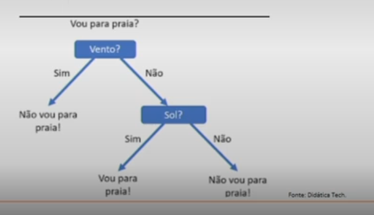


Para tomarmos decisões, precisamos dos operadores relacionais:

| Operador | Descrição          |
| -------- | ------------------ |
| ==       | Igual              |
| !=       | Não igual          |
| >        | Maior que          |
| <        | Menor que          |
| >=       | Maior que ou igual |
| <=       | Menor que ou igual |

O comando `if.. else..` significam `se.. senão..` e são usados para construir as estruturas condicionais.


### Estrutura condicional simples:

```python
nome = 'Daniel'
sobrenome = ''
lista = []

if name:
    print('A variável nome não é vazia')
```

No java, temos o seguinte modelo:

```java
if (operation) {
    // Bloco do resultado...
}
```

No Python, o modelo é baseado em tabulações:

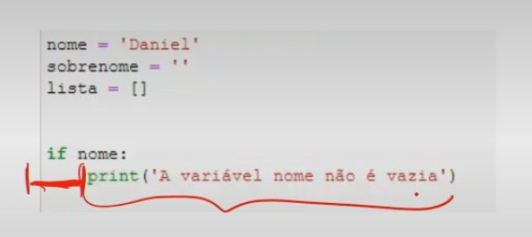

### Estrutura composta:

```python
valor1 = 10
valor2 = 20

if valor1 > valor2:
    print('O valor1 é maior do que o valor2')

else:
    print('O valor 2 é maior do que o valor1')
```

> A composta, refere-se ao `if` e o `else`.

### Estrutura encadeada, devemos usar o comando "elif", que é uma abreviação de else if.

```python
cor = "alguma cor"

if cor == 'verde':
    print('Acelerar')

elif cor == 'amarelo':
    print('Atenção')

else:
    print('Parar')
```

### Estruturas lógicas em Python: `and`, `or`, `not`

Podemos usar os operadores booleanos para construir estruturas de decisões mais complexas.

Operador booleano **and**: o resultado será *True*, quando os dois argumentos forem verdadeiros.

Operador booleano **or**: o resultado será *True*, quando pelo menos um dos argumentos for verdadeiro.

Operador booleano **not**: ele irá inverter o valor do argumento.

Portanto, se o argumento for verdadeiro, a operação o transformará em false e vice-versa.

**Exemplo:**

Estrutura condicional usando os operadores booleanos. Um aluno só pode ser aprovado caso ele tenha menos de 5 faltas e média final igual ou superior a 7.

```python
dtde_faltas = int(input("Digite a quantidade de faltas: "))
media_final = float(input("Digite a média final: "))

if dtde_faltas <= 6 and media_final >= 7:
    print("Aluno aprovado!")

else:
    print("Aluno reprovado!")
```

### Estruturas de Repetição

Estrutura de repetição em Python: **while** e **for**:

Em uma estrutura de repetição sempre haverá uma estrutura de decisão, pois a repetição de um trecho de código sempre está associada a uma condição. Ou seja, um bloco de comandos será executado repetidas vezes, até que uma condição não seja mais satisfeita.


O comando while deve ser utilizado para construir e controlar a estrutura decisão, sempre que o número de repetições não seja conhecido.

```python
numero = 1

while numero != 0:

    numero = int(input("Digite um número: "))

    if numero % 2 == 0:
        print("Número par!")
    else:
        print("Número ímpar!")
```

> todo o bloco com a identação de uma tabulação (4 espaços) faz parte da estrutura de repetição.
> Lembre: todos os blocos de comandos em Python são controlados pela identação.

Na prática é comum utilizarmos esse tipo de estrutura de repetição, com o **while**, para deixarmos serviços executando em servidores.

A instrução Python for itera sobre os itens de qualquer sequência, por exemplo, iterar sobre os caracteres de uma palavra, pois uma palavra é um tipo de sequência.

O comando **for** seguido da variável de controle "c", na sequência o comando "in", por fim, a sequência sobre a qual a estrutura deve iterar. Os dois pontos marcam o início do bloco que deve ser repetido.

```python
nome = "Guido"

for c in nome:
    print(c)
```

Com o comando for, podemos usar a função enumerate() para retornar à posição de cada item, dentro da sequência.

Considerando o exemplo dado, no qual atribuímos a variável "nome" o valor de "Guido", "G" ocupa a posição 0 na sequência, "u" ocupa a posição 1, "i" a posição 2, e assim por diante. Veja que a variável "i" é usada para capturar a posição e a variável "c" cada caractere da palavra.

```python
nome = "Guide"
for i, c in enumerate(nome):
    print(f"Posição = {i}, valor = {c}")
```

Controle de repetição com **range**, **break** e **continue**:

Python requer uma sequência para que ocorra a iteração. Para criar uma sequência numérica de iteração em Python, podemos usar a função range().

```python
for x in range(5):
    print(x)
```

> No comando, "x" é a variável de controle, ou seja, a cada iteração do laço, seu valor é alterado, já a função range() foi utilizada para criar um "iterable" numérico (objeto iterável) para que as repetições acontecesse.

### A função range() pode ser usada de três formas distintas:

Método 1: Passando um único argumento que representa a quantidade de vezes que o laço deve repetir;

Método 2: Passando dois argumentos, um que representa o início das repetições e outro o limite superior (NÃO INCLUÍDO) do valor da variável de controle;

Método 3: Passando três argumentos, um que representa o início das repetições; outro, o limite superior (NÃO INCLUÍDO) do valor da variável de controle e um que representa o incremento.

Além de controlar as iterações com o tamanho da sequência, outra forma de influenciar no fluxo é por meio dos comandos "*break*" e "*continue*".

O comando **break** "para" a execução de uma estrutura de repetição, já com o comando **continue**, conseguimos "pular" algumas execuções, dependendo de uma condição.

**Exemplo 1**

```python
# Exemplo de uso do break
disciplina = "Linguagem de programação"

for c in disciplina:
    if c == 'a':
        break
    else:
        print(c)
```

**Exemplo 2**

```python
# Exemplo de uso do continue
disciplina = "Linguagem de programação"
for c in disciplina:
    if c == 'a':
        continue
    else:
        print(c)
```

---

> Conceitos
>
> ## Implementando Soluções em Python Mediante Funções

Soluções dividindo-a em funções (blocos), além de ser uma boa prática de programação, tal abordagem facilita a leitura, a manutenção e a escalabilidade da solução.

- print() é uma função built-in do interpretador Python

Função **built-in** é um objeto que está integrado ao núcleo do interpretador, não precisa ser feita nenhuma instalação adicional.

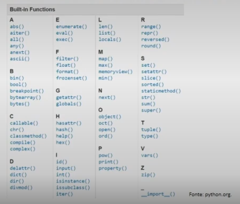

A função `eval()` usada no código recebe como entrada uma string digitada pelo usuário, que nesse caso é uma equação linear.

```python
a = 2
b = 1

equacao = input("Digite a fórmula geral da equação linear (a * x + b): ")
print(f"\nA entrada do usuário {equacao} é do tipo {type(equacao)}")

for x in range(5):
    y = eval(equacao)
    print(f"\nResultado da equação para x = {x} é {y}")
```

Essa entrada é analisada e avaliada como uma expressão Python pela função eval(). Veja que, para cada valor de x, a fórmula é executada como uma expressão matemática (linha 8) e retorna um valor diferente. Prudência para o uso, pois é fácil alguém externo à aplicação fazer uma "injection" de código intruso.

### Função definida pelo usuário

- Podemos escolher o nome da função, sua entrada e sua saída.
- Nomes das funções devem estar em minúsculas, com as palavras separadas por underline, conforme necessário, para melhorar a legibilidade.
- Os nomes de variáveis seguem a mesma convenção que os nomes de funções.
- É preciso abir e fechar parênteses, pois é dentro dos parênteses que os parâmetros de entrada da função devem ser definidos.
- Usamos o comando "def" para indicar que vamos definir uma função. Em seguida, escolhermos o nome da função "imprimir_mensagem".

**Exemplo:**

A função abaixo recebe dois parâmetros. Esses parâmetros são variáveis locais, ou seja, são variáveis que existem somente dentro da função.

```python
def imprimir_mensagem(disciplina, curso):

    print(f"Minha primeira função em Python desenvolvida na disciplina: {disciplina}, do curso: {curso}.")

imprimir_mensagem("Python", "ADS")
```

### Funções com parâmetros definidos e indefinios

Sobre os argumentos que uma função pode receber, para nosso estudo, vamos classificar em seis grupos:

1. Parâmetro posicional, obrigatório, sem valor default (padrão), tentar invocar a função, sem passar os parâmetros, acarreta um erro.

   ```python
   def somar(a, b):
       return a + b
   
   r = somar(2, 3)
   print(r)
   ```

2. Parâmetro posicional, obrigatório, com valor default (padrão), quando a função for invocada, caso nenhum valor seja passado, o valor default é utilizado.

   ```python
   def calcular_desconto(valor, desconto=0):
       # O parâmetro desconto possui zero valor default
       valor_com_desconto = valor - (valor * desconto)
       return valor_com_desconto
   
   valor1 = calcular_desconto(100) # Não aplicar nenhum desconto
   valor2 = calcular_desconto(100, 0.25) # Aplicar desconto de 25%
   
   print(f"\nPrimeiro valor a ser pago = {valor1}")
   print(f"\nSegundo valor a ser pago = {valor2}")
   ```

3. Parâmetro nominal, obrigatório, sem valor default (padrão). Não mais importa a posição dos parâmetros, pois eles serão identificados pelo nome, a chamada da função é obrigatório passar todos os valores e sem valor default.

   ```python
   def converter_maiuscula(texto, flag_maiuscola):
       if flag_maiuscola:
           return texto.upper()
       else:
           return texto.lower()
   
   texto = converter_maiuscula(flag_maiuscola=True, texto="João") # Passagem nominal de parâmtros
   print(texto)
   ```

4. Parâmetro nominal, obrigatório, com valor default (padrão), nesse grupo os parâmetros podem possuir valor default.

   ```python
   def converter_minuscula(texto, flag_minuscula=True): # O parâmtro flag_minuscula possui True como valor default
       if flag_minuscula:
           return texto.lower()
       else:
           return texto.upper()
   
   texto1 = converter_minuscula(flag_minuscula=True, texto="LINGUAGEM de Programação")
   texto2 = converter_minuscula(texto="LINGUAGEM de Programação")
   print(f"\nTexto 1 {texto1}")
   print(f"\nTexto 2 {texto2}")
   ```

5. Parâmetro posicional e não obrigatório (args), a passagem de valores é feita de modo posicional, porém a quantidade não é conhecida.

   ```python
   def imprimir_parametros(*args):
       qtde_parametros = len(args)
       print (f"Quantidade de parâmetros = {qtde_parametros}")
   
   for i, valor in enumerate(args):
       print(f"Posição = {i}, valor = {valor}")
   
   print("\nChamada 1")
   imprimir_parametros("São Paulo", 10, 23.78, "João")
   print("\nChamada 2")
   imprimir_parametros(10, "São Paulo")
   ```

6. Parâmetro nominal e não obrigatório (kwargs), agora a passagem é feita de modo nominal e não posicional, o que nos permite acessar tanto o valor do parâmetro quanto o nome da variável que o armazena.

   ```python
   def imprimir_parametros(**kwargs):
       print(f"Tipo de objeto recebido = {type(kwargs)}\n")
       qtde_parametros = len(kwargs)
       print(f"Quantidade de parâmetros = {qtde_parametros}")
   
       for chave, valor in kawargs.items():
           print(f"variável = {chave}, valor = {valor}")
   
   print("\nChamada 1")
   imprimir_parametros(cidade="São Paulo", idade=33, nome="João")
   print("\nChamada 2")
   imprimir_parametros(desconto=10, valor=100)
   ```

### Funções anônimas em Python

Uma função anônima é uma função que não é construída com o "def" e, por isso, não possui nome. Esse tipo de construção é útil, quando a função faz somente uma ação e é usada uma única vez.

Poderoso recurso da linguagem Python: a expressão "lambda".

```python
somar = lambda x, y: x + y
somar(x=5, y=3)
```

---

## Estrutura de dados em Python

Em Python existem objetos em que podemos armazenar mais de um valor, aos quais damos o nome de estruturas de dados.

Tudo em Python é um objeto. Já conhecemos alguns tipos de objetos em Python, tais como o init (inteiro), o str (string), o float (ponto flutuante). Os tipos de estruturas de dados: listas, tuplas, conjuntos, dicionário e matriz.

Vamos do tipo sequência: texto, listas e tuplas.

- Objetos do tipo sequência: texto, listas e tuplas.
- Objetos do tipo set (conjunto).
- Objetos do tipo mapping (dicionário).
- Objetos do tipo array NumPy.

### Objetos do tipo sequência

Essas estruturas de dados representam sequências finitas indexadas por números não negativos.

O primeiro elemento de uma sequência ocupa o índice 0; o segundo, 1; o último elemento, a posição n -1, em que n é capacidade de armazenamento da sequência.

Ex.: Sequência de caracteres.

Um texto é um objeto da classe str (strings), que é um tipo de sequência. Os objetos da classe str possuem todas as operações, mas são objetos imutáveis, razão pela qual não é possível atribuir u novo valor a uma posição específica.

```python
texto = "Aprendendo Python na disciplina de linguagem de programação."

print(f"Tamanho do texto = {len(texto)}")
print(f"Python in texto = {'Python' in texto}")
print(f"Quantidade de y no texto = {texto.count('y')}")
print(f"As 5 primeiras lentas são: {texto[0:6]}")
```

Na entrada 1, usamos algumas operações das sequências.
A operação len() permite saber o tamanho da sequência.
O operador 'in', por sua vez, permite saber se um determinado valor está ou não na sequência.
O operador count permite contar a quantidade de ocorrências de um valor.
E a notação com colchetes permite fatiar a sequência, exibindo somente partes dela. Na linha 6, pedimos para exibir da posição 0 até a 5, pois o valor 6 não é incluído.

Por meio da estrutura de repetição, imprimimos cada elemento da lista juntamente com seu índice. Veja que a sequência possui a função index, que retorna a posição de um valor na sequência.

```python
vogais = ['a', 'e', 'i', 'o', 'u'] # Também proderia ter sido criada usando aspas duplas

for vogal in votais:
    print (f'Posição = {vogais.index(vogal)}, valor = {vogal}')
```

As listas possuem diversas funções, além das operações já mencionadas. Na documentação oficial (PSF, 2020b) você encontra uma lista completa com todas as operações possíveis.

Vamos falar agora sobre a função split(), usada para "cortar" um texto e transformá-lo em uma lista. Essa função pode ser usada sem nenhum parâmetro: texto.split(). Nesse caso, a string será cortada a cada espaço em branco que for encontrado. Caso seja passado um parâmetro: texto.split(","), então o corte será feito no parâmetro especificado.

```python
texto = "Aprendendo Python na disciplina de linguagem de programação."

print(f"texto = {texto}")
print(f"Tamanho do texto = {len(texto)}\n")

palavras = texto.split()

print(f"palavras = {palavras}")
print(f"Tamanho de palavras = {len(palavras)}")
```

<u>List comprehension (Compreensão de lista)</u>

A lista comprehension, também pode ser chamada de listcomp. Esse tipo de técnica é utilizada quando, dada uma sequência, deseja-se criar uma nova sequência, porém com as informações originais transformadas ou filtradas por um critério.

<u>Lista</u>

É uma estrutura de dados do tipo sequencial que possui como principal característica ser mutável. Ou seja, novos valores pode ser adicionados ou removidos da sequência. Em Python, as listas pode ser construídas de várias maneiras:

- Usando um par de colchetes para denotar uma lista vazia:

  `lista1 = []`

- Usando um par de colchetes e elementos separados por vírgulas:

  `lista2 = ['a', 'b', 'c']`

- Usando uma "list comprehension":

  `x for x in iterable`

- Usando o construtor de tipo:

  `list()`

```python
linguagens = ["Python", "Java", "JavaScript", "C", "C#", "C++", "Swift", "Go", "Kotlin"]
# Linguagens = '''Python Java JavaScript C C# C++ Swift Go Kotlin'''.split()
# Essa sintax produz o mesmo resultado que a linha 1

print("Antes da listcomp = ", linguagens)

linguagens = [item.lower() for item in linguagens]

print("\nDepois da listcomp = ", linguagens)
```

```bash
root@10:/home/marcos/Documentos# python teste4.py
Antes da listcomp = ['Python', 'Java', 'JavaScript', 'C', 'C#', 'C++', 'Swift', 'Go', 'Kotlin']

Depois da listcomp = ['python', 'java', 'javascript', 'c', 'c#', 'c++', 'swift', 'go', 'kotlin']
```

<u>Funções map() e filter()</u>

Funções built-in que são usadas por esse tipo de estrutura de dados: map() e filter().

A função map() é utilizada para aplicar uma determinada função em cada item de um objeto iterável.

Para que essa transformação seja feita, a função map() exige que sejam passados dois parâmetros: a função e o objeto iterável.

```python
# Exemplo

print("Exemplo")

linguagens = '''Python Java JavaScript C C# C++ Swift Go Kotlin'''.split()
nova_lista = map(lambda x: x.lower(), linguagens)
print(f"A nova lista é = {nova_lista}\n")
nova_lista = list(nova_lista)
print(f"Agora sim, a nova lista é = {nova_lista}")
```

```bash
Exemplo
A nova lista é = <map object at 0x000001BFCF96BF10>

Agora sim, a nova lista é = ['python', 'java', 'JavaScript', 'c', 'c#', 'c++', 'swift', 'go', 'kotlin']
```

A função range() cria um objeto numérico iterável. Então usamos o construtor list() para transformá-lo em uma lista com números, que variam de 0 a 20. Lembre-se de que o limite superior do argumento da função range() não é incluído. Na linha 3, criamos uma nova lista com a função filter, que com a utilização da expressão lambda, retorna somente os valores pares.

```python
numeros = list(range(0, 21))

numeros_pares = list(filter(lambda x: x % 2 == 0, numeros))

print(numeros_pares)
```

<u>Tuplas</u>

A grande diferença entre listas e tuplas é que as primeiras são mutáveis, razão pela qual, com elas, conseguimos fazer atribuições a posições específicas: por exemplo, lista[2] = 'maça'.

Por sua vez, nas tuplas isso não é possível, uma vez que são objetos imutáveis.

Em Python, as tuplas podem ser construídas de três maneiras:

1. Usando um par de parênteses para denotar uma tupla vazia:

   ```python
   tupla1 = ()
   ```

2. Usando um par de parênteses e elementos separados por vírgulas:

   ```python
   tupla2 = ('a', 'b', 'c')
   ```

3. Usando o construtor de tipo:

   ```python
   tuple()
   ```

"**Não vi diferença nenhuma entre usar lista e usar tupla**".

Em alguns casos, mais de uma estrutura realmente pode resolver o problema, mas em outros não. Como a tupla é imutável, sua utilização ocorre em casos nos quais a ordem dos elementos é importante e não pode ser alterada, já que o objeto tuple garante essa característica. A função enumerate(), que normalmente usamos nas estruturas de repetição, retorna uma tupla cujo primeiro elemento é sempre o índice da posição e cujo segundo elemento é o valor em si.

```python
vogais = ('a', 'e', 'i', 'o', 'u')
print(f"Tipo do objeto vogais = {type(vogais)}")

for p, x in enumerate(vogais):
    print(f"Posição = {p}, valor = {x}")
```

```bash
Tipo de objeto vogais = <class 'tuple'>
Posição = 0, valor = a
Posição = 1, valor = e
Posição = 2, valor = i
Posição = 3, valor = o
Posição = 4, valor = u
```

<u>Objetos do tipo Set</u>

A tradução "conjunto" para set nos leva diretamente à essência desse tipo de estrutura de dados em Python. Um objeto do tipo set habilita operações matemáticas de conjuntos, tais como: união, intersecção, diferença, etc. Esse tipo de estrtura pode ser usado, portanto, em testes de associação e remoção de valores duplicados de uma sequência (PSF, 2020).

<u>Objetos do tipo Set</u>

Das operações que já conhecemos sore sequências, conseguimos usar nessa nova estrtura:

```python
len(s)
x in s
x not in s
```

Além dessas operações, podemos adicionar um novo elemento a um conjunto com a função add(valor). Também podemos remover com remove(valor). Em Python, os objetos do tipo set podem ser construídos destas maneiras:

1. Usando um par de chaves e elementos separados por vírgulas:

   ```python
   set1 = {'a', 'b', 'c'}
   ```

2. Usando o construtor de tipo:

   ```python
   set(iterable)
   ```

<u>Objetos do tipo mapping</u>

As estruturas de dados que possuem um mapeamento entre uma chave e um valor são consideradas objetos do tipo mapping. Em Python, o objeto que possui essa propriedade é o dict (dicionário). Uma vez que esse objeto é mutável, conseguimos atribuir um novo valor a uma chave já existente.

Podemos construir dicionários em Python das seguintes maneiras:

1. Usando um par de chaves para denotar um dict vazio:

   ```python
   dicionario1 = {}
   ```

2. Usando um par de elementos na forma *chave : valor*, separados por vírgulas:

   ```python
   dicionario2 = {'one': 1, 'two': 2, 'three': 3}
   ```

3. usando o construtor de tipo:

   ```python
   dict()
   ```

Não é possível criar um conjunto vazio, com set = {}, pois essa é a forma de construção de um dicionário.

Para construir com utilização da função set(iterable), obrigatoriamente temos de passar um objeto iterável para ser transformado em conjunto.

esse objeto pode ser uma lista, uma tupla ou até mesmo uma string (que é um tipo de sequência).

```python
# Exemplo 1 - Criação de dicionário vazio, com atribuição posterior de chave e valor
dici_1 = {}
dici_1['nome'] = "João"
dici_1['idade'] = 30

# Exemplo 2 - Criação de dicionário usando um par de elementos na forma, chave : valor
dici_2 = {'nome': 'João', 'idade': 30}

# Exemplo 3 - Criação de dicionário com uma lista de tuplas. Cada tupla representa um par chave : valor
dici_3 = dict([('nome', "João"), ('idade', 30)])
```

<u>Objetos do tipo array NumPy</u>

O caso da biblioteca NumPy, criada especificamente para a computação científica com Python. O NumPy contém, entre outras coisas:

- Um poderoso objeto de matriz (array) N-dimensional.
- Funções sofisticadas.
- Ferramentas para integrar código C/C++ e Fortran.
- Recursos úteis de álgebra linear, transformação de Fourier e números aleatórios.

> Sem dúvida, o NumPy é a biblioteca mais poderosa para trabalhar com dados tabulares (matrizes), além de ser um recurso essencial para os desenvolvedores científicos, como os que desenvolvem soluções de inteligência artificial para imagens.

```python
import numpy

matriz_1_1 = numpy.array([1, 2, 3]) # Cria matriz 1 linha e 1 coluna
matriz_1_2 = numpy.array([[1, 2], [3, 5]]) # Cria matriz 2 linhas e 2 colunas
matriz_1_3 = numpy.array([[1, 2], [3, 4], [5, 6]]) # Cria matriz 3 linhas e 2 colunas
matriz_1_4 = numpy.array([[1, 2, 3], [4, 5, 6]]) # Cria matriz 2 linhas e 3 colunas

print(type(matriz_1_1))
print('\n matriz_1_1', matriz_1_1)
print('\n matriz_2_2 = \n', matriz_2_2)
print('\n matriz_3_2 = \n', matriz_3_2)
print('\n matriz_2_3 = \n', matriz_2_3)
```

---

## Algoritmos de busca: Parte 1

Esse universo, como o nome sugere, os algoritmos resolvem problemas relacionados ao encontro de valores em uma estrutura de dados.

Em Python, temos a operação "in" ou "not in" usada para verificar se um valor está em uma sequência.

```python
nomes = 'João Marcela Sonia daryl Vernson Eder Mechelle Edan Igor Ethan Reed Travis Hoyt'.spite()

print('Marcela' in nomes)
print('Roberto' in nomes)
```

Usamos o operador in para verificar se dois nomes constavam na lista. No primeiro, obtivemos True; e no segundo, False.

<u>Busca linear (ou Busca Sequencial)</u>

Percorre os elementos da sequência procurando aqueles de destino, começa por uma das extremidades da sequência e vai percorrendo até encontrar (ou não) o valor desejado. Pesquisa linear examina todos os elementos da sequência até encontrar o de destino, o que pode ser muito custoso computacionalmente.

Para implementar a busca linear, vamos precisar de uma estrutura de repetição (for) para percorrer a sequência, e uma estrutura de decisão (if) para verificar se o valor em uma determinada posição é o que procuramos.

```python
def executar_busca_linear(lista, valor):
    for elemento in lista:
        if valor == elemento:
            return Ture
        return False
```

Criamos a função "executar_busca_linear", que recebe uma lista e um valor a ser localizado.

Na linha 2, criamos a estrutura de repetição, que percorrerá cada elemento da lista pela comparação com o valor buscado (linha 3).

Caso este seja localizado, então a função retorna o valor booleano True; caso não seja encontrado, então retorna False.

Nossa função é capaz de determinar se um valor está ou não presente em uma sequência, certo? E se, no entanto, quiséssemos saber sua posição na sequência?

Em Python, as estruturas de dados do tipo sequência possuem a função index(), que é usada da seguinte forma:

```python
sequencia.index(valor)
```

A função index() espera como parâmetro o valor a ser procurado na sequência.

```python
vogais = 'aeiou'
resultado = vogais.index('e')
print(resultado)
```

## Algoritmos de busca: Parte 2

<u>Complexidade</u>

Em termos computacionais, um algoritmo é considerado melhor que o outro quando, para a mesma entrada, utiliza menos recursos computacionais em termos de memória e processamento.

Estudo da viabilidade de um algoritmo, em termos de espaço e tempo de processamento, é chamado de análise da complexidade do algorítimo.

Análise da complexidade é feita em duas dimensões: espaço e tempo. Podemos, então, concluir que a análise da complexidade de um algoritmo tem como um dos grandes objetivos encontrar o comportamento do algoritmo (a função matemática) em relação ao tempo de execução para o pior caso, ao que chamamos de complexidade assintótica.

<u>Busca binária</u>

Outro algoritmo usado para buscar um valor em uma sequência é o de busca binária. A primeira grande diferença entre o algoritmo de busca linear e o algoritmo de busca binária é que, com este último, os valores precisam estar ordenados.

A lógica é a seguinte:

- Encontra o item no meio da sequência (meio da list).
- Se o valor procurado for igual ao item do meio, a busca se encerra.
- Se não for, verifica-se se o valor buscado é maior ou menor que o valor central.
- Se for maior, então a busca acontecerá na metade superior da sequência (a inferior é descartada); se não for, a busca acontecerá na metade inferior da sequência (a superior é descartada).

Veja que o algoritmo, ao encontrar o valor central de uma sequência, a divide em duas partes, o que justifica o nome de busca binária.

Suponha que tenhamos uma lista com 1024 elementos. Na primeira iteração do loop, ao encontrar o meio e excluir uma parte, a lista a ser buscada já é diminuída para 512. Na segunda iteração, novamente ao encontrar o meio e excluir uma parte, restam 256 elementos. Na terceira iteração, restam 128. Na quarta, restam 64. Na quita, restam 32. Na sexta, restam 16. Na sétima 8. Na oitava 4. Na nona 2. Na décima iteração resta apenas 1 elemento. Ou seja, para 1024 elementos, **no pior caso**, o loop será executado apenas **10*** vezes, diferentemente da busca linear, na qual a iteração aconteceria **1024** vezes.

```python
def executar_busca_binaria(lista, valor):
    minimo = 0
    maximo = len(lista) - 1

    while minimo <= máximo:
        # Encontra o elemento que divide a lista ao meio
        meio = (minimo + maximo) // 2
        # Verifica se o valor procurado está a esquerda ou direita do valor central
        if valor < lista[meio]:
            maximo = meio - 1
        elif valor > lista[meio]:
            minimo = meio + 1
        else:
            return True # Se o valor for encontrado para aqui

    return False # Se chegar até aqui, significa que o valor não foi encontrado.
```

### Quais as vantagens e limitações da busca sequencial?

Busca Sequencial, é a forma mais simples de buscar, percorresse registro por registro em busca da chave.

Na melhor das hipóteses, a chave de busca estará na posição 0. Portanto, teremos um único acesso em lista[0]. Possui resultados melhores para quantidades pequena e média de buscas. Na pior das hipóteses, a chave é o último elemento ou não pertence à lista e, portanto, acessamos todos os n elementos da lista. Perda de eficiência para os outros registros, o método é mais "caro".

## Algoritmos de Ordenação

A essência dos algoritmos de ordenação consiste em comparar dois valores, verificar qual é menor e colocar na posição correta.

O que vai mudar, neste caso, é como e quando a comparação é feita. Para que possamos começar a entender a essência dos algoritmos de ordenação.

E Python, existem duas formas já programadas que nos permitem ordenar uma sequência:

A função built-in **sorted()** e o método **sort()**, presente nos objetos da classe list..

```python
lista = [10, 4, 1, 15, -3]

lista_ordenada1 = sorted(lista)

lista_ordenada2 = lista.sort()

print('lista = ', lista, '\n')
print('lista_ordenada1 = ', lista_ordenada1)
print('lista_ordenada2 = ', lista_ordenada2)

print('lista = ', lista)
```

```python
lista = [-3, 1, 4, 10, 15]

lista_ordenada1 = [-3, 1, 4, 10, 15]
lista_ordenada2 = None
lista = [-3, 1, 4, 10, 15]
```

```python
lista = [7, 4]

if lista[0] > lista[1]:
    aux = lista[1]
    lista[1] = lista[0]
    lista[0] = aux

print(lista)
```

> Resultado

```python
[4, 7]
```

> Outros valores

```python
lista = [5, -1]

if lista[0] > lista[1]:
    lista[0], lista[1] = lista[1], lista[0]

print(lista)
```

> Resultado

```python
[-1, 5]
```

<u>Selection sort (Ordenação por seleção)</u>

O algoritmo selection sort recebe esse nome, porque faz a ordenação sempre escolhendo o menor valor para ocupar uma determinada posição.

A lógica do algoritmo é a seguinte:

Iteração 1: percorre toda a lista, procurando o menor valor para ocupar a posição 0.

Iteração 2: a partir da posição 1, percorre toda a lista, procurando o menor valor para ocupar a posição 1.

Iteração 3: a partir da posição 2, percorre toda a lista, procurando o menor valor para ocupar a posição 2.

Esse processo é repetido N-1 vezes, sendo N o tamanho da lista.

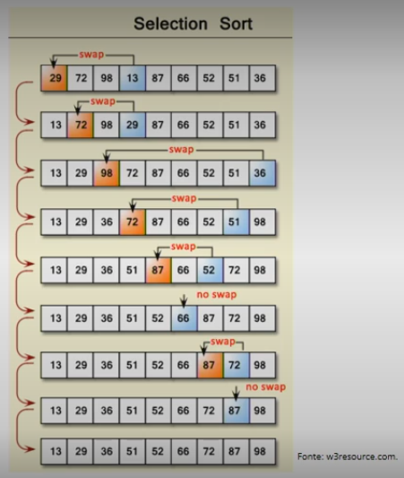

> Algoritmo, como seria.

```python
def executar_selection_sort(lista):
    n = len(lista)
    for i in range(0, n):
        if lista[j] < lista[index_menur]:
            index_menor = j
        lista[i], lista[index_menur] = lista[index_menor], lista[i]
    return lista

lista = [10, 9, 5, 8, 11, 3]
print(executar_selection_sort(lista))
```

> Resultado

```python
[3, 5, 8, 9, 10, 11]
```

<u>Bubble sort (Ordenação por "bolha")</u>

O algoritmo bubble sort (algoritmo da bolha) faz a ordenação sempre a partir do início da lista, comparando um valor com seu vizinho. Esse processo é repetido até que todas as pessoas estejam na posição correta.

A lógica do algoritmo é a seguinte:

Iteração 1: seleciona o valor na posição 0 e o compara com seu vizinho - se for menor, há troca; se não for, seleciona o próximo e compara, repetindo o processo.

Iteração 2: seleciona o valor na posição 0 e compara ele com seu vizinho, se for menor troca, senão seleciona o próximo e compara, repetindo o processo.

Iteração N - 1: seleciona o valor na posição 0 e o compara com seu vizinho - se for menor, há troca; se não for, seleciona o próximo e compara, repetindo o processo.

<u>Bubble sort</u>

```python
def executar_bubble_sort(lista):
    n = len(lista)
    for i in range(n-1):
        for j in range(n-1):
            if lista[j] > lista[j + 1]:
                lista[j], lista[j + 1] = lista[j + 1], lista[j]
    return lista

lista = [10, 9, 5, 8, 11, -1, 3]
executar_bubble_sort(lista)
```

> Resultado

```python
[-1, 3, 5, 8, 9, 10, 11]
```

<u>Merge sort (Ordenação por junção)</u>

O algoritmo merge sor recebe esse nome porque faz a ordenação em duas etapas:

1. divide a lista em sublistaas;
2. e junta (merge) as sublistas já ordenadas.

O paradigma de dividir e conquistar envolve três etapas em cada nível da recursão:

i. dividir o problema em várias subproblemas;
ii. conquistar os subproblemas, resolvendo-os recursivamente - se os tamanhos dos subproblemas forem pequenos o suficiente, apenas resolva os subproblemas de maneira direta;
iii. combinar as soluções dos subproblemas na solução do problema original.

<u>Merge sort (Pseudo-algoritmo)</u>

**Etapa de divisão:**

- Com base na lista original, encontre o meio e separe-a em duas listas: esquerda_1 e direta_2.
- Com base na sublista esquerda_1, se a quantidade de elementos for maior que 1, encontre o meio e separe-a em duas listas: esquerda_1_1 e direita_1_1.
- Com base na sublista esquerda_1_1, se a quantidade de elementos for maior que 1, encontre o meio e separe-a em duas listas: esquerda_1_2 e direita_1_2.
- Repita o processo até encontrar uma lista comm tamanho 1.
- Chame a etapa de merge.
- Repita o processo para todas as sublistas.

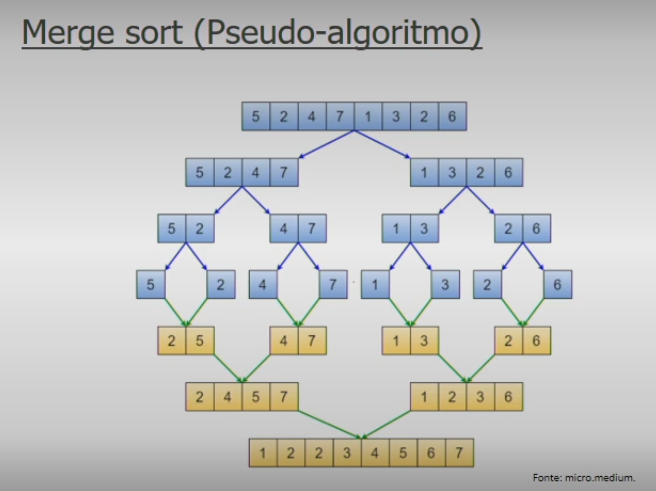

> Conceitos
>
> ## Recapitulando

- Estrutura de dados em Python
- Algoritmos de busca
- Algoritmos de Ordenação

## Python Orientado a Objeto

### Prof.ª Elisa Antolli

### Contextualização

- Classes e Métodos em Python
- Bibliotecas e Módulos em Python
- Aplicação de banco de dados com Python

> Conceitos
>
> ## Linguagem de programação: conceitos de orientação a objetos

O que são objetos e o que as classes têm a ver com eles?

Uma classe é uma abstração que descreve entidades do mundo real e quando instanciadas dão origem a objetos com características similares.

Portanto, a classe é o modelo e o objeto é uma instância.

Abstração - Classes e objetos

Objetos são os componentes de um programa OO. Um programa que usa a tecnologia OO é basicamente uma coleção de objetos.

Uma classe é um modelo para um objeto. Podemos considerar uma classe uma forma de organizar os dados (de um objeto) e seus comportamentos (PSF, 2020a). A classe é o modelo e o objeto é uma instância.

Entende-se por instância a existência física, em memória, do objeto.

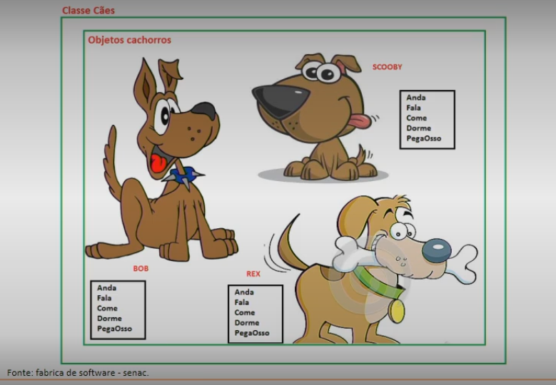

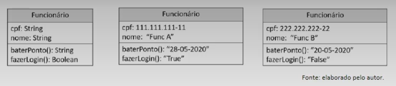

Cada diagrama de classes é definido por três seções separadas: o próprio nome da classe, os dados e os comportamentos.

Termos a classe funcionário, são especificados o que um funcionário deve ter.

No nosso caso, como dados, ele deve ter um CPF e um nome, como comportamento, ele deve bater ponto e fazer login. Esses dados estão "preenchidos", ou seja, foram instanciados e, portanto, são objetos.

### Atributos

Os dados armazenados em um objeto representam o estado do objeto. Na terminologia de programação OO, esses dados são chamados de atributos. Os atributos contêm as informações que diferenciam os vários objetos - os funcionários, neste caso. ***Atributos*** são portanto, as características de um objeto, essas características também são conhecidas como variáveis, utilizando o exemplo dos cães, temos alguns atributos, tais como: cor, peso, altura e nome.

```python
public class Chachorro {
    public String nome;
    public float peso;
    public float altura;
    public String cor;
}
```

### Métodos

Nas linguagens procedurais, o comportamento é definido por procedimentos, funções e sub-rotinas. Na terminologia de programação OO, esses comportamentos estão contidos nos métodos, aos quais você envia uma mensagem para invocá-los.

***Métodos*** são portanto, as ações que os objetos podem exercer quando solicitados, onde podem interagir e se comunicarem com outros objetos, utilizando o exemplo dos cães, temos alguns exemplos: latir, correr, pular.

Implementando a classe "Cachorro" além dos Atributos, agora com Métodos:

```python
public class Cachorro {
    public String name; [...]
    public String cor;
    void pular {
        if (altura >= 80) {
            System.out.println("Seu cachorro pula alto");
        } else {
            System.out.println("Seu cachorro pula baixo");
        }
    }
}
```

### Herança

Por meio desse mecanismo, é possível fazer o reuso de código, criando soluções mais organizadas.

A herança permite que uma classe herde os atributos e métodos de outra classe. Observe, na Figura, que as classes funcionário e cliente herdam os atributos da classe pessoa. A classe pessoa pode ser chamada de classe-pai, classe-base, superclasse, ancestral; por sua vez, as classes derivadas são as classes filhas, subclasses.

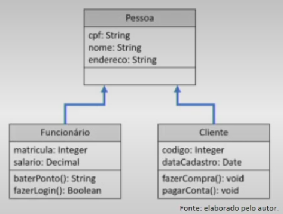

### Encapsulamento

O ato de combinar os atributos e métodos na mesma entidade é, na linguagem OO, chamado de encapsulamento (Weisfeld, 2013), termo que também aparece na prática de tonar atributos privados, quando estes são encapsulados em métodos para guardar e acessar seus valores.

Isso se chama <u>Ocultação de Informação</u> e é muito importante na programação.

As Classes encapsulam dados e comportamento em cima desses dados.

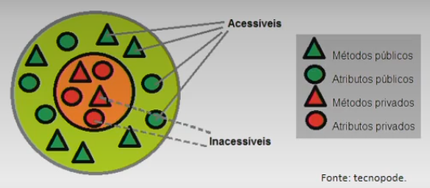

### Poliformismo

Quando uma mensagem é enviada para um objeto, este deve ter um método definido para responder a essa mensagem. Em uma hierarquia de herança, todas as subclasses herdam as interfaces de sua superclasse.

No entanto, como toda subclasse é uma entidade separada, cada uma delas pode exigir uma resposta separada para a mesma mensagem.

**Polimorfismo** significa "muitas formas", é o termo definido em linguagens orientadas a objetos, que permite ao desenvolvedor usar o mesmo elemento de formas diferentes.

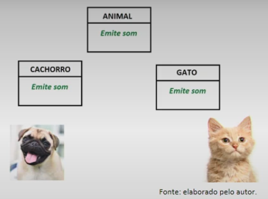

> Conceito
>
> ## Classes e métodos em Python

### A Classes em Python

Utiliza-se a palavra reservada `class` para indicar a criação de uma classe, seguida do nome e dois pontos. No bloco identado devem ser implementados os atributos e métodos da classe.

```python
class ClassName:
    <statement-1>
    .
    .
    .
    <statement-N>
```

*Exemplo de um código*

```python
class PrimeiraClasse:
    def imprimir_mensagem(self, nome): # Criando um método
        print(f"Olá {nome}, seja bem-vindo!")
        objeto1 = PrimeiraClasse() # Instanciando um objeto do tipo PrimeiraClasse
        objeto1.imprimir_mensagem('João') # Invicando o método
```

### Construtor da classe `__init__()`

Atributos de instância, também chamadas de variáveis de instâncias. Esse tipo de atributo é capaz de receber um valor diferente para cada objeto.

Um atributo de instância é uma variável procedida com o parâmetro self, ou seja, a sintaxe para criar e utilizar é self.nome_atributo. Ao instanciar um novo objeto, é possível determinar um estado inicial para variáveis de instâncias por meio do método construtor da classe.

Em Python, o método construtor é chamado de `__init__()`.

Criamos a classe Televisao, que possui um atributo de instância e três métodos, o primeiro dos quais é (`__init()__`), aquele que é invocado quando o objeto é instanciado. Nesse método construtor, instanciamos o atributo volume com o valor 10, ou seja, todo objeto do tipo Televisao será criado com volume = 10. Veja que o atributo recebe o prefixo self., que o identifica como variável de instância.

```python
class Televisao:
    def __init__(self):
        self.volume = 10
    def aumentar_volume(self):
        self.volume += 1
    def diminuir_volume(self):
        self.volume -= 1

tv = Televisao()
print("Volume ao ligar a tv = ", tv.volume)
tv.aumentar_volume()
print("Volume autal = ", tv.volume)
```

### Variáveis e métodos privados

Em linguagens de programação OO, como Java e C#, as classes, os atributos e os métodos são acompanhados de modificadores de acesso, que podem ser: **public**, **private** e **protected**.

Em Python, **<u>não</u>** existem modificadores de acesso e todos os recursos são públicos. Para simbolizar que um atributo ou método é privado, por convenção, usa-se um sublinhado "_" antes do nome; por exemplo, _cpf, _calcular_desconto() (PSF, 2020a).

Conceitualmente, dado que um atributo é privado, ele só pode ser acessado por membros da própria classe. Portanto, ao declarar um atributo privado, precisamos de métodos que acessem e recuperem os valores ali guardados. Em Python, além de métodos para este fim, um atributo privado pode ser acessado por <u>decorator</u>.

Implementamos a classe `ContaCorrente`, que possui dois atributos privados: `_cpf` e `_saldo`. Para guardar um valor no atributo cpf, deve-se chamar o método set_cpf, e, para recuperar seu valor, usa-se `get_cpf`.

```python
class ContaCorrente:
    def __init__(self):
        self._saldo += valor
    def depositar(self, valor):
        self._saldo += valor
    def consultar_saldo(self):
        return self._sald
```

> ( ! ) Lembre-se: em Python, atributos e métodos privados são apenas uma convenção, pois, na prática, os recursos podem ser acessados de qualquer forma.

### Herança em Python

Em Python, uma classe aceita múltiplas heranças, ou seja, herda recursos de diversas classes. A sintaxe para criar a herança é feita com parênteses após o nome da classe: *`class NomeClasseFilha(NomeClassePi)`*.

Se for uma herança múltipla, cada superclasse deve ser separada por vírgula.

```python
class Pessoa:
    def __init__(self):
        self.cpf = Nome
        self.nome = Nome
        self.endereco = Nome
```

```python
f1 = Funcionario()
fi.nome = "Funcionário A"
print(f1.nome)

c1 = Cliente()
c1.cpf = "111.111.111-11"
print(c1.cpf)
```

```python
class Funcionario(Pessoa):
    def __init_(self):
        self.matricula = Nome
        self.salacio = Nome
    def bater_ponto(self):
        # Código aqui
        pass
	def fazer_login(self):
        # Código aqui
        pass
```

### Métodos mágicos em Python

Quando uma classe é criada em Python, ela herda, mesmo que não declarado explicitamente, todos os recursos de uma classe-base chamada ***object***.

Veja o resultado da função `dir()`, que retorna uma lista com os recursos de um objeto. A classe Pessoa, que explicitamente não tem nenhuma herança, possui uma série de recursos nos quais os nomes estão com underline (sublinhado). Todos eles são chamados de métodos mágicos e, com a herança, podem ser sobrescritos.

```python
print(dir(Pessoa()))
```

> *( i ) Métodos mágicos*

```python
['__class__', '__delattr__', '__dict__', '__dir__', '__doc__', '__eq__', '__format__', '__ge__', '__getattribute__', '__gt__', '__hash__', '__init__', '__init_subclass__', '__le__', '__lt__', '__module__', '__ne__', '__new__', '__reduce__', '__reduce_ex__', '__repr__', '__setattr__', '__sizeof__', '__str__', '__subclasshook__', '__weakref__', 'cpf', 'endereco', 'nome']
```

### Método construtor na herança e sobrescrita

Na herança, quando adicionamos a função `__init__()`, a classe-filho não herdará o construtor dos pais. Ou seja, o construtor <u>da classe-filho</u> sobrescreve (override) o da classe-pai. Para utilizar o construtor da <u>classebase</u>, é necessário invocá-lo explicitamente, dentro do construtor-filho, da seguinte forma:

```python
ClassePai.__init__().
```

### Herança múltipla

Python permite que uma classe-filha herde recursos de mais de uma superclasse. Para isso, basta declarar cada classe a ser herdada separada por vírgula.

### Bibliotecas e módulos em Python

Um módulo pode ser uma biblioteca de códigos, o qual possui diversas funções (matemáticas, sistema operacional. etc.) as quais possibilitam a reutilização de códigos de uma forma elegante e eficiente.

### Módulos e Bibliotecas em Python

Uma opção para organizar o código é implementar funções, contexto em que cada bloco passa a ser responsável por uma determinada funcionalidade. outra forma é utilizar a orientação a objetos e criar classes que encapsulam as características e os comportamentos de um determinado objeto.

Conseguimos utilizar ambas as técnicas para melhorar o código, mas, ainda assim, estamos falando de toda a solução agrupada em um arquivo Python (.py).

### COMO UTILIZAR UM MÓDULO

Para utilizar um módulo é preciso importá-lo para o arquivo. Essa importação pode ser feita de maneiras destintas:

- `import moduloXXText`
- `import moduloXX as apelido`
- `form moduloXX import itemA, itemB`

A forma de importação também determina a sintaxe para utilizar a funcionalidade.

### Classificação dos módulos (bibliotecas)

Três categorias, cada uma das quais vamos estudar:

- Módulos built-in: embutidos no interpretador.
- Módulos de terceiros: criados por terceiros e disponibilizados via PyPI.
- Módulos próprios: criados pelo desenvolvedor.

> - Módulo Built-in: Como estão embutidos no interpretador, esses módulos não precisam de nenhuma instalação adicional.
> - Módulos random: Random é um módulo built-in usado para criar números aleatórios.
> - Módulo os: OS é um módulo built-in usado para executar comandos no sistema operacional.
> - Módulo re: O módulo re (regular expression) fornece funções para busca de padrões em um texto. Uma expressão regular especifica um conjunto de strings que corresponde a ela. As funções neste módulo permitem verificar se uma determinada string corresponde a uma determinada expressão regular.
> - Módulo datetime: Trabalhar com datas é um desafio nas mais diversas linguagens de programação. Em Python há um módulo built-in capaz de lidar com datas e horas. O módulo datetime fornece classes para manipular datas e horas.

### Módulos de terceiros

Programadores autônomos e empresas podem, com isso, criar uma solução em Python e disponibilizar em forma de biblioteca no repositório PyPI, o que permite que todos usufruam e contribuam para o crescimento da linguagem.

Para utilizar uma biblioteca do repositório PyPI, é preciso instalá-la.

Para isso, abra um terminal no sistema operacional e digite: `pip install biblioteca`  [biblioteca é o nome do pacote que deseja instalar. Por exemplo: `pip install numpy`].

```bash
pip install numpy
```

Grande vantagem de usar bibliotecas é que elas encapsulam a complexidade de uma determinada tarefa, razão pela qual, com poucas linhas de códigos, conseguimos realizar tarefas complexas.

### Bibliotecas que têm sido amplamente utilizadas

- Bibliotecas para tratamento de imagens
- Bibliotecas para visualização de dados
- Bibliotecas para tratamento de dados
- Bibliotecas para tratamento de textos
- Internet, rede e cloud
- Bibliotecas para acesso a bancos de dados
- Deep learning - Machine learnig
- Biblioteca para jogos - PyGames

### Biblioteca requests

A biblioteca requests habilita funcionalidades do protocolo **HTTP**, como o `get` e o `post`. Dentre seus métodos, o `get()` é o responsável por capturar informações da Internet. O método `get()` permite que você informe a URL de que deseja obter informações.

Sua sintaxe é: `request.get('https://xxxx')`.

*Para outros parâmetros dessa função, como autenticação, cabeçalhos, etc., consulte a documentação.*

**Exemplo:**

```python
import requests

info = requests.get('https://api.github.com/events')
info.headers
```

### MATPLOTLIB

Matplotlib é uma biblioteca com funcionalidades para criar gráficos. A quantidade de funcionalidades embutidas em uma biblioteca traz um universo de possibilidades ao desenvolvedor. Consulte sempre a documentação e os fóruns para acompanhar as novidades.

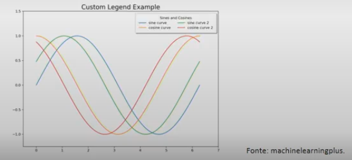

### Módulos próprios

- Os códigos podem ser organizados em diversos arquivos com extensão `.py` ou seja, em módulos.
- Cada módulo pode importar outros módulos, tanto os pertencentes ao mesmo projeto, como os built-in ou de terceiros.
- É dentro do módulo principal que vamos utilizar a funcionalidade de conexão para copiar um arquivo que está em um servidor para outro local.
- É importante ressaltar que, da forma pela qual fizemos a importação, ambos os arquivos `.py` precisam estar no mesmo nível de pasta. Se precisarmos usar o módulo utils em **vários projetos**, é interessante transformá-lo em uma biblioteca e disponibilizá-la via PyPI.

> Conceitos
>
> ## Aplicação de banco de dados com Python

### Introdução a banco de dados

Os sistemas de banco de dados podem ser divididos em duas categorias: **banco de dados relacional** e **banco de dados NoSQL**.

Na teoria base dos bancos de dados relacionais, os dados são persistidos em uma estrutura bidimensional, chamada de relação (que é uma tabela), que está baseada na teoria dos conjuntos pertencentes à matemática. Cada unidade de dados é conhecida como coluna, ao passo que cada unidade do grupo é conhecida como linha, tupla ou registro.

| Exemplo |  A   |    B     |        C         |    D    |   E   |
| :-----: | :--: | :------: | :--------------: | :-----: | :---: |
|    1    |  Id  |   Nome   |       Raça       |   Cor   | Idade |
|    2    |  1   | Caramelo |    Vira lata     | Amarela |   8   |
|    3    |  2   |   Xuxa   |     Dálmata      | Branca  |   3   |
|    4    |  3   |   Lola   | Golden Retriever | Amarela |   4   |
|    5    |  4   | Bolinha  |     Pinscher     |  Preta  |  12   |

Já no **NoSQL** é usado para abordar a classe de banco de dados que não seguem os princípios do sistema de banco de dados relacional (RDBMS) e são projetados especificamente para lidar com a velocidade e a escala de aplicações.

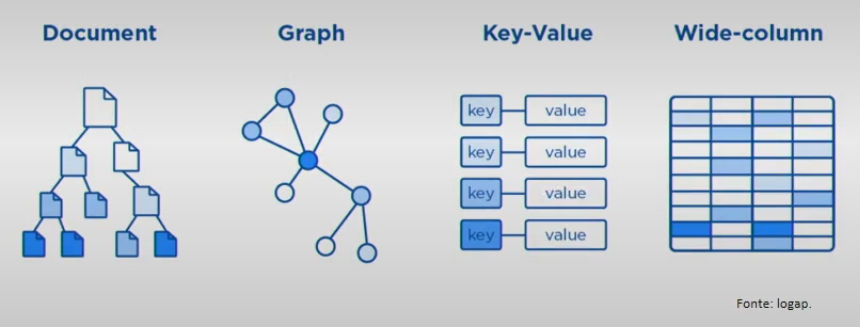

### Linguagem de consulta estruturada - SQL

SQL, significa (structured query language), é a linguagem que permite aos usuários se comunicarem com banco de dados relacionais.

As instruções da linguagem SQL são divididas em três grupos: **DDL**, **DML**, **DCL**.

- **DDL** (Data Definition Language). Fazem parte deste grupo as instruções destinadas a criar, deletar e modificar banco de dados e tabelas. Neste módulo vão aparecer comandos como *CREATE*, o *ALTER* e o *DROP*.
- **DML** (Data Manipulation Language). Fazem parte deste grupo as instruções destinadas a recuperar, atualizar, adicionar ou excluir dados em um banco de dados. Neste módulo vão aparecer comandos como *INSERT*, *UPDATE* e *DELETE*.
- **DCL** (Data Control Language). Fazem parte deste grupo as instruções destinadas a manter a segurança adequada para o banco de dados. Neste módulo vão aparecer comandos como *GRANT* e *REVOK*.

### Conexão com banco de dados relacional

Para fazer a conexão e permitir que uma linguagem de programação se comunique com um banco de dados com a utilização da linguagem SQL, podemos usar as tecnologias **ODBC** (Open Database Connectivity) e **JDBC** (Java Database Connectivite).

A grande vantagem de utilizar as tecnologias ODBC ou JDBC está no fato de que uma aplicação pode acessar diferentes RDBMS sem precisar recompilar o código. Essa transparência é possível porque a comunicação direta com o RDBMS é feita por um driver. Um dirver é um software específico responsável por traduzir as chamadas ODBC e JDBC para a linguagem do RDBMS.

### Conexão de banco de dados SQL em Python

Para se comunicar com um RDBMS em Python, podemos utilizar bibliotecas já disponíveis, com uso das quais, por meio do driver de um determinado fornecedor, será possível fazer a conexão e a execução de comandos SQL no banco.

Por exemplo, para se conectar com um banco de dados Oracle, podemos usar a biblioteca **cx-Oracle**, ou, para se conectar a um PostgreSQL, temos como opção o **psycopg2**.

## BANCO DE DADOS SQLITE

Essa tecnologia pode ser embutida em telefones celulares e computadores e vem incluída em inúmeros outros aplicativos que as pessoas usam todos os dias. Ao passo que a maioria dos bancos de dados SQL usa um servidor para rodar e gerenciar, o SQLite não possui um processo de servidor separado. O SQLite lê e grava diretamente em arquivos de dispostivo de armazenamento, ou seja, um banco de dados SQL completo com várias tabelas, índices, triggers e visualizações está contida em um único arquivo de dispositivo de armazenamento.

O interpretador Python possui o módulo built-in **sqlite3**, que permite utilizar o mecanismo de banco de dados SQLite.

### Criando um banco de dados

O primeiro passo é importar o módulo **sqlite3**. Em razão da natureza do SQLite (ser um arquivo no dispositivo de armazenamento), ao nos conectarmos a um banco, o arquivo é imediatamente criado na pasta do projeto.

```python
import sqlite3
conn = sqlite3.connect('aulaDB.db')
print(type(conn))
```

### Criando uma tabela

Agora que temos uma conexão com um banco de dados, vamos utilizar uma instrução DDL da linguagem SQL para criar a tabela fornecedor. O comando SQL que cria a tabela fonecedor está no código a seguir e foi guardado em uma variável chamada **ddl_create**.

```python
ddl_create = """
CREATE TABLE fornecedor (
    id_fornecedor INTEGER NOT NULL PRIMARY  KEY AUTOINCREMENT,
    nome_fornecedor TEXT NOT NULL,
    cnpj VARCHAR(18) NO TULL,
    cidade TEXT,
    estado VARCHAR(2) NOT NULL,
    cep VARCHAR(9) NOT NULL,
    data_cadastro DATE NOT NULL
);
"""
```

Agora basta utilizar um mecanismo para que esse comando seja executado no banco. Esse mecanismo, segundo o PEP 249, deve estar implementado em um método chamado **execute()** de um objeto **cursor**.

Portanto, sempre que precisarmos executar um comando SQL no banco usando a linguagem Python, usaremos um cursor para construir essa ponte.

Além de criar uma tabela, também podemos excluí-la. A sintaxe para <u>apagar</u> uma tabela (e todos os seus dados) é "*DROP TABLE table_name*".

> Exemplo:
>
> ```python
> import sqlite3
> conn = sqlite3.connect('aulaDB.db')
>
> cursor = conn.cursor()
> cursor.execute(ddl_create)
> print("Tabela criada!")
> print("Descrição do cursor: ", cursor.description)
> print("Linhas afetadas: ", cursor.nowcount)
> cursor.close()
> conn.close()
> ```

### CRUD - Create, Read, Update, Delete

CRUD é um acrônimo para as quatro operações do DML que podemos fazer em uma tabela no banco de dados. Podemos inserir informações (create), ler (read), atualizar (update) e apagar (delete).

Os passos necessários para efetuar uma das operações do CRUD são sempre os mesmos:

- (i) estabelecer a conexão com um banco;
- (ii) criar um cursor e executar o comando;
- (iii) gravar a operação;
- (iv) fechar o cursor e a conexão.

### informações do banco de dados e das tabelas

Além das operações de CRUD, é importante sabermos extrair informações estruturais do banco de dados e das tabelas. Os comandos necessários para extrair essas informações podem mudar entre os bancos.

- **CREATE**: Uma maneira mais prática de inserir vários registros é passar uma lista de tuplas, na qual cada uma destas contém os dados a serem inseridos em uma linha. Nesse caso, teremos que usar o método `executemany()` do cursor.
- **READ**: Recuperar os dados. Também precisamos estabelecer uma conexão e criar um objeto cursor para executar a instrução de seleção. Ao executar a seleção, podemos usar o método `fetchall()` para capturar todas as linhas, através de uma lista de tuplas.
- **UPDATE**: Ao inserir um registro no banco, pode ser necessário alterar o valor de uma coluna, o que pode ser feito por meio da instrução `SQL UPDATE`.
- **DELETE**: Ao inserir um registro no banco, pode ser necessário removê-lo no futuro, o que pode ser feito por meio da instrução `SQL DELETE`.

> Conceito
>
> ## Recaptulando
>
> - Classes e Métodos em Python
> - Bibliotecas e Módulos em Python
> - Aplicação de banco de dados com Python

# Linguagem de programação: Introdução a Biblioteca Pandas

> Prof.ª Elisa Antolli

> ## Contextualização
>
> - Linguagem de programação: Introdução a Biblioteca Pandas
> - Introdução a Manipulação de Dados em Pandas
> - Visualização de Dados em Python

> Conceitos
>
> ## Linguagem de programação: Introdução a Biblioteca Pandas

Pandas é um pacote Python que fornece estruturas de dados projetadas para facilitar o trabalho com dados estruturados (tabelas) e de séries temporais.

Para utilizar a biblioteca pandas é preciso fazer a instalação.

Pandas possui duas estruturas de dados que são as principais para análise/manipulação de dados: a **Series** e o **DataFrame**.

Uma **Series** é um como um vetor de dados (unidimencional), capaz de armazenar diferentes tipos de dados.

Um **DataFrame** é conjunto de Series, ou como a documentação apresentada, um contêiner para Series.

Ambas estruturas, possuem como grande característica, a indexação das linhas, ou seja, cada linha possui um rótulo (nome) que o identifica, o qual pode ser uma string, um inteiro, um decimal ou uma data.

A Figura abaixo ilustra uma Series (A) e um DataFrame (B).

Veja que uma Series possui somente "uma coluna" de informação e seus rótulos (índices). Um DataFrame pode ter uma ou mais colunas e além dos índices, também há um rótulo de identificação com o nome da coluna. Podemos comparar um DataFrame como uma planilha eletrônica, como o Excel (da Microsoft) ou o Calc (do Open Office).

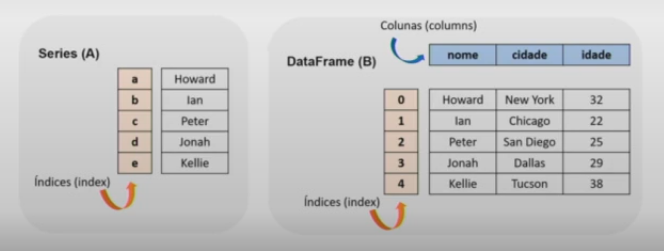

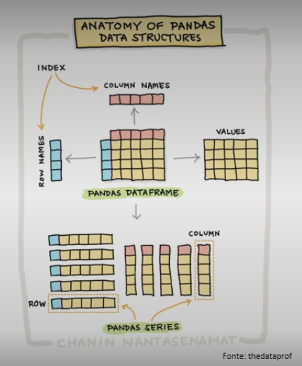

Vamos importar a biblioteca antes de começar nossa primeira linha de código. Por convenção, a biblioteca é importada com o apelido (as) pd. Logo, para utilizar as funcionalidades, vamos utilizar a sintaxe pd.funcionalidades.

```python
import pandas as pd
```

- Series: Precisamos utilizar o método Series() do pacote pandas. O método possui o seguinte construtor: `pandas.Series(data=None, index=None, dtype=None, name=None, copy=False, fastpath=False)`.
- Dentre todos os parâmetros esperados, somente um é obrigatório para se criar uma Series com dados (se for uma Series sem dados, nenhum parâmetro é obrigatório), o parâmetro data=XXX.

> Exemplo:
> ```python
> import pandas as pd
> 
> pd.Series(data=5)
> 
> lista_nomes = 'Howard Ian Peter Jonh Kellie'.split()
> 
> pd.Series(lista_nomes) # Cria uma Series com o valor a lista_nomes = 'Howard Ian Peter Jonh Kellie'.split()
> 
> dados = {
>     'nome1': 'Howard',
>     'nome2': 'Ian',
>     'nome3': 'Peter',
>     'nome4': 'Jonah',
>     'nome5': 'Kelie',
> }
> 
> pd.Series(dados) # Cria uma Series com um dicionário
> ```

Criamos uma Series com um único valor, veja que aparece 0 como índice e 5 como valor.

Quando não deixamos explícito os rótulos (índices) que queremos usar é construído um range de 0 até N-1, onde N é a quantidade de valores.

Criamos uma Series a partir de uma lista de nomes, veja que agora os índices variam de 0 até 4 e o dtype é "object".

Criamos uma Series a partir de um dicionário, a grande diferença desse tipo de dados na construção é que a chave do dicionário é usada como índice.

```python
import panas as pd

series_dados = pd.Series([10.2, -1, None, 15, 23.4])
print('Quantidade de linhas = ', series_dados.shape) # Retorna uma tupla com o número de linhas
print('Tipo de dados ', series_dados.dtypes) # Retorna o tipo de dados, se for misto será objeto
print('Os valores são únicos? ', series_dados.is_unique) # Verifica se os valores são únicos (sem duplicações)
print('Existem valores nulos? ', series_dados.hasnas) # Verifica se existe valores nulos
print('Quantos valores existem? ', series_dados.count()) # Conta quantos valores existem (excluí os nulos)
```

Criamos uma série contando números e um valor nulo (None). As informações extraídas são mais com relação a "forma" dos dados, portanto poderiam ser usadas independente do tipo de dado armazenado na Series, inclusive em um cenário de dados com diferentes tipos.

```bash
Quantidade de linhas = (5,)
Tipo de dados float64
Os valores são úncios? True
Existem valores nulos? True
Quantos valores existem? 4
```

```python
import pandas as pd

series_dados = pd.Series([10.2, -1, None, 15, 23.4])
print('Qual o menor valor? ', series_dados.min()) # Extrei o menor número da Series (nesse caso os dados precisam ser do mesmo tipo)
print('Qual o maior valor? ', series_dados.max()) # Extrai o número máximo, com a mesma condição do mínimo
print('Qual a média aritmética? ', series_dados.mean()) # Extrai a média aritmética de uma Series numérica
print('Qual o desvio padrão? ', series_dados.std()) # Extrai o desvio padrão de uma Series numérica
print('Qual a mediana? ', series_dados.median()) # Extrai a mediana de uma Series numérica
print('\nResumo:\n', series_dados.describe()) # Exibe um resuumo sobre os dados na Series
```

Já as informações neste caso, como se tratam de funções matemáticas e estatísticas, podem fazer mais sentido quando utilizadas para tipos numéricos.

```bash
Qual o menor valor? -1.0
Qual o maior valor? 23.4
Qual a média aritmética? 11.899999999999999
Qual o desvio padrão? 10.184301645179211
Qual a mediana? 12.6

Resumo:
 count     4.000000
mean     11.900000
std      10.184302
min      -1.000000
25%       7.400000
50%      12.600000
75%      17.100000
max      23.400000
dtype: float64
```

DataFrame: utilizar o método DataFrame() do pacote pandas. O método possui o seguinte construtor:

`pandas.DataFrame(data=None, index=None, columns=None, dtype=None, copy=False)`.

Veja que todos os parâmetros possuem valores padrões (default) o que permite instanciar um objeto de diferentes formas. Dentre todos os parâmetros esperados, somente um é obrigatório para se criar um DataFrame com dados, o parâmetro data=XXXX. Esse parâmetro pode receber, um objeto iterável, como uma lista, tupla, um dicionário ou um DataFrame.

### Construtor DataFrame com lista

Invocando o método DataFrame e passando como parâmetro a lista de nomes e um nome (rótulo) para a coluna. Essa construção é para criar um DataFrame, no qual cada lista passe a ser uma coluna.

`pd.DataFrame(lista_nomes, columns=['nome'])`

```python
import pandas as pd


lista_nomes = 'Howard Ian Peter Jonah Kellie'.split()

pd.DataFrame(lista_nomes, columns=['nome'])

print(pd.DataFrame(lista_nomes, columns=['nome']))
```

> Resultado
>
> ```bash
>      nome
> 0  Howard
> 1     Ian
> 2   Peter
> 3   Jonah
> 4  Kellie
> ```

### Construtor DataFrame com dicionário

DataFrames também podem ser construídos a partir de estruturas de dados do tipo dicionário. Cada chave será uma coluna e pode ter atribuída uma lista de valores. Obs.: cada chave deve estar associada a uma lista de mesmo tamanho.

### Extraindo informações de um DataFrame

Cada objeto possui seus próprios atributos e métodos, logo, embora Series e DataFrame tenham recursos em comum, eles também possuem suas particularidades. No DataFrame temos o método **info()** que mostra quantas linhas e colunas existem.

Também exibe o tipo de cada coluna e quantos valores não nulos existem ali. Esse método também retorna uma informação sobre a quantidade de memória RAM essa estrutura está ocupando.

### Seleção de colunas em um DataFrame

Podemos realizar operações em colunas específicas de um DataFrame ou ainda criar um novo objeto contendo somente as colunas que serão usadas em uma determinada análise. Para selecionar uma coluna, as duas possíveis sintaxes são:

```python
nome_df.nome_coluna
nome_df[nome_coluna]
```

A primeira forma é familiar aos desenvolvedores que utilizam a linguagem SQL, porém ela não aceita colunas com espaços entre as palavras. Já a segunda aceita.

Se precisarmos selecionar mais do que uma coluna, então precisamos passar uma lista, da seguinte forma:

```python
nome_df[['col1', 'col2', 'col3']]
```

Se preferir a lista pode ser criada fora da seção e passada como parâmetro. Através da seleção de certas colunas podemos extrair informações específicas e até compará-las com outras counas ou com outros dados.

Esse recurso é muito utilizado por quem trabalha na área de dados.

Um dos grandes recursos da biblioteca pandas é sua capacidade de fazer leitura de dados estruturados, através de seus métodos, guardando em um DataFrame.

A biblioteca possui uma série de métodos "read", cuja sintaxe é: `pandas.read_XXXX()` onde a sequência de X representa as diversas opções disponíveis.

Vamos utilizar o método `read_html()` para capturar os dados e carregar em um DataFrame.

```python
import pandas as pd

url = 'https://en.wikipedia.org/wiki/Minnesota'

dfs = pd.read_html(url)
print(type(dfs))
print(len(dfs))
```

*Sabendo que o tamanho da lista resultado do método é 1, então para obter a tabela que queremos, basta acessar a posição 0 da lista.*

> Conceitos
>
> ## Introdução à manipulação de dados em Pandas

### Métodos para leitura e escrita da biblioteca Pandas

- A biblioteca Pandas foi desenvolvida para trabalhar com dados estruturados, ou seja, dados dispostos em linhas e colunas. Os dados podem estar gravados em arquivos, em páginas web, em APIs, em outros softwares, em objects stores (sistemas de armazenamento em cloud) ou em bancos de dados.
- Para todas essas origens (e até mais), a biblioteca possui métodos capazes de fazer a leitura dos dados e carregar em um DataFrame.
- Dentre todos os possíveis métodos para leitura, nessa aula vamos estudar o **read_json**, o **read_csv** e a função **read_sps**, que contempla a função **read_sel_query**.

> - JSON (JavaScript Object Notation - Notação de Objetos JavaScripts) é uma formatação leve de troca de dados e independente de linguagem de programação.
> - CSV (comma-separated values - valores separados por vírgulas) é um formato de arquivo, nos quais os dados são separados por um delimitador.

### Leitura de JSON e CSV com Pandas

É necessário fazer a importação da biblioteca, só precisamos importar uma única vez no notebook ou no script .py.

```python
import pandas
```

A leitura de um arquivo JSON deve ser feita com o método:

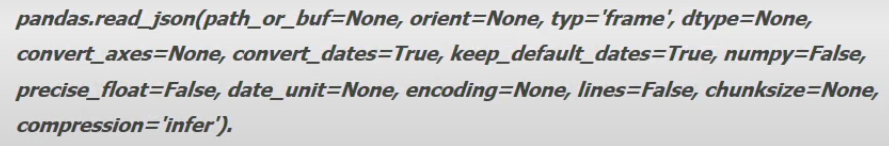

O único parâmetro que é obrigatório para se carregar os dados é o "path_or_buf", no qual deve ser passado um caminho para o arquivo ou um "arquivo como objeto" que é um arquivo lido com a função `open()`, por exemplo.

Estamos usando o método **read_json** para carregar dados de uma API. Veja que estamos passando o caminho para o método. Nessa fonte de dados, são encontradas a taxa selic de cada dia.

```python
pd.read_json("https://api.bcb.gov.br/dados/serie/bcdata.sgs.11/dados?formato=json").head()
```

Para realizar o carregamento dos dados, é necessário incluir o caminho (diretório), portanto o parâmetro "**filepath_or_buffer**" é obrigatório.

Outro parâmetro que é importante para a leitura desse arquivo é o **sep** ou **delimiter** (ambos fazem a mesma coisa), veja que sep, por padrão possui o valor ',', ou seja, caso não seja especificado nenhum valor, então o método fará a leitura dos dados considerando que estão separados por **vírgula**.

O parâmetro header, tem como valor padrão 'infer', que significa que o método realiza a inferência para os nomes das colunas a partir da primeira linha de dados do arquivo.

Além de vários métodos para carregar e salvar os dados, a biblioteca pandas possui uma diversidade de métodos para a transformação dos dados e a extração de informação para áreas de negócio.

O trabalho com dados: capturar os dados em suas origens, fazer transformações nos dados a fim de padronizá-los, aplicar técnicas estatísticas clássicas ou algorítimos de **machine/deep learning** feito por engenheiros e cientistas de dados.

Cada profissional atuando em uma parte específica, dependendo da organização da empresa. Em todo esse trabalho é comum fazer a divisão em duas etapas: **(i) captura e transformação/padronização dos dados**, **(ii) extração de informações**.

> Conceitos
>
> ## Trabalhando com dados

### Etapa de captura e transformação/padronização dos dados

A extração dos dados podem ser realizada por meio do método `read_json()` e guardando em um DataFrame (DF) pandas. Ao carregar os dados em um DF, podemos visualizar quantas linhas e colunas, bem como os tipos de dados em cada coluna, com o método `info()`.

<u>Remover linhas duplicadas</u>

Para o carregamento de uma base de dados, um dos primeiros tratamentos que devemos fazer é remover os dados duplicados. Certamente, saber qual registro remover, depende da área de negócio e do problema a ser resolvido.

Um DataFrame da biblioteca pandas possui o método `meu_df.drop_duplicates()` que permite fazer essa remoção de dados duplicados.

**<u>Criar novas colunas</u>**

A segunda transformação que veremos é como criar uma nova coluna. A sintaxe é similar a criar uma nova chave em um dicionário:

`meu_df['nova_coluna'] = dado.`

Ex.: Uma coluna que adiciona a data de extração das informações:

```python
import pandas as pd
from datetime import date
from datetime import datatime as dt

lista_nomes = 'Howard Ian Peter Jonah Kellie'.split()

dfs = pd.DataFrame(lista_nomes, columns=['nome'])

print(pd.DataFrame(lista_nomes, columns=['nome']))

data_extracao = data.today()
dfs['data_extracao'] = data_extracao

print(dfs.info())
dfs.head()
```

```bash
<class 'pandas.core.frame.DataFram'>
RangeIndex: 5 entries, 0 to 4
Data columns (total 2 columns):
 #   Column         Non-Null Count  Dtype
---  ------         --------------  -----
 0   nome           5 non-null      object
 1   data_extracao  5 non-null      object
dtypes: object(2)
memory usage: 208.0+ bytes
None
```

**<u>Método to datatime() e astype()</u>**

Trabalhar com o tipo "data" pode trazer vantagens, como por exemplo, ordenar da data mais recente para mais antiga. Vamos utilizar os métodos ***pandas.to_datatime()*** e ***minha_series.astype()*** para fazer a conversão e transformar as colunas data e data_extracao.

Nessa conversão usamos o método **astype**, que transforma os dados de uma coluna (que é uma Series) em um determinado tipo, nesse caso, o tipo <u>datetime</u> especificado. Com astype() podemos padronizar valores das colunas, por exemplo, transformando todos em **float**, ou **int**, ou **str**, ou outro tipo. Vamos ver que agora, ao usar o método info(), temos que ambas colunas são do tio datetime (datetime da biblioteca pandas).

O formato resultante ano-mês-dia é um padrão do datetime64[ns], que segue o padrão internacional, no qual o ano vem primeiro, seguido do mês e por último o dia.

Poderíamos usar o stftime() para transformar o traço em barra (/), mas aí o resultado seriam strings e não datas.

*O formato resultante ano-mês-dia é um padrão do datetime64[ns], que segue o padrão internacional, no qual o ano vem primeiro, seguido do mês e por último o dia*.

```python
data_extracao = date.today()
dfs['data_extracao'] = data_extracao
dfs['data_extracao'] = dfs['data_extracao'].astype('datetime64[ns]')

print(dfs.info())
dfs.head()
```

```bash
<class 'pandas.core.frame.DataFrame'>
RangeIncex: 5 entries, 0 to 4
Data columns (total 2 columns):
 #   Column         Non-Null Count  Datype
---  ------         --------------  ------
 0   nome           5 non-null      object
 1   data_extracao  5 nom-null      datetime64[ns]
dtypes: datetime64[ns](1), object(1)
memory usage: 208.0+ bytes
None
```

**Series.str**: Quando selecionamos uma coluna no DF sabemos que o resultado é uma Series e esse objeto tem um recurso "**str**", que permite aplicar as funções de string para todos os valores da Series.

Acessamos o recurso str e aplicamos o método **upper()**. Dessa forma, a biblioteca pandas "entende" que queremos converter todos os valores dessa coluna para letras maiúsculas.

**Método serot_values()**: **sort_values()** que permite ordenar o DF, de acordo com os valores de uma coluna. Esse método é do DataFrame, por isso a notação `meu_df.metodo()`. Utilizamos três parâmetros do método `sort_values`, o primeiro informando qual coluna deve ser usada para ordenar, o segundo, para que seja feito em ordem decrescente (do maior para o menor) e o terceiro (`inplace=True`) significa que queremos modificar o próprio objeto, na prática estamos sobrescrevendo o DF.

```python
data_extracao = date.today()
dfs['data_extracao'] = data_extracao
dfs['data_extracao'] = dfs['data_extracao'].astype('datetimes64[ns]')
dfs.sort_values(by='data_extracao', ascending=False, inplace=True)

print(dfs.head())
```

```bash
    nome
0 Howard
1 Ian
2 Peter
3 Jonah
4 Kellie
    nome data_extracao
0 Howard    2022-11-10
1 Ian       2022-11-10
2 Peter     2022-11-10
3 Jonah     2022-11-10
4 Kellie    2022-11-10
```

```python
data_extracao = dt.now()
dfs['data_extracao'] = data_extracao
dfs['data_extracao'] = dfs['data_extracao'].astype('datetime64[ns]')
dfs=dfs.append({'nome' : 'TESTE' , 'data_extracao' : dt(2020, 5, 17)} , ignore_index=True)

dfs.sort_values(by='data_extracao', ascending=Fasle, inplace=True)

print(dfs)
```

```bash
     nome              data_extracao
0  Howard 2022-11 10 17:06:21.838743
1     Ian 2022-11 10 17:06:21.838743
2   Peter 2022-11 10 17:06:21.838743
3   Jonah 2022-11 10 17:06:21.838743
4  Kellie 2022-11 10 17:06:21.838743
5   TESTE 2020-05 17 00:00:00.000000
```

**<u>Método reset index() e set index()</u>**

Nenhuma transformação afeta o índice, lembra-se como não especificamos rótulos ele usa um intervalo numérico, mas esse intervalo é diferente da posição de um vetor, pois é um nome e vai acompanhar a linha independente da transformação.

As únicas formas de alterar o índice são com os métodos **reset_index()** e **set_index()**. o primeiro redefine o índice usando o padrão e o segundo define novos índices.

Durante a  transofrmação dos dados, pode ser necessário definir novos valores para os índices, ao índices de usar o range numérico. Essa transformação pode ser feita usando o método **meu_df.set_index()**. O método permite especificar os novos valores usando uma coluna já existente ou então passando uma lista, de tamanho igual a quantidade de linhas.

**<u>Filtros com loc</u>**

Um dos recursos mais utilizados por equipes das áreas de dados é a aplicação de filtros. A distinção por gênero, por exemplo, pode ser um filtro.

Um exemplo de filtro poderia possibilitar comparar a idade de todos, com a idade de cada grupo e entender se as mulheres ou homens estão abaixo ou acima da média geral.

DataFrames da biblioteca pandas possuem uma propriedade chamada **loc**, essa propriedade permite acessar um conjunto de linhas (filtrar linhas), por meio do índice ou por um vetor booleano (vetor de **True** ou **False**).

**<u>Filtros com testes booleanos</u>**

Podemos usar operadores relacionais e lógicos para fazer testes condicionais com os valores das colunas de um DF.

Ao criarmos um teste condicional, internamente, a biblioteca testa todas as linhas do DF ou da Series, retornando uma Series booleana, ou seja, composta por valores **True** ou **False**.

O teste condicional pode ser construído também utilizando operadores lógicos. Para a operação lógica **AND** (E), em pandas, usa-se o caracter **&**. Para fazer a operação lógica OR (OU), usa-se o caracter **|**.

Cada teste deve estar entre parênteses, senão ocorre um erro.

ao criar as condições, basta aplicá-las no DataFrame para criar o filtro.

a construção é feita passando a condição para a propriedade **loc**.

| Nome | Idade |
| :----: | :---: |
| Howard | 30 |
| Ian    | 30 |
| Peter  | 30 |
| Jonah  | 30 |
| Kellie | 30 |
| TESTE | 25 |

```python
dfs = pd.DataFrame(lista_nomes, columns=['nome'])

dfs['idade'] = 30
dfs=dfs.append({'nome' : 'TESTE' , 'idade' : 25} , ignore_index=True)

#print(dfs)

print(dfs.log[(dfs['idade'] < 30)])
```

```bash
    nome  idade
5  TESTE  25
```

**<u>Banco de dados com pandas</u>**

Além dos métodos para acessar arquivos, a biblioteca pandas possui dois métodos que permitem executar instruções SQL em banco de dados.

1. `pandas.read_sql(sql, con, index_col=None, coerce_float=True, params=None, parse_dates=None, columns=None, chunksize=None)`
2. `pandas.read_sql_query(sql, con, index_col=None, coerce_float=True, params=None, parse_dates=None, chunksize=None)`

> *O mínimo de parâmetros que ambos métodos exigem é a instrução SQL e uma conexão com um banco de dados (con). A conexão com o banco de dados, deve ser feita usando uma outra biblioteca, por exemplo, sqlalchemy (suporte para diversos bancos), pyodbc para SQL Server, cx_Oracle para Oracle, psycopg2 para Postgresql, dentre outros.*

> Conceitos
>
> ## Visualização de dados em Python

**<u>Bibliotecas e funções para criação de gráficos</u>**

Para a criação de gráficos em Python são utilizadas as bibliotecas <u>matplotib</u> e outras baseadas na matplotlib, além de funções que permitem criar e personalizar os gráficos.

**<u>Matplotlib</u>**

A instalação da biblioteca pode ser feita via pip install: `pip install matplotlib`, lembrando que em ambientes como o projeto Anaconta e o Colab esse recurso já está disponível.

Existem duas sintaxes que são amplamente adotadas para importar essa biblioteca para o projeto:

```python
import matplotlib.pyplot as plt
```

```python
from matplotlib import pyplot as plt
```

Em ambas formas de importação utilizamos o apelido de "plt" que é uma convenção adotada para facilitar o uso das funções.

Ao trabalharmos no jpyter notebook com o kernel do IPypthon (o kernel do IPython é o backend de execução do Python para o Jupyter), podemos habilitar uma opção para fazer a impressão do gráfico "inline", ou seja, no próprio notebook. Para habilitar utiliza-se a sintaxe `%matplotlib inline`.

Portanto, projetos no jupyter notebook, que utilizem o matplotlib sempre terão no começo, os comandos a seguir.

```python
from matplotlib import pyplot as plt
%matplotlib inline
```

Vamos criar duas listas aleatórias de valores inteiros com o módulo random e então plotar um gráfico de linhas, com a função **plt.plot()** do módulo pyplot.

Após criar duas listas com valores aleatórios, a função plot() as recebe como parâmetros, utilizando-as para os valores dos eixos **horizontal** (x) e **vertical** (y) e já cria o gráfico.

<u>Parâmetros e muitos outros, podem ser configurados!</u>

> Exemplo
>
> ```python
> import matplotlib.pyplot as plt
> import random
> 
> dados1 = random.sample(range(100), k=20)
> dados2 = random.sample(range(100), k=20)
> 
> plt.plot(dados1, dados2) # Pyplot gerencia a figura e o exio
> ```
>
> 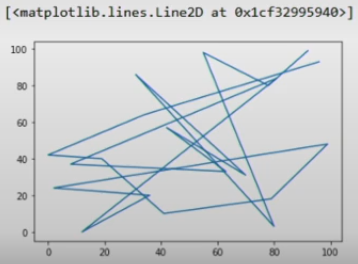

**<u>Existem essencialmente duas maneiras de usar o Matplotlib</u>**:

Deixar para o pyplot criar e gerenciar automaticamente figuras e eixos, e usar as funções do pyplot para plotagem.

Criar explicitamente figuras e eixos e chamar métodos sobre eles (o "estilo orientado a objetos (OO)").

No gráfico que criamos, nós utilizamos a opção 1, ou seja, foi o próprio módulo que criou o ambiente da figura e do eixo.

Ao utilizar a segunda opção, podemos criar uma figura com ou sem eixos, com a função **plt.supblots()**, que quando invocada sem parâmetros, cria um layout de figura com 1 linha e a coluna.

**Bilioteca pandas**

As principais estruturas de dados da biblioteca pandas (Series e DataFrame) possuem o método **plot()**, construído com base no matplotlib e que permite criar gráficos a partir dos dados nas estruturas.

A partir de um DataFrame, podemos invocar o método:

```python
df.plot(*args, **kwargs)
```

Para criar os gráficos. Os argumentos dessa função, podem variar, mas existem três que são triviais: os **nomes** das colunas com os dados para os eixos **x** e **y**, bem como o tipo de gráfico (kind).

**Biblioteca seaborn**

Seaborn é outra biblioteca Python, também baseada na matplotlib, que foi desenvolvida especificamente para criação de gráficos. Seaborn pode ser instalado via pi install: `pip install seaborn`, e para utilizar no projeto existe uma convenção para sintaxe:

```python
import seaborn as sns
```

A biblioteca conta com um repositório de datasets que podem ser usados para explorar as funcionalidades. O tipo de dados que uma coluna possui é muito importante para a biblioteca seborn, uma vez que as funções usadas para construir os gráficos são divididas em grupos: relacional, categóricos, distribuição, regressão, matriz e grid.

**Função barplot()**

Dentro do grupo de funções para gráficos de variáveis categóricas, temos o **barplot()**, que permite criar gráficos de barras, mas... por que usaríamos essa função e não a da biblioteca pandas?

A resposta está nas opções de parâmetros que cada biblioteca suporta. Construtor da função bartplot possui uma série de parâmetros estatísticos, que dão muita flexibilidade e poder aos cientista de dados, vamos falar sobre o parâmetro "**estimator**", que por default é a função média. Isso significa que cada barra do gráfico, exibirá a média dos valores de uma determinada coluna, o que pode não fazer sentido, uma vez que queremos exibir a quantidade dos valores (len) ou a soma (sum).

Existem muitos conceitos estatísticos envolvidos e a biblioteca saborn fornece mecanismos para que essas informações estejam presentes nos resultados visuais.

**Função countplot()**

Esse método não aceita que sejam passados valores de x e y ao mesmo tempo, pois a contagem será feita sobre uma variável categórica, portanto devemos especificar **x** ou **y**, a diferença será na orientação do gráfico. Se informamos **x**, teremos um gráfico na *vertical*, se **y**, na *horizontal*.

**Função scartterplot()**

Os gráficos do grupo relaciona, permitem avalizar, de forma visual a relação entre duas variáveis: **x**, **y**. O gráfico scatterplot é muito utilizado por cientistas de dados que estão buscando por padrões nos dados.

**Função countplot()**

> Como definir
>
> ```python
> df = sns.load_dataset("titanic")
> sns.countplot(x=df["class"])
> ```
>
> .png)

**Função scartterplot()**

> Como definir
>
> ```python
> sns.scatterplot(data=tips, x="total_bill", y="tip")
> ```
>
> .png)

---

> Conceitos
>
> ## Recaptulando

- Linguagem de programação: Introdução à Biblioteca pandas
- Introdução à Manipulação de Dados em Pandas
- Visualização de Dados em Python

