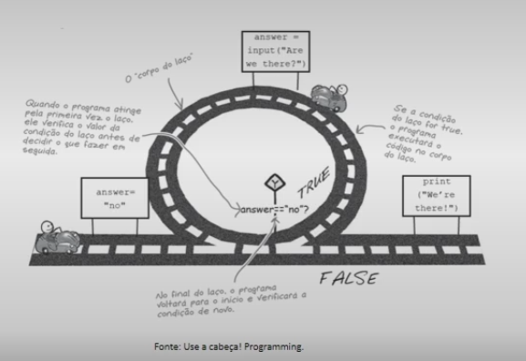

#  Linguagem de Programação

## Introdução à Linguagem Python

### Prof.ª Elisa Antolli (Mestre em Ciência da Computação)

---

## Principais conceitos de programação em Python

- A linguagem Python
- Ferramentas
- Estruturas lógicas, condicionais e de repetição
- Funções
- Exemplos de códigos

> Conceitos

## Introdução linguagem de Programação Python

O que é Linguagem de Programação?

- As linguagens de programação foram criadas para solucionar qualquer tipo de problema na área tecnológica computacional.
- Cada linguagem possui suas particularidades.
- Permite que um programador crie programas a partir de um conjunto de ordens, ações consecutivas, dados e algorítimos.
- Python é uma linguagem de script de alto nível, de tipagem forte e dinâmica.

## Primeiros passos em Python

- Vamos criar nosso primeiro programa em Python.

  ```python
  print("Hello, World!")
  ```

  ```tex
  Hello, World!
  ```

## A Linguagem Python

- Criado no início dos anos 1990 por Guido van Rossum no Stichting Mathematisch Centrum (CWI), na Holanda, foi sucessor de uma linguagem chamada ABC.
- Em 2001, a Python Software Foundation (PSF) foi formada, uma organização sem fins lucrativos criada especificamente para possuir a propriedade intelectual relacionada ao Python.

### Porque Python?

- Python é uma linguagem de programação clara e poderosa.
- usa sintaxe clara, facilitando a leitura dos programas que você escreve;
- Linguagem fácil, ideal para o desenvolvedor de protótipos e outras tarefas de programação;
- Grande biblioteca padrão, suporta muitas tarefas de programação;
- Possui inúmeras bibliotecas que estendem seu poder de atuação.
- Linguagem interpretada, ou seja, uma vez escrito o código, este não precisa ser convertido em linguagem de máquina por um processo de compilação;
- Permite atribuição múltipla;
- O interpretador Python 3 utiliza unicode por padrão, o que torna possível usar nomes de variáveis com acento e até outros caracteres especiais, porém não é uma boa prática.
- Códigos em Python pode ser feito tanto em local quanto em nuvem.

## Instalação do interpretador Python:

[https://www.python.org/downloads/](https://www.python.org/downloads/)

Na instalação, marcar a opção "Add Python 3.x to PATH".

O Python instalado, já podemos digitar comandos python:

> No terminal

```bash
print("Olá mundo!")
```

> Resultado

```bash
Olá mundo!
```

## Ferramentas

- Para implementação de soluções, normalmente utiliza-se uma IDE, (Integrated Development Environment) ou Ambiente de Desenvolvimento Integrado.

- Duas IDE's disputam a preferência dos desenvolvedores Python, o PyCharm e o Visual Studio Code (VSCode).

  - PyCharm: Profissional e Community, sendo a primeira paga e a segunda gratuita.
  - VSCode: Gratuito.

- Python Anaconda ([https://www.anaconda.com/distribution/](https://www.anaconda.com/distribution/)).

  Consiste na unição de ferramentas Python, composta por bibliotecas e IDE's.

- Possui tanto o interpretador Python quanto bibliotecas, duas interfaces de desenvolvimento: a IDE spyder e o projeto Jupyter.

- Grande diferencial do projeto Anaconda é ter o Jupyter Notebook ([https://jupyter.org/](https://jupyter.org/)) integrado na instalação, principalmente para o uso sistemas de controle de versão (como o Git / GitHub).

- Google Colaboratory (Colab)

  [https://colab.research.google.com/notebooks/](https://colab.research.google.com/notebooks/)

- Especialmente adequado para aprendizado de máquina, análise de dados e educação. Colab é um serviço de notebook Jupyter hospedado que não requer configuração para ser usado.

---

> Conceitos

## Variáveis e tipos básicos de dados em Python

### Variáveis

- Variáveis são espaços alocados na memória RAM para guardar valores temporariamente.
- Em Python, esses espaços não precisam ser tipados, a variável pode ser alocada sem especificar o tipo de dado que ela aguardará.
- As variáveis são tipadas dinamicamente nessa linguagem.

Exemplos:

- Para saber o tipo de dado que uma variável guarda, podemos imprimir seu tipo usando a função type(), veja como:

  ```python
  x = 10
  name = "Teste"
  nota = 8.5
  flag = True
  
  print(type(x))
  print(type(name))
  print(type(nota))
  print(type(flag))
  ```

  > Resultado

  ```bash
  <class 'int'>
  <class 'str'>
  <class 'float'>
  <class 'bool'>
  ```

  Em Python, tudo é objeto! Por isso os tipos de dados aparecem com a palavra "class".

  Função input() faz a leitura de um valor digitado.

  Veja como usar:

  ```python
  name = input("Digite um nome: ")
  print(name)
  ```

  > Resultado

  ```bash
  Digite um nome: Marcos
  Marcos
  ```

  Temos uma variedade de formas de imprimir texto e variável em Python.

  Vejamos algumas:

  - podemos usar formatadores de caracteres (igual em C)
  - podemos usar a função format() e
  - podemos criar uma string formatada.

  **Modlo 1: usando Formatadores de caracteres (igual na linguagem C):**

  *print("Oá %s, bem vindo a disciplina de programação. Parabéns pelo seu primeiro hello world" % (name))*

  ```python
  name = input("Digite um nome: ")
  print("Olá %s, bem vindo a disciplina de programação. Parabéns pelo seu primeiro hello world" % (name))
  ```

  > Resultado

  ```bash
  Digite um nome: Marcos
  Olá Marcos, bem vindo a disciplina de programação. Parabéns pelo seu primeiro hello world
  ```

  **Modo 2: usando a função format() para imprimir variável e texto:**

  ```python
  print("Olá {}, bem vindo a disciplina de programação. Parabéns pelo seu primeiro hello world".format(name))
  ```

  **Modo 3: usando strings formatadas**

  ```python
  print(f"Olá {name}, bem vindo a disciplina de programação. Parabéns pelo seu primeiro hello world")
  ```

- Usamos o hash # para criar comentários de uma linha.

- Nessa PEP, a 498, o autor destaca o uso do "modo 3" como a melhor opção, chamando-a de "f-strings".

- As strings formatadas com "f-strings" só podem ser usadas com o interpretador Python na versão 3.6.

---

## Operações matemáticas suportadas por Python

Com exceção das funções abs() e pow() e da notação de potência **, as outras operações e sintaxe são similares a diversas linguagens de programação.

| Operation       | Result                                                       |
| --------------- | ------------------------------------------------------------ |
| x + y           | sum of x and y                                               |
| x - y           | difference of x and y                                        |
| x * y           | product of x and y                                           |
| x / y           | quotient of x and y                                          |
| x // y          | floored quotient of x and y                                  |
| x % y           | remainder of x / y                                           |
| -x              | x negated                                                    |
| abs(x)          | absolute value or magnitude of x                             |
| int(x)          | x converted to integer                                       |
| float(x)        | x converted to floating point                                |
| complex(re, im) | a complex number with real part / imaginary part *im. im* defaults to ... |
| c.conjugate()   | conjugate of the complex number...                           |
| divmod(x, y)    | the pair (x // y, x % y)                                     |
| pow(x, y)       | x to the power y                                             |
| x ** y          | x to the power y                                             |

Repare como é fundamental conhecer a ordem de procedências das operações para não criar cálculos errados durante a implementação de uma solução.

1. Primeiro resolvem-se os parênteses, do mais interno para o mais externo.
2. Exponenciação.
3. Multiplicação e divisão.
4. Soma e subtração.

```python
# Qual o resultado armazenado na variável operacao_1: 25 ou 17?
operacao_1 = 2 + 3 * 5
# Qual o resultado armazenado na variável operacao_2: 25 ou 17?
operacao_2 = (2 + 3) * 5
# Qual o resultado armazenado na variável operacao_3: 4 ou 1?
operacao_3 = 4 / 2 ** 2
# Qual o resultado armazenado na variável operacao_4: 1 ou 5?
operacao_4 = 13 % 3 +4
```

> Resultado

```bash
Resutlado em operacao_1 = 17
Resutlado em operacao_2 = 25
Resutlado em operacao_3 = 1.0
Resutlado em operacao_4 = 5
```

---

## Estruturas Lógicas, Condicionais e de Repetição em Python

Em geral, em um programa você tem opções de caminhos ou lista de comandos que nada mais são que trechos de códigos que podem ser executados, devendo-se tomar decisões sobre qual trecho de código será executado em um determinado momento.


Para tomarmos decisões, precisamos dos operadores relacionais:

| Operador | Descrição          |
| -------- | ------------------ |
| ==       | Igual              |
| !=       | Não igual          |
| >        | Maior que          |
| <        | Menor que          |
| >=       | Maior que ou igual |
| <=       | Menor que ou igual |

O comando `if.. else..` significam `se.. senão..` e são usados para construir as estruturas condicionais.


### Estrutura condicional simples:

```python
nome = 'Daniel'
sobrenome = ''
lista = []

if name:
    print('A variável nome não é vazia')
```

No java, temos o seguinte modelo:

```java
if (operation) {
    // Bloco do resultado...
}
```

No Python, o modelo é baseado em tabulações:


### Estrutura composta:

```python
valor1 = 10
valor2 = 20

if valor1 > valor2:
    print('O valor1 é maior do que o valor2')

else:
    print('O valor 2 é maior do que o valor1')
```

> A composta, refere-se ao `if` e o `else`.

### Estrutura encadeada, devemos usar o comando "elif", que é uma abreviação de else if.

```python
cor = "alguma cor"

if cor == 'verde':
    print('Acelerar')

elif cor == 'amarelo':
    print('Atenção')

else:
    print('Parar')
```

### Estruturas lógicas em Python: `and`, `or`, `not`

Podemos usar os operadores booleanos para construir estruturas de decisões mais complexas.

Operador booleano **and**: o resultado será *True*, quando os dois argumentos forem verdadeiros.

Operador booleano **or**: o resultado será *True*, quando pelo menos um dos argumentos for verdadeiro.

Operador booleano **not**: ele irá inverter o valor do argumento.

Portanto, se o argumento for verdadeiro, a operação o transformará em false e vice-versa.

**Exemplo:**

Estrutura condicional usando os operadores booleanos. Um aluno só pode ser aprovado caso ele tenha menos de 5 faltas e média final igual ou superior a 7.

```python
dtde_faltas = int(input("Digite a quantidade de faltas: "))
media_final = float(input("Digite a média final: "))

if dtde_faltas <= 6 and media_final >= 7:
    print("Aluno aprovado!")

else:
    print("Aluno reprovado!")
```

### Estruturas de Repetição

Estrutura de repetição em Python: **while** e **for**:

Em uma estrutura de repetição sempre haverá uma estrutura de decisão, pois a repetição de um trecho de código sempre está associada a uma condição. Ou seja, um bloco de comandos será executado repetidas vezes, até que uma condição não seja mais satisfeita.



O comando while deve ser utilizado para construir e controlar a estrutura decisão, sempre que o número de repetições não seja conhecido.

```python
numero = 1

while numero != 0:

    numero = int(input("Digite um número: "))

    if numero % 2 == 0:
        print("Número par!")
    else:
        print("Número ímpar!")
```

> todo o bloco com a identação de uma tabulação (4 espaços) faz parte da estrutura de repetição.
> Lembre: todos os blocos de comandos em Python são controlados pela identação.

Na prática é comum utilizarmos esse tipo de estrutura de repetição, com o **while**, para deixarmos serviços executando em servidores.

A instrução Python for itera sobre os itens de qualquer sequência, por exemplo, iterar sobre os caracteres de uma palavra, pois uma palavra é um tipo de sequência.

O comando **for** seguido da variável de controle "c", na sequência o comando "in", por fim, a sequência sobre a qual a estrutura deve iterar. Os dois pontos marcam o início do bloco que deve ser repetido.

```python
nome = "Guido"

for c in nome:
    print(c)
```

Com o comando for, podemos usar a função enumerate() para retornar à posição de cada item, dentro da sequência.

Considerando o exemplo dado, no qual atribuímos a variável "nome" o valor de "Guido", "G" ocupa a posição 0 na sequência, "u" ocupa a posição 1, "i" a posição 2, e assim por diante. Veja que a variável "i" é usada para capturar a posição e a variável "c" cada caractere da palavra.

```python
nome = "Guide"
for i, c in enumerate(nome):
    print(f"Posição = {i}, valor = {c}")
```

Controle de repetição com **range**, **break** e **continue**:

Python requer uma sequência para que ocorra a iteração. Para criar uma sequência numérica de iteração em Python, podemos usar a função range().

```python
for x in range(5):
    print(x)
```

> No comando, "x" é a variável de controle, ou seja, a cada iteração do laço, seu valor é alterado, já a função range() foi utilizada para criar um "iterable" numérico (objeto iterável) para que as repetições acontecesse.

### A função range() pode ser usada de três formas distintas:

Método 1: Passando um único argumento que representa a quantidade de vezes que o laço deve repetir;

Método 2: Passando dois argumentos, um que representa o início das repetições e outro o limite superior (NÃO INCLUÍDO) do valor da variável de controle;

Método 3: Passando três argumentos, um que representa o início das repetições; outro, o limite superior (NÃO INCLUÍDO) do valor da variável de controle e um que representa o incremento.

Além de controlar as iterações com o tamanho da sequência, outra forma de influenciar no fluxo é por meio dos comandos "*break*" e "*continue*".

O comando **break** "para" a execução de uma estrutura de repetição, já com o comando **continue**, conseguimos "pular" algumas execuções, dependendo de uma condição.

**Exemplo 1**

```python
# Exemplo de uso do break
disciplina = "Linguagem de programação"

for c in disciplina:
    if c == 'a':
        break
    else:
        print(c)
```

**Exemplo 2**

```python
# Exemplo de uso do continue
disciplina = "Linguagem de programação"
for c in disciplina:
    if c == 'a':
        continue
    else:
        print(c)
```

---

> Conceitos

## Implementando Soluções em Python Mediante Funções

Soluções dividindo-a em funções (blocos), além de ser uma boa prática de programação, tal abordagem facilita a leitura, a manutenção e a escalabilidade da solução.

- print() é uma função built-in do interpretador Python

Função **built-in** é um objeto que está integrado ao núcleo do interpretador, não precisa ser feita nenhuma instalação adicional.


A função `eval()` usada no código recebe como entrada uma string digitada pelo usuário, que nesse caso é uma equação linear.

```python
a = 2
b = 1

equacao = input("Digite a fórmula geral da equação linear (a * x + b): ")
print(f"\nA entrada do usuário {equacao} é do tipo {type(equacao)}")

for x in range(5):
    y = eval(equacao)
    print(f"\nResultado da equação para x = {x} é {y}")
```

Essa entrada é analisada e avaliada como uma expressão Python pela função eval(). Veja que, para cada valor de x, a fórmula é executada como uma expressão matemática (linha 8) e retorna um valor diferente. Prudência para o uso, pois é fácil alguém externo à aplicação fazer uma "injection" de código intruso.

### Função definida pelo usuário

- Podemos escolher o nome da função, sua entrada e sua saída.
- Nomes das funções devem estar em minúsculas, com as palavras separadas por underline, conforme necessário, para melhorar a legibilidade.
- Os nomes de variáveis seguem a mesma convenção que os nomes de funções.
- É preciso abir e fechar parênteses, pois é dentro dos parênteses que os parâmetros de entrada da função devem ser definidos.
- Usamos o comando "def" para indicar que vamos definir uma função. Em seguida, escolhermos o nome da função "imprimir_mensagem".

**Exemplo:**

A função abaixo recebe dois parâmetros. Esses parâmetros são variáveis locais, ou seja, são variáveis que existem somente dentro da função.

```python
def imprimir_mensagem(disciplina, curso):

    print(f"Minha primeira função em Python desenvolvida na disciplina: {disciplina}, do curso: {curso}.")

imprimir_mensagem("Python", "ADS")
```

### Funções com parâmetros definidos e indefinios

Sobre os argumentos que uma função pode receber, para nosso estudo, vamos classificar em seis grupos:

1. Parâmetro posicional, obrigatório, sem valor default (padrão), tentar invocar a função, sem passar os parâmetros, acarreta um erro.

   ```python
   def somar(a, b):
       return a + b
   
   r = somar(2, 3)
   print(r)
   ```

2. Parâmetro posicional, obrigatório, com valor default (padrão), quando a função for invocada, caso nenhum valor seja passado, o valor default é utilizado.

   ```python
   def calcular_desconto(valor, desconto=0):
       # O parâmetro desconto possui zero valor default
       valor_com_desconto = valor - (valor * desconto)
       return valor_com_desconto
   
   valor1 = calcular_desconto(100) # Não aplicar nenhum desconto
   valor2 = calcular_desconto(100, 0.25) # Aplicar desconto de 25%
   
   print(f"\nPrimeiro valor a ser pago = {valor1}")
   print(f"\nSegundo valor a ser pago = {valor2}")
   ```

3. Parâmetro nominal, obrigatório, sem valor default (padrão). Não mais importa a posição dos parâmetros, pois eles serão identificados pelo nome, a chamada da função é obrigatório passar todos os valores e sem valor default.

   ```python
   def converter_maiuscula(texto, flag_maiuscola):
       if flag_maiuscola:
           return texto.upper()
       else:
           return texto.lower()
   
   texto = converter_maiuscula(flag_maiuscola=True, texto="João") # Passagem nominal de parâmtros
   print(texto)
   ```

4. Parâmetro nominal, obrigatório, com valor default (padrão), nesse grupo os parâmetros podem possuir valor default.

   ```python
   def converter_minuscula(texto, flag_minuscula=True): # O parâmtro flag_minuscula possui True como valor default
       if flag_minuscula:
           return texto.lower()
       else:
           return texto.upper()
   
   texto1 = converter_minuscula(flag_minuscula=True, texto="LINGUAGEM de Programação")
   texto2 = converter_minuscula(texto="LINGUAGEM de Programação")
   print(f"\nTexto 1 {texto1}")
   print(f"\nTexto 2 {texto2}")
   ```

5. Parâmetro posicional e não obrigatório (args), a passagem de valores é feita de modo posicional, porém a quantidade não é conhecida.

   ```python
   def imprimir_parametros(*args):
       qtde_parametros = len(args)
       print (f"Quantidade de parâmetros = {qtde_parametros}")
   
   for i, valor in enumerate(args):
       print(f"Posição = {i}, valor = {valor}")
   
   print("\nChamada 1")
   imprimir_parametros("São Paulo", 10, 23.78, "João")
   print("\nChamada 2")
   imprimir_parametros(10, "São Paulo")
   ```

6. Parâmetro nominal e não obrigatório (kwargs), agora a passagem é feita de modo nominal e não posicional, o que nos permite acessar tanto o valor do parâmetro quanto o nome da variável que o armazena.

   ```python
   def imprimir_parametros(**kwargs):
       print(f"Tipo de objeto recebido = {type(kwargs)}\n")
       qtde_parametros = len(kwargs)
       print(f"Quantidade de parâmetros = {qtde_parametros}")
   
       for chave, valor in kawargs.items():
           print(f"variável = {chave}, valor = {valor}")
   
   print("\nChamada 1")
   imprimir_parametros(cidade="São Paulo", idade=33, nome="João")
   print("\nChamada 2")
   imprimir_parametros(desconto=10, valor=100)
   ```

### Funções anônimas em Python

Uma função anônima é uma função que não é construída com o "def" e, por isso, não possui nome. Esse tipo de construção é útil, quando a função faz somente uma ação e é usada uma única vez.

Poderoso recurso da linguagem Python: a expressão "lambda".

```python
somar = lambda x, y: x + y
somar(x=5, y=3)
```

