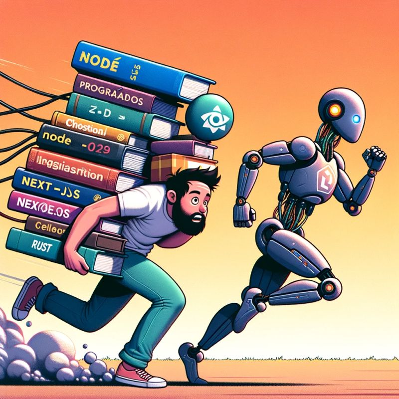

# Engenharia de Software

---

Os profissionais que concluem o curso de Engenharia de Software - Bacharelado podem ser chamados de "engenheiros de software". Assim como os formados em medicina são chamados de médicos, os formados em engenharia de software são chamados de engenheiros de software porque adquirem as habilidades e conhecimentos necessários para projetar, desenvolver e manter software de alta qualidade e complexidade. Essa é a designação profissional comum para aqueles que concluem esse curso.

|                            Perfil                            | Marcos Aurélio Rocha da Silva                                |
| :----------------------------------------------------------: | ------------------------------------------------------------ |
|                                    | *"**Estudante de Engenharia de Software - Bacharelado** na Faculdade ANHANGUERA, apaixonado por desvendar os mistérios do código e da inovação. Compartilhando aprendizados e insights nessa jornada para simplificar o complexo. ✨ #EngenhariaDeSoftware #CódigoCriativo"*  **Eu**: *"Sou um entusiasta do Linux e apaixonado por sua filosofia de código aberto, sempre imerso em explorar suas infinitas possibilidades. Como programador e técnico de informática, minha jornada no mundo da tecnologia é marcada por uma diversidade de papéis. Além disso, sou empresário e atualmente exerço o importante papel de funcionário público, atuando como motorista de veículos de emergência, como ambulâncias, no sudeste do Maranhão. Morando nessa região, encontro inspiração na diversidade cultural e na riqueza de paisagens. Comprometimento e dedicação são meus pilares enquanto persigo meus objetivos, tanto no campo profissional quanto no pessoal."* |
|        *"Quem estuda sabe, quem não sabe acredita."*         | Essa frase não possui um autor específico amplamente reconhecido. É uma expressão comum que reflete a ideia de que a experiência de estudar proporciona um conhecimento mais profundo e real, enquanto quem não tem esse conhecimento pode basear suas crenças em suposições ou ideias superficiais. |
| "Engenharia de Software e IA."   | Em plena era da Inteligência Artificial, tem gente que acha que engenharia de software é só questão de digitar códigos.  Aí vem a surpresa: mesmo os códigos mais tops ficam ultrapassados perto de uma IA que aprende e se aprimora sozinha. O futuro é dos engenheiros que manjam de ensinar máquinas e criar arquiteturas robustas, não só de programar. E aí, continua na vibe de só aprender a última linguagem de programação que tá na moda? |

[Linguagem de programação](./ProgrammingLanguage/README.md)

