# Engenharia de Software

> ## Sumário
>
> - [Princípios da Engenharia de Software](#princípios-da-engenharia-de-software "Princípios da Engenharia de Software")
> - [Fundamentos da Engenharia de Software](#fundamentos-da-engenharia-de-software "Fundamentos da Engenharia de Software")
> - [Tipos de Software](#tipos-de-software "Tipos de Software")
> - [Crise do Software](#crise-do-software "Crise do Software")
> - [Eternos Mitos](#eternos-mitos "Eternos Mitos")
> - [Modelo de Processo](#modelo-de-processo "Modelo de Processo")
> - [Processos de Software](#processos-de-softwares "Processos de Software")
>     - [4 Atividades Fundamentais](#4-atividades-fundamentais "4 Atividades Fundamentais")
>     - [Modelos de Processos](#modelos-de-processos "Modelos de Processos")
> - [Metodologia Ágil](#metodologia-ágil "Metodologia Ágil")
>     - [Histórico](#histórico "Histórico")
>     - [Características Fundamentais das Metodologias Ágeis](#características-fundamentais-das-metodologias-ágeis "Características Fundamentais das Metodologias Ágeis")
>     - [Metodologia Ágil - Extreme Programming (XP)](#metodologia-%C3%A1gil---extreme-programming-xp "Metodologia Ágil - Extreme Programming (XP)")
> - [Equipe de Trabalho](#equipe-de-trabalho "Equipe de Trabalho")
>     - [Metodologia Ágil - Scrum](#metodologia-%C3%A1gil---scrum "Metodologia Ágil - Scrum")
>         - [Quadro Scrum](#quadro-scrum "Quadro Scrum")
>         - [Exemplo de um Projeto Scrum](#exemplo-de-um-projeto-scrum "Exemplo de um Projeto Scrum")
>         - [Gestão de Configuração](#gest%C3%A3o-de-configura%C3%A7%C3%A3o "Gestão de Configuração")
> - [Qualidade de Software](#qualidade-de-software "Qualidade de Software")
>     - [Conceito](#conceito "Conceito")
>     - [Custo da Qualidade](#custo-da-qualidade "Custo da Qualidade")
>     - [Elementos que impactam na qualidade de um software](#elementos-que-impactam-na-qualidade-de-um-software "Elementos que impactam na qualidade de um software")
>     - [Requisitos Funcionais](#requisitos-funcionais "Requisitos Funcionais")
>     - [Requisitos Não-funcionais](#requisitos-não-funcionais "Requisitos Não-funcionais")
> - [Garantia da Qualidade](#garantia-da-qualidade "Garantia da Qualidade")
> - [Qualidade do Produto](#qualidade-do-produto "Qualidade do Produto")
> - [Indicadores de Qualidade](#indicadores-de-qualidade "Indicadores de Qualidade")
> - [ISO 9000](#iso-9000 "ISO 9000")
> - [ISO 9001](#iso-9001)
> - [Qualidade do Processo](#qualidade-do-processo "Qualidade do Processo")
> - [CMMI](#cmmi "CMMI")

## Princípios da Engenharia de Software

Os princípios que você mencionou são fundamentais na Engenharia de Software. Aqui está uma breve descrição de cada um:

- **Organização**: Refere-se à estruturação e ao gerenciamento de equipes de maneira eficaz para alcançar os objetivos do projeto.

- **Hierarquia**: É a decomposição do sistema em módulos e submódulos, formando uma estrutura hierárquica.

- **Formalidade**: É a precisão na especificação dos requisitos, design e implementação do software.

- **Completude**: Garante que todos os requisitos do usuário sejam atendidos e que o software funcione como esperado.

- **Dividir para conquistar**: Este princípio envolve a decomposição de um problema complexo em partes menores e mais gerenciáveis.

- **Ocultação**: Este princípio envolve esconder os detalhes internos de um módulo, expondo apenas as operações que os outros módulos podem realizar.

- **Localização**: Este princípio se refere à minimização das interdependências entre módulos, de modo que uma alteração em um módulo tenha o mínimo impacto possível nos outros módulos.

- **Integridade conceitual**: Este princípio implica que o sistema deve ter uma única filosofia de design que seja claramente refletida em todas as suas partes.

- **Abstração**: Este princípio envolve a representação de entidades complexas como entidades de alto nível, escondendo os detalhes internos.

Esses princípios ajudam a orientar os engenheiros de software no desenvolvimento de sistemas de software eficientes e eficazes.

[Sumário](#sum%C3%A1rio "Sumário")

> Introcução

## Fundamentos da Engenharia de Software

A Engenharia de Software é uma disciplina que se concentra na produção de software de alta qualidade, eficiente e confiável. Ela abrange uma variedade de tópicos fundamentais, incluindo:

1. **Análise de Requisitos**: É o processo de entender as necessidades do usuário, os objetivos do sistema e os requisitos funcionais e não funcionais. Isso pode envolver a realização de entrevistas com os usuários, a observação do ambiente do usuário e a análise de documentos existentes.

2. **Projeto de Software**: Envolve a criação de um plano detalhado para a implementação do software. Isso pode incluir a escolha de um paradigma de programação (por exemplo, programação orientada a objetos), a definição da arquitetura do sistema e a criação de diagramas UML.

3. **Codificação**: É o processo de implementar o projeto de software em um idioma de programação específico. Isso envolve a escrita de código, a revisão de código e a refatoração.

4. **Teste**: Envolve a verificação de que o software funciona como esperado. Isso pode incluir testes unitários, testes de integração, testes de sistema e testes de aceitação do usuário.

5. **Manutenção**: É o processo de atualizar e melhorar o software após a sua implementação. Isso pode envolver a correção de bugs, a adição de novos recursos e a melhoria do desempenho.

6. **Gerenciamento de Projetos de Software**: Envolve o planejamento, a organização e o gerenciamento de recursos para garantir a conclusão bem-sucedida de projetos de software específicos.

7. **Qualidade de Software**: Envolve a garantia de que o software atenda a padrões de qualidade específicos. Isso pode envolver a realização de revisões de código, a realização de testes de qualidade e a adesão a padrões de codificação.

8. **Processos de Software**: Envolve a definição e a adesão a processos específicos durante o ciclo de vida do desenvolvimento de software. Isso pode incluir metodologias ágeis, como Scrum e Kanban, ou metodologias mais tradicionais, como o Modelo em Cascata.

Esses são apenas alguns dos fundamentos da Engenharia de Software. A disciplina é vasta e continua a evoluir à medida que novas tecnologias e práticas emergem.

[Sumário](#sum%C3%A1rio "Sumário")

## Tipos de Software

Os tipos de software são categorias amplas que abrangem uma variedade de programas e aplicações. Aqui está uma breve descrição de cada um:

- **Sistema**: Softwares de sistema são projetados para operar e controlar o hardware do computador, fornecendo uma plataforma para outros softwares. Exemplos incluem sistemas operacionais como Windows, Linux e macOS.

- **Aplicação**: Softwares de aplicação são projetados para ajudar os usuários a realizar tarefas específicas. Exemplos incluem processadores de texto, planilhas e navegadores da web.

- **Engenharia/Científico**: Estes são softwares usados para aplicações científicas e de engenharia, como modelagem 3D, simulação de sistemas físicos e análise de dados.

- **Embarcado**: Softwares embarcados são programas que são incorporados em dispositivos de hardware e são usados para controlar funções e operações específicas desses dispositivos.

- **Web**: Softwares web são aplicações que são acessadas através de um navegador da web. Eles incluem sites, aplicações web e serviços de nuvem.

- **Aplicativos móveis**: Estes são softwares projetados para funcionar em dispositivos móveis, como smartphones e tablets. Eles são normalmente baixados de uma loja de aplicativos.

- **Inteligência Artificial**: Softwares de inteligência artificial são projetados para imitar a inteligência humana. Eles são usados em uma variedade de aplicações, desde assistentes virtuais até sistemas de recomendação e carros autônomos.

Cada tipo de software tem suas próprias características e requisitos únicos, e a Engenharia de Software desempenha um papel crucial no desenvolvimento de todos eles.

[Sumário](#sum%C3%A1rio "Sumário")

## Crise do Software

A "Crise do Software" é um termo que foi usado para descrever os desafios significativos enfrentados pela indústria de software nas décadas de 1960 e 1970, quando a demanda por software começou a superar a capacidade de produzi-lo de maneira eficiente e eficaz. Aqui está uma breve descrição dos pontos que você mencionou:

- **Projetos que estouram o cronograma**: Isso se refere à situação em que o desenvolvimento de software leva mais tempo do que o planejado originalmente. Isso pode ser devido a uma variedade de fatores, incluindo requisitos mal definidos, mudanças nos requisitos durante o desenvolvimento e subestimação da complexidade do software.

- **Projetos que estouram o orçamento**: Isso ocorre quando o custo de desenvolvimento de software excede o orçamento planejado. Isso pode ser causado por uma série de fatores, incluindo atrasos no cronograma, mudanças nos requisitos e problemas técnicos imprevistos.

- **Produto final de baixa qualidade ou que não atenda aos requisitos**: Isso se refere à situação em que o software entregue não atende às expectativas ou requisitos do usuário. Isso pode ser devido a uma compreensão inadequada dos requisitos do usuário, falta de testes adequados ou práticas de desenvolvimento de software de baixa qualidade.

- **Produtos não gerenciáveis e difíceis de manter e evoluir**: Isso se refere à dificuldade de manter e atualizar o software após sua entrega inicial. Isso pode ser causado por uma arquitetura de software mal projetada, código mal escrito ou falta de documentação adequada.

A Engenharia de Software surgiu como uma disciplina para ajudar a resolver a "Crise do Software", introduzindo práticas e princípios rigorosos para o desenvolvimento de software. Isso inclui a aplicação de abordagens sistemáticas, disciplinadas e quantificáveis para o desenvolvimento, operação e manutenção de software.

[Sumário](#sum%C3%A1rio "Sumário")

## Eternos Mitos

Os mitos que você mencionou são bastante comuns na indústria de software. Aqui está uma breve explicação de por que eles são considerados mitos:

- **A existência de um manual de procedimentos e padrões é suficiente para a equipe produzir com qualidade**: Embora os manuais de procedimentos e padrões sejam importantes, eles não garantem a qualidade por si só. A qualidade do software depende de vários fatores, incluindo a competência da equipe, a compreensão clara dos requisitos e a aplicação eficaz de boas práticas de engenharia de software.

- **Se o projeto estiver atrasado, sempre é possível adicionar mais programadores para cumprir o cronograma**: Este é um mito conhecido como a "falácia do homem-mês". Adicionar mais programadores a um projeto atrasado pode realmente atrasá-lo ainda mais devido ao tempo necessário para a integração e comunicação da nova equipe.

- **Os requisitos mudam com frequência, mas sempre é possível acomodá-los, pois o software é flexível**: Embora o software seja inerentemente flexível, acomodar mudanças frequentes nos requisitos pode levar a um aumento significativo no esforço de desenvolvimento e no risco de introduzir erros. É importante gerenciar as mudanças de requisitos de forma eficaz para minimizar seu impacto.

- **O teste do software ou sua verificação formal pode remover todos os erros**: Embora o teste e a verificação formal sejam cruciais para a qualidade do software, eles não podem garantir a remoção de todos os erros. Alguns erros podem não ser detectados durante o teste ou a verificação, e alguns podem ser introduzidos durante a manutenção do software.

Esses mitos destacam a importância de uma abordagem equilibrada e bem informada para a engenharia de software.

[Sumário](#sum%C3%A1rio "Sumário")

## Modelo de processo

Um "Modelo de Processo" na Engenharia de Software é uma representação simplificada de um processo de software. Ele apresenta uma descrição abstrata de um processo de desenvolvimento de software, desde a fase inicial de concepção até a fase final de manutenção e retirada do software. Cada modelo de processo segue uma série de etapas específicas para garantir a conclusão bem-sucedida de um produto de software.

Aqui estão alguns dos modelos de processo mais comuns:

- **Modelo Cascata**: Este é o modelo mais antigo e tradicional, onde as fases de desenvolvimento de software são vistas como fluindo constantemente para baixo (como uma cascata) através das fases de requisitos, design, implementação, teste (validação), integração e manutenção.

- **Modelo Iterativo e Incremental**: Este modelo enfatiza a entrega inicial de uma implementação operacional e melhora essa implementação através de muitas versões até que o sistema completo esteja implementado.

- **Modelo Espiral**: Este modelo combina elementos do design e prototipagem em estágios para combinar vantagens de desenvolvimento top-down e bottom-up. É destinado a sistemas grandes, complexos e é usado em ambientes onde a segurança é importante.

- **Modelo Ágil**: Este modelo promove o desenvolvimento iterativo, onde os requisitos e soluções evoluem através da colaboração entre equipes auto-organizadas e multifuncionais. Ele defende a adaptação flexível em resposta às mudanças.

Cada modelo tem suas próprias forças e fraquezas, e a escolha do modelo de processo depende da natureza do projeto e do ambiente de desenvolvimento. A Engenharia de Software moderna tende a favorecer abordagens mais adaptativas e iterativas, como os métodos ágeis.

[Sumário](#sum%C3%A1rio "Sumário")

## Processos de Softwares

Os **Processos de Software** são um conjunto de atividades que levam ao desenvolvimento de um produto de software. Essas atividades podem envolver a inicialização, planejamento, análise, design, codificação, teste e manutenção. 

Existem vários modelos de processos de software, cada um com suas próprias vantagens e desvantagens. Aqui estão alguns dos mais comuns:

1. **Modelo em Cascata**: Este é o modelo mais antigo e mais simples, onde cada fase do ciclo de vida do software leva à próxima. Ele começa com a coleta de requisitos, seguida por análise e design, implementação, teste e, finalmente, manutenção. No entanto, este modelo é criticado por sua falta de flexibilidade para acomodar mudanças durante o desenvolvimento.

2. **Desenvolvimento Iterativo e Incremental**: Este modelo envolve a repetição de ciclos de desenvolvimento (iterações), cada um resultando em um incremento adicional do software. Isso permite que o feedback seja incorporado e as mudanças sejam feitas durante o desenvolvimento.

3. **Modelo Espiral**: Este modelo combina elementos do modelo em cascata e do desenvolvimento iterativo e incremental, com um foco adicional na gestão de riscos.

4. **Desenvolvimento Ágil**: Este é um termo guarda-chuva para uma variedade de métodos de desenvolvimento que valorizam a colaboração, a flexibilidade e a entrega de software funcional. Exemplos incluem Scrum, Extreme Programming (XP) e Lean Software Development.

5. **DevOps**: Este é um conjunto de práticas que visa integrar as equipes de desenvolvimento e operações para melhorar a colaboração e a produtividade, automatizando infraestrutura, fluxos de trabalho e monitoramento contínuo de aplicações.

Cada modelo tem suas próprias forças e fraquezas, e a escolha do modelo depende das necessidades específicas do projeto de software. É importante notar que o processo de software não é apenas sobre a produção de código; ele também envolve a gestão de requisitos, a gestão de projetos, a garantia de qualidade, e outras disciplinas.

[Sumário](#sum%C3%A1rio "Sumário")

### 4 Atividades Fundamentais

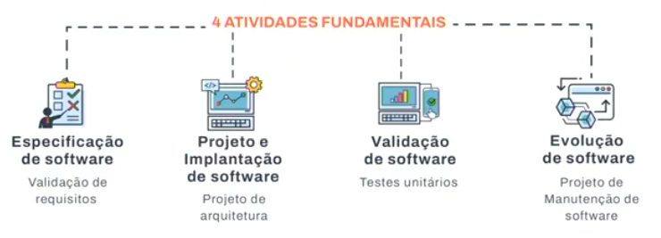

Vamos discutir cada uma dessas atividades fundamentais em detalhes:

1. **Especificação de Software**: Esta é a primeira fase do processo de desenvolvimento de software. Envolve a compreensão e a documentação dos requisitos do software. Isso pode incluir a identificação das necessidades do usuário, a definição das funcionalidades que o software deve ter e a especificação dos requisitos de desempenho, interface, segurança e outros atributos do sistema.

2. **Projeto e Implantação de Software**: Esta fase envolve a transformação dos requisitos especificados em um design de software detalhado. O design do software define a arquitetura do sistema, os componentes do software, as interfaces e os dados. A implementação envolve a tradução do design em código de programação. Durante a implementação, o software é codificado, testado e depurado.

3. **Validação de Software**: Esta é a fase de teste do software. O objetivo é garantir que o software atenda aos requisitos especificados e funcione como esperado. Isso pode envolver testes unitários, testes de integração, testes de sistema e testes de aceitação. A validação também pode incluir a verificação e a validação do software para garantir que ele atenda a todos os requisitos funcionais e não funcionais.

4. **Evolução de Software**: Após a entrega do software, ele precisa ser mantido e evoluído para atender às mudanças nos requisitos do usuário ou do ambiente operacional. A evolução do software pode envolver a correção de erros, a melhoria do desempenho, a adaptação do software a novos ambientes ou a adição de novas funcionalidades.

Essas quatro atividades são fundamentais para o processo de engenharia de software e são realizadas em diferentes graus em todos os projetos de software. Elas ajudam a garantir que o software desenvolvido atenda às necessidades do usuário e seja de alta qualidade.

[Sumário](#sum%C3%A1rio "Sumário")

### Modelos de processos

> Modelo em Cascata

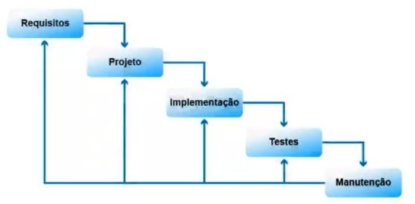

São na verdade, fases típicas encontradas em muitos modelos de processos de software. Vamos discutir cada um deles:

1. **Requisitos**: Esta fase envolve a coleta, análise, documentação e validação das necessidades e expectativas do usuário para o sistema de software. O resultado é um documento de requisitos de software que serve como um contrato entre os stakeholders e os desenvolvedores.

2. **Projeto**: Nesta fase, os requisitos são transformados em uma representação do software que pode ser implementada. Isso pode incluir o projeto da arquitetura do sistema, a escolha de algoritmos e estruturas de dados, a definição de interfaces de usuário e de sistema, e a criação de modelos e protótipos.

3. **Implementação**: Aqui, o projeto do software é codificado em um idioma de programação. Isso também pode envolver atividades como a integração de componentes de software, a criação de bancos de dados e a configuração do ambiente de software.

4. **Testes**: Esta fase envolve a verificação de que o software implementado atende aos requisitos especificados e funciona como esperado. Isso pode incluir testes unitários, testes de integração, testes de sistema e testes de aceitação.

5. **Manutenção**: Após o software ser liberado e estar em uso, ele precisará ser mantido. Isso pode envolver a correção de erros, a adaptação do software a novos ambientes, a adição de novas funcionalidades e a melhoria do desempenho.

Essas fases são comuns a muitos modelos de processos de software, incluindo o modelo em cascata. No entanto, dependendo do modelo de processo específico sendo usado (por exemplo, Agile, Iterativo, Espiral), essas fases podem ser realizadas em diferentes ordens, podem se sobrepor, ou podem ser repetidas várias vezes.

> Modelo Espiral

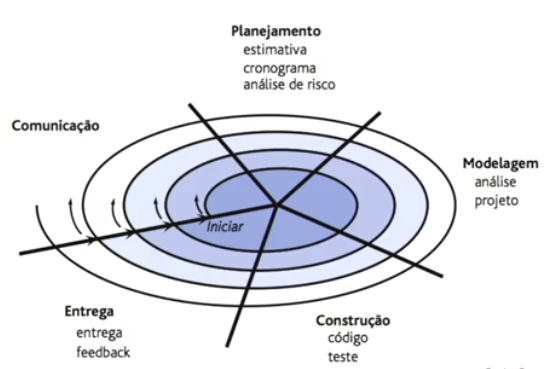

O **Modelo de Processo Espiral** é um modelo de desenvolvimento de software que combina elementos do design iterativo e do modelo em cascata, com um foco especial na gestão de riscos. Ele é dividido em várias fases:

1. **Início**: Esta é a fase inicial onde os objetivos gerais do projeto são identificados e os recursos são alocados.

2. **Comunicação**: Esta fase envolve a comunicação com os stakeholders para coletar e refinar os requisitos do sistema. Isso pode envolver reuniões, entrevistas, questionários e outras formas de comunicação.

3. **Planejamento**: Nesta fase, um plano detalhado para o projeto é desenvolvido. Isso pode incluir a definição de atividades, prazos, recursos necessários e marcos do projeto.

4. **Modelagem**: Aqui, os requisitos coletados são transformados em um modelo de software. Isso pode envolver a criação de diagramas de fluxo de dados, diagramas de classes, diagramas de sequência e outros artefatos de modelagem.

5. **Construção**: Nesta fase, o modelo de software é transformado em código. Isso envolve atividades como codificação, teste e integração.

6. **Entrega**: Finalmente, o software é entregue aos usuários finais. Isso pode envolver atividades como treinamento de usuários, instalação de software e suporte pós-implantação.

Uma característica única do modelo espiral é que ele é iterativo, o que significa que essas fases são repetidas várias vezes ao longo do ciclo de vida do projeto, permitindo a incorporação de feedback e a realização de ajustes conforme necessário. Além disso, a gestão de riscos é uma consideração importante em todas as fases do modelo espiral.

> Modelo **V**

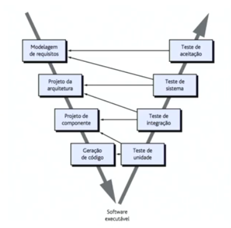

O **Modelo de Processo em V** é um modelo de desenvolvimento de software que ilustra as relações entre cada fase do ciclo de vida do desenvolvimento e seu fase de teste associada. As fases do Modelo em V são:

1. **Modelagem de Requisitos**: Esta é a primeira fase onde os requisitos do sistema são coletados e documentados.

2. **Projeto da Arquitetura**: Nesta fase, a arquitetura de alto nível do sistema é projetada.

3. **Projeto de Componente**: Aqui, os componentes individuais do sistema são projetados em detalhes.

4. **Geração de Código**: Nesta fase, o código real do software é escrito com base nos projetos.

5. **Teste de Unidade**: Esta fase envolve o teste de partes individuais do software para garantir que elas funcionem corretamente.

6. **Teste de Integração**: Aqui, os componentes individuais do software são combinados e testados juntos para garantir que eles interajam corretamente.

7. **Teste do Sistema**: Nesta fase, o sistema completo é testado para garantir que ele atenda aos requisitos especificados.

8. **Teste de Aceitação**: Esta é a fase final de teste onde o sistema é testado em um ambiente que imita o ambiente de produção real.

No final de todas essas etapas, temos o "Software Executável", que é o produto final pronto para ser entregue ao usuário. O Modelo em V é conhecido por sua ênfase na verificação e validação durante o desenvolvimento de software.

> Modelo Incremental

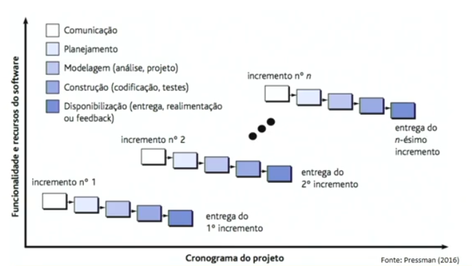

Modelo Incremental no desenvolvimento de software com base na imagem.

O Modelo Incremental é um método de desenvolvimento de software onde o produto é projetado, implementado e testado de forma incremental (um pouco mais é adicionado a cada vez) até que o produto esteja finalizado. Ele envolve tanto o desenvolvimento quanto a manutenção. O produto é definido como finalizado quando satisfaz todos os seus requisitos.

O fluxograma na imagem descreve as etapas e fases deste modelo de desenvolvimento:

1. **Comunicação**: Esta é a primeira etapa onde os requisitos básicos são coletados do cliente.
2. **Planejamento**: Nesta etapa, os requisitos são estudados e planejados.
3. **Modelagem**: Isso inclui análise e design do software de acordo com os requisitos.
4. **Construção**: O software é desenvolvido e testado.
5. **Disponibilização**: O software é entregue e o feedback é coletado para o próximo incremento.

O processo é então repetido, entregando um novo conjunto de incrementos de software a cada vez, até que o sistema completo esteja pronto para ser implantado. O modelo é projetado para reduzir o custo inicial de entrega e fornece uma implementação básica de funcionalidade que pode ser gradualmente expandida ao longo do tempo.

Este modelo é flexível e menos custoso para mudar o escopo e os requisitos. Ele permite que partes do sistema sejam desenvolvidas e entregues aos clientes de maneira incremental. É uma boa escolha para grandes projetos com requisitos incertos e complexos. No entanto, requer uma definição clara e completa do sistema e pode ser um modelo caro de usar.

[Sumário](#sum%C3%A1rio "Sumário")

> Conceitos

## Metodologia Ágil

A Metodologia Ágil é uma abordagem de desenvolvimento de software que se baseia em valores e princípios que priorizam a colaboração entre equipes, a entrega de valor ao cliente e a capacidade de adaptação a mudanças. Aqui estão alguns pontos importantes sobre a Metodologia Ágil:

1. **Iteratividade (repetição)**: Os métodos ágeis são baseados em ciclos iterativos e incrementais de trabalho. O gerenciamento com essa abordagem é dividido em iterações menores, permitindo que partes funcionais do produto sejam entregues em intervalos regulares, em vez de esperar até o fim do projeto para entregar um produto final.

2. **Colaboração**: Esses métodos incentivam a colaboração e a comunicação entre todas as pessoas da equipe, bem como com os stakeholders do projeto. Uma das características das equipes ágeis é trabalhar de forma interdisciplinar, promovendo a troca constante de ideias, conhecimentos e experiências.

3. **Autonomia e empoderamento das equipes**: A colaboração gera mais autonomia e empoderamento dessas equipes, pois as pessoas são incentivadas a se auto-organizarem, a tomar decisões e a definir o melhor caminho para atingir os objetivos do projeto.

4. **Entrega de valor**: Esses atributos dos métodos ágeis e sua cultura de experimentação favorecem a entrega de valor, pois, ao priorizarem entregas contínuas e incrementos de valor em cada iteração, permitem que clientes e stakeholders obtenham benefícios tangíveis mais cedo e possam fornecer feedbacks para orientar o desenvolvimento do projeto.

A Metodologia Ágil surgiu em meados da década de 1990, em contraponto aos métodos tradicionais, vistos como burocráticos, lentos e ineficientes. Ela é uma resposta aos desafios impostos pelas metodologias tradicionais, principalmente no mercado de engenharia de software.

[Sumário](#sum%C3%A1rio "Sumário")

### Histórico

Vamos falar sobre a história da Metodologia Ágil:

***Meados de 1990***

A Metodologia Ágil teve origem no final da década de 1990 como uma alternativa aos métodos tradicionais de gerenciamento de projetos. Durante esse período, muitas empresas estavam insatisfeitas com os resultados obtidos por meio dos métodos cascata, nos quais todas as fases do projeto eram definidas antecipadamente e seguidas de forma linear. 

***2001: Surgimento e Propagação de Paradigmas de Desenvolvimento de Software Ágeis***

No início, a metodologia ágil era composta por práticas como Extreme Programming (XP) e Scrum. Essas abordagens enfatizavam a colaboração em equipe, iteração contínua e entrega de valor ao cliente em curtos períodos de tempo. Ao longo dos anos, a metodologia ágil evoluiu e foi adotada por uma variedade de setores além do desenvolvimento de software.

***Manifesto Ágil***

O Manifesto Ágil é um documento que foi criado em fevereiro de 2001 por um grupo de 17 especialistas que já praticavam métodos ágeis como XP, DSDM, SCRUM, FDD e outros. O manifesto estabelece os princípios fundamentais da metodologia ágil. Os signatários do manifesto acreditavam que a colaboração próxima entre os membros da equipe, a resposta rápida às mudanças e a entrega de valor incremental eram essenciais para o sucesso de um projeto.

Os princípios fundamentais do Manifesto Ágil são:

1. **Indivíduos e interações** mais que processos e ferramentas
2. **Software em funcionamento** mais que documentação abrangente
3. **Colaboração com o cliente** mais que negociação de contratos
4. **Responder a mudanças** mais que seguir um plano

[Sumário](#sum%C3%A1rio "Sumário")

### Motivação para a criação da Metodologia Ágil

A Metodologia Ágil foi criada como uma resposta aos métodos tradicionais de desenvolvimento de software, que eram vistos como rígidos, pesados e excessivamente focados em documentação. Aqui estão algumas das principais motivações para a criação da Metodologia Ágil:

1. **Menos centradas em documentação**: Os métodos tradicionais de desenvolvimento de software muitas vezes exigiam uma grande quantidade de documentação antes que qualquer código fosse escrito. Isso poderia atrasar o início do desenvolvimento e tornar difícil a adaptação a mudanças. A Metodologia Ágil, por outro lado, valoriza "software em funcionamento mais que documentação abrangente".

2. **São adaptativas em vez de predeterminantes**: Os métodos tradicionais muitas vezes tentavam prever todas as necessidades do projeto no início, o que é quase impossível em projetos complexos. A Metodologia Ágil aceita que as necessidades do projeto vão mudar ao longo do tempo e se adapta a essas mudanças.

3. **Aceitam mudanças ao longo do desenvolvimento de maneira natural**: Em vez de resistir a mudanças, como muitas vezes acontece nos métodos tradicionais, a Metodologia Ágil vê a mudança como algo natural e até mesmo desejável. Ela valoriza "responder a mudanças mais que seguir um plano".

4. **Orientados a pessoas e não a processos**: A Metodologia Ágil coloca as pessoas no centro do processo de desenvolvimento. Ela valoriza "indivíduos e interações mais que processos e ferramentas". Isso significa que a Metodologia Ágil dá ênfase à colaboração, à comunicação e à capacidade das equipes de se auto-organizarem.

[Sumário](#sum%C3%A1rio "Sumário")

### Características fundamentais das Metodologias Ágeis

Características fundamentais das metodologias ágeis na engenharia de software. Aqui está um resumo mais detalhado:

1. **Planejamento Incremental e Iterativo**: As metodologias ágeis, como Scrum e XP, enfatizam a entrega incremental e iterativa de software funcional. Isso permite que as equipes obtenham feedback rápido e façam ajustes conforme necessário.

2. **Enfoque nos Fatores Humanos**: As metodologias ágeis valorizam as interações individuais e a colaboração da equipe acima de processos e ferramentas. Elas reconhecem que o sucesso do projeto depende das pessoas envolvidas e de como elas trabalham juntas.

3. **Adaptação a Mudanças**: Em vez de seguir um plano fixo, as metodologias ágeis são projetadas para se adaptar às mudanças. Elas aceitam que os requisitos podem mudar ao longo do tempo e fornecem mecanismos para lidar com essas mudanças.

4. **Envolvimento do Cliente**: As metodologias ágeis enfatizam a colaboração estreita com os clientes e a inclusão deles no processo de desenvolvimento. Isso ajuda a garantir que o produto final atenda às suas necessidades e expectativas.

Esses princípios ajudam as equipes a entregar produtos de alta qualidade de maneira eficiente e eficaz, enquanto se adaptam às mudanças nas necessidades do negócio. Isso é especialmente útil em ambientes de negócios dinâmicos e incertos.

[Sumário](#sum%C3%A1rio "Sumário")

### Metodologia Ágil - *Extreme Programming* (XP)

Extreme Programming (XP) é uma metodologia ágil de desenvolvimento de software que enfatiza a entrega de alta qualidade e funcionalidade ao cliente.

1. **Desenvolvimento Rápido**: XP utiliza um ciclo de desenvolvimento curto e iterativo, o que permite um rápido desenvolvimento e entrega de funcionalidades. Isso é alcançado através de práticas como programação em pares, desenvolvimento orientado a testes (TDD) e integração contínua.

2. **Requisitos em Constante Mudança**: XP aceita que os requisitos do software podem mudar frequentemente. Para lidar com isso, utiliza-se o planejamento de releases e iterações, permitindo que os requisitos sejam atualizados e priorizados regularmente.

3. **Valores do XP**:
    - **Comunicação**: A comunicação eficaz é fundamental no XP. A programação em pares, as reuniões de stand-up diárias e a presença do cliente na equipe são algumas das maneiras pelas quais o XP enfatiza a comunicação.
    - **Simplicidade**: XP incentiva a equipe a fazer o que é necessário hoje e evitar a super-engenharia. O código deve ser simples de entender e modificar.
    - **Feedback**: O feedback rápido é essencial no XP. Isso é alcançado através de práticas como TDD, integração contínua e revisões de código.
    - **Coragem**: XP enfatiza a coragem para enfrentar problemas, fazer mudanças necessárias no código e adaptar-se a novos requisitos.

Esses princípios e práticas ajudam as equipes a responder rapidamente às mudanças, melhorar a qualidade do software e proporcionar maior satisfação ao cliente.

> Ciclo da XP

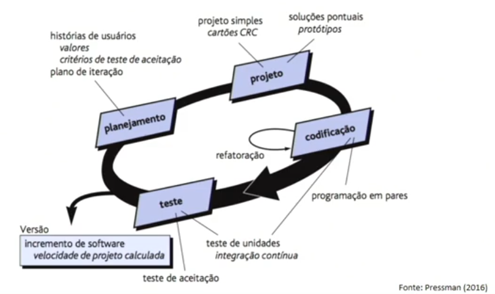

Explicação com base na imagem mostra, o ciclo da XP (Extreme Programming), uma metodologia de desenvolvimento ágil de software. Aqui estão as fases do ciclo:

1. **Planejamento**: Esta fase envolve a consideração de histórias de usuários, valores, critérios de teste de aceitação e plano de iteração. As histórias de usuários ajudam a entender os requisitos do usuário final. Os valores e critérios de teste de aceitação ajudam a definir o que é necessário para o software ser considerado completo. O plano de iteração ajuda a organizar o trabalho em pequenos incrementos.

2. **Projeto**: Esta fase envolve um projeto simples, cartões CRC (Class Responsibility Collaboration) e soluções pontuais ou protótipos. O projeto simples ajuda a manter o código limpo e fácil de entender. Os cartões CRC são uma ferramenta para ajudar no design de classes e na identificação de responsabilidades e colaborações entre elas. Soluções pontuais ou protótipos são usados para explorar possíveis soluções para problemas complexos.

3. **Codificação**: Esta fase inclui programação em pares e refatoração contínua. A programação em pares ajuda a melhorar a qualidade do código e a compartilhar conhecimento entre a equipe. A refatoração contínua ajuda a manter o código limpo e fácil de manter.

4. **Teste**: Esta fase envolve teste de unidades e integração contínua. O teste de unidades ajuda a verificar se cada parte do software funciona como esperado. A integração contínua ajuda a garantir que todas as partes do software funcionem juntas.

No final do ciclo, há um incremento do software e a velocidade do projeto é calculada. O incremento do software é a adição de novas funcionalidades ao software. A velocidade do projeto é uma medida de quanto trabalho a equipe pode completar em uma iteração.

[Sumário](#sum%C3%A1rio "Sumário")

## Equipe de Trabalho

Aqui estão as responsabilidades desses papéis na metodologia Extreme Programming (XP):

1. **Gerente de Projeto**: O Gerente de Projeto em XP serve como uma ponte entre a equipe, os clientes e eventuais fornecedores. Ele assegura que as pessoas certas dialoguem dentro da equipe e fora dela. Além disso, o gerente de projeto monitora o progresso da equipe e ajuda-a a perceber continuamente tudo o que já foi conquistado. Ele também é responsável por coordenar os recursos humanos, financeiros e materiais; monitorar os indicadores dos projetos; coordenar e gerenciar as equipes; garantir que a metodologia de gestão seja aplicada de forma coerente.

2. **Coach**: O Coach em XP tem um papel proativo. Ele ajuda os clientes e desenvolvedores a escrever testes para as histórias, antes mesmo que elas sejam implementadas. Além disso, trabalha com os desenvolvedores ao longo da iteração, ajudando-os a automatizar os testes. O Coach também é responsável por identificar os pontos fortes e pontos de melhorias dos colaboradores e dos processos.

3. **Analista de Teste**: Os Analistas de Teste em XP têm um papel proativo. No início de cada iteração, eles ajudam clientes e desenvolvedores a escrever testes para as histórias, antes mesmo que elas sejam implementadas. Além disso, trabalham com os desenvolvedores ao longo da iteração, ajudando-os a automatizar os testes. Quando a equipe não consegue automatizar alguns testes, os analistas de teste os executam manualmente.

4. **Redator Técnico**: O Redator Técnico ajuda a equipe a criar e manter a documentação do projeto. Eles garantem que a documentação evolua de forma iterativa, atualizando os documentos mais perto do fim das iterações. Eles descrevem o que foi feito de fato pelos desenvolvedores, ao invés daquilo que eles combinaram que iriam fazer. Os redatores técnicos devem compreender quem é o público alvo das publicações, assegurar que a linguagem certa seja usada e fazer com que a informação seja atualizada continuamente. Além disso, eles devem monitorar o uso dos documentos e, na medida do possível, eliminar documentos que não estejam provendo valor para o projeto.

5. **Desenvolvedor**: Os desenvolvedores em XP têm várias responsabilidades. Eles são encarregados de cuidar da inteligência do software, fazer a comunicação com outros sistemas para validar uma compra, por exemplo, junto com uma instituição financeira, e fornecer dados para o Front-end exibir na tela do usuário. Além disso, eles devem estar sempre em contato com o cliente e também em contato entre si. Eles também são responsáveis por codificar, testar e refatorar o software.

[Sumário](#sum%C3%A1rio "Sumário")

### Metodologia Ágil - *Scrum*

O **Scrum** é uma metodologia ágil que é amplamente utilizada no desenvolvimento de software e também pode ser aplicada em vários outros ambientes de trabalho. Ele é focado na gestão de projetos e tem como base o planejamento iterativo e incremental.

Aqui estão alguns conceitos-chave do Scrum:

1. **Sprints**: O trabalho é dividido em ciclos chamados Sprints, que geralmente duram de duas a quatro semanas. Cada Sprint tem um objetivo definido e uma lista de tarefas a serem concluídas.

2. **Product Backlog**: É uma lista priorizada de tarefas ou histórias de usuários que precisam ser concluídas para o projeto. O Product Owner é responsável por manter e priorizar o Product Backlog.

3. **Sprint Planning**: No início de cada Sprint, a equipe se reúne para planejar o trabalho que será realizado durante o Sprint. Eles selecionam tarefas do Product Backlog para trabalhar com base na prioridade e na estimativa de esforço.

4. **Daily Scrum**: É uma reunião diária de 15 minutos onde a equipe discute o progresso e planeja o trabalho do dia.

5. **Sprint Review**: No final de cada Sprint, a equipe se reúne para revisar o trabalho concluído e o que não foi concluído.

6. **Sprint Retrospective**: Após a revisão do Sprint, a equipe se reúne para discutir o que funcionou bem, o que pode ser melhorado e como implementar melhorias no próximo Sprint.

***Elementos da Scrum***

Aqui estão os detalhes sobre os elementos do Scrum:

1. **Gestão e planejamento de Software**: O Scrum é uma estrutura para gerenciar e planejar projetos de software. Ele permite que as equipes trabalhem de forma iterativa e incremental, com cada iteração chamada de Sprint. Durante o planejamento do Sprint, a equipe seleciona itens do Product Backlog (uma lista priorizada de requisitos do projeto) para trabalhar durante o próximo Sprint.

2. **Reuniões Regulares (Stand-up Meeting)**: As reuniões diárias de Scrum, também conhecidas como Stand-up Meetings, são uma parte essencial do Scrum. Durante essas reuniões curtas, cada membro da equipe discute o que eles fizeram no dia anterior, o que planejam fazer no dia atual e quaisquer obstáculos que possam estar enfrentando.

3. **Projetos são divididos em ciclos**: No Scrum, os projetos são divididos em ciclos chamados Sprints. Cada Sprint tem uma duração fixa, geralmente de duas a quatro semanas, durante a qual a equipe trabalha para completar um conjunto específico de tarefas.

4. **Entrega incremental**: O Scrum enfatiza a entrega incremental de software. No final de cada Sprint, a equipe deve ter um incremento de software potencialmente entregável. Isso significa que o software deve estar em um estado em que possa ser entregue ao cliente, se o cliente desejar.

5. **Envolvimento do cliente**: No Scrum, o envolvimento do cliente é fundamental. O cliente (representado pelo Product Owner) é responsável por definir e priorizar os itens do Product Backlog. Além disso, o cliente é encorajado a participar das revisões do Sprint, onde a equipe demonstra o trabalho que completou durante o Sprint.

Vamos detalhar um pouco mais sobre cada papel na equipe de trabalho do Scrum:

- **Scrum Master**: Este é o facilitador do projeto. Ele não é o líder da equipe no sentido tradicional, mas age como um escudo entre a equipe e quaisquer distrações. Ele garante que a equipe siga as práticas e regras do Scrum. O Scrum Master é responsável por remover quaisquer obstáculos ou impedimentos que a equipe possa enfrentar, permitindo que eles se concentrem totalmente no projeto.

- **Product Owner**: Esta é a pessoa responsável pelo projeto em si. Ele é o principal stakeholder do projeto e tem a missão de indicar os requisitos mais importantes a serem tratados nos Sprints. O Product Owner deve ter uma visão clara do produto e ser capaz de comunicar essa visão para a equipe. Ele é responsável por priorizar o backlog do produto para garantir que o trabalho esteja alinhado com a estratégia do negócio e entregue o máximo de valor.

- **Scrum Team**: Esta é a equipe de desenvolvimento. Eles são responsáveis por entregar o produto. Uma equipe Scrum típica é composta por seis a dez pessoas e inclui uma mistura de habilidades necessárias para entregar o produto. As equipes são altamente auto-organizadas, o que significa que decidem internamente quem fará o quê, quando e como.

- **Product Backlog**: Este é uma lista que contém todas as funcionalidades desejadas para o produto. É uma lista dinâmica que muda e evolui com o tempo e as necessidades do negócio. O Product Owner é responsável por manter e priorizar o Product Backlog.

- **Sprint Backlog**: Esta é a lista de tarefas que a equipe se comprometeu a executar durante um Sprint. Estas tarefas são selecionadas do Product Backlog durante o planejamento do Sprint e são aquelas que a equipe acredita que pode completar durante o próximo Sprint.

- **Sprint**: Este é um ciclo de trabalho fixo, que normalmente varia de duas a quatro semanas, durante o qual um conjunto de tarefas é concluído. Cada Sprint começa com uma reunião de planejamento, durante a qual a equipe seleciona as tarefas do Product Backlog que eles se comprometem a completar. O Sprint termina com uma revisão e uma retrospectiva para refletir sobre o trabalho realizado e planejar melhorias para o próximo Sprint.

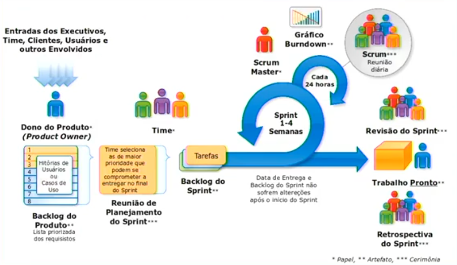

A imagem mostra um diagrama do processo de desenvolvimento Scrum, incluindo os papéis, atividades e fluxos de trabalho envolvidos. Vamos detalhar:

- **Entradas dos Executivos, Time, Clientes, Usuários e outros Envolvidos**: Estas são as fontes de entrada para o processo. Eles fornecem as informações necessárias para o desenvolvimento do produto.

- **Dono do Produto (Product Owner)**: Esta pessoa tem uma lista prioritizada de requisitos chamada "Backlog do Produto". Ele é responsável por manter e priorizar este backlog.

- **Time**: O time seleciona itens de maior prioridade que podem se comprometer a entregar no final do Sprint durante a "Reunião de Planejamento do Sprint".

- **Scrum Master**: Este é o facilitador do projeto. Ele ajuda a equipe a seguir as práticas e regras do Scrum e remove quaisquer obstáculos ou impedimentos que a equipe possa enfrentar.

- **Sprint**: Este é um ciclo de trabalho fixo, que dura 1-4 semanas. Durante isso, o time trabalha nas "Tarefas" selecionadas. Ao final do sprint, há uma “Revisão do Sprint” para avaliar o trabalho e uma “Retrospectiva” para discutir melhorias.

- **Gráfico Burndown**: Este gráfico monitora o trabalho concluído. Ele é atualizado a cada 24 horas para mostrar o progresso da equipe.

- **Backlog do Sprint**: Esta é a lista de tarefas que a equipe se comprometeu a executar durante um Sprint. Estas tarefas são selecionadas do Product Backlog durante o planejamento do Sprint.

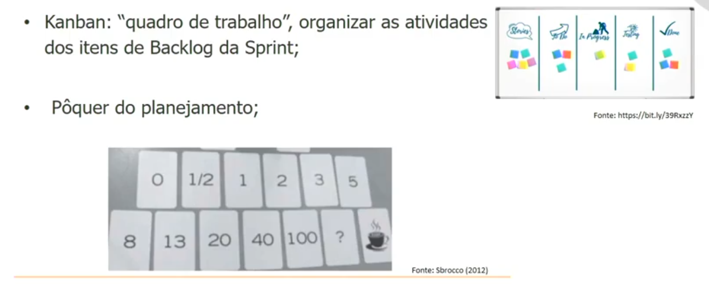

Vamos detalhar esses conceitos:

- **Kanban**: O Kanban é uma estrutura ágil que tem sua origem nos princípios da manufatura enxuta (lean), uma metodologia usada principalmente no desenvolvimento de software e na gestão de projetos. O Kanban enfatiza a visualização do trabalho, a limitação do trabalho em andamento (Work in Progress ou WIP) e a maximização do fluxo para melhorar a eficiência. O termo "Kanban" é uma palavra japonesa que significa "sinalização" ou "cartão" e é usado para fazer referência a um sistema de sinalização que utiliza cartões. No contexto de desenvolvimento de software, o Método Kanban foi criado por David J. Anderson em 2010, combinando elementos do pensamento Lean com o pensamento ágil.

- **Quadro de Trabalho**: O quadro de trabalho, também conhecido como quadro Kanban, é uma ferramenta visual que ajuda a organizar e gerenciar o fluxo de trabalho. Ele é composto por colunas que representam as diferentes etapas do processo de trabalho. Cada tarefa é representada por um cartão (ou post-it) que se move pelo quadro à medida que avança pelas etapas do processo. O quadro de trabalho serve para manter a empresa e o funcionário sempre alinhados quanto aos objetivos das funções, além de manter ambos na mesma página quanto às expectativas de projeção de carreira e salário.

- **Pôquer do Planejamento (Planning Poker)**: O Pôquer do Planejamento, também chamado de Scrum Poker, é uma técnica baseada em consenso e gamificação usada principalmente para estimar esforço ou tamanho relativo das metas no desenvolvimento de software. No Pôquer do Planejamento, os membros do grupo fazem estimativas jogando cartas numeradas para baixo na mesa, em vez de falar em voz alta. Os cartões são revelados, e as estimativas são discutidas. Ao esconder as figuras desta maneira, o grupo pode evitar o viés cognitivo da ancoragem, onde o primeiro número falado em voz alta estabelece um precedente para as estimativas subsequentes.

> **Scrum e Backlogs**
>
> Conceitos relacionados ao **Scrum**, uma metodologia ágil amplamente utilizada no desenvolvimento de software:
>
> 1. **Product Backlog**:
>    - O **Product Backlog** é uma lista completa de todas as funcionalidades, requisitos e melhorias que devem ser implementadas no produto final. Ele representa o conjunto total de trabalho a ser realizado.
>    - Os itens no Product Backlog são priorizados pelo **Proprietário do Produto** (Product Owner) com base no valor que cada item agrega ao produto.
>    - O Product Backlog é dinâmico e pode ser atualizado a qualquer momento para refletir mudanças nas necessidades do cliente ou no mercado.
>    - Serve como uma fonte contínua de requisitos para o desenvolvimento da equipe.
> 2. **Sprint Backlog**:
>    - O **Sprint Backlog** é uma lista de itens de trabalho selecionados a partir do Product Backlog para serem concluídos durante um **sprint**.
>    - Um sprint é um período curto e fixo (geralmente de 1 a 4 semanas) em que a equipe Scrum trabalha para concluir uma quantidade definida de trabalho.
>    - Durante o planejamento do sprint, a equipe seleciona os itens do Product Backlog que serão incluídos no Sprint Backlog.
>    - Os itens do Sprint Backlog são desmembrados em tarefas menores que a equipe pode executar durante o sprint.
>    - O Sprint Backlog é revisado diariamente durante o Scrum Daily Standup para acompanhar o progresso e identificar quaisquer obstáculos.
> 3. **Sprint**:
>    - O **Sprint** é o período de tempo durante o qual a equipe trabalha no Sprint Backlog para entregar um incremento de software funcional.
>    - Durante o sprint, a equipe se concentra em concluir as tarefas do Sprint Backlog.
>    - O Sprint tem uma duração fixa e não pode ser alterado uma vez iniciado.
>    - No final do sprint, a equipe realiza uma revisão do trabalho concluído e planeja o próximo sprint.
>
> Em resumo:
>
> - O **Product Backlog** representa todo o trabalho a ser feito.
> - O **Sprint Backlog** é uma seleção específica de itens do Product Backlog para um sprint.
> - O **Sprint** é o período de tempo em que a equipe trabalha no Sprint Backlog para entregar um incremento de software funcional.

[Sumário](#sum%C3%A1rio "Sumário")

### Quadro Scrum

O **Quadro Scrum** é uma ferramenta visual essencial no gerenciamento de projetos ágeis e na metodologia Scrum. Ele ajuda a equipe a visualizar o trabalho, limitar a quantidade de trabalho em andamento e maximizar a eficiência (ou fluxo).

O Quadro Scrum é dividido em várias partes:

1. **Backlog do Produto**: Esta é uma lista priorizada de todos os recursos, funções, melhorias e correções que precisam ser feitas no produto. O proprietário do produto é responsável por manter o backlog do produto.
2. **Backlog da Sprint**: São itens selecionados do backlog do produto para serem concluídos durante a próxima sprint. A equipe decide quais itens serão incluídos durante a reunião de planejamento da sprint.
3. **Em Andamento**: Esta seção do quadro mostra todas as tarefas que estão atualmente em andamento.
4. **Concluído**: Aqui estão todas as tarefas que foram concluídas durante a sprint.
5. **Impedimentos**: Qualquer coisa que esteja impedindo a equipe de realizar uma tarefa é listada aqui.

O Quadro Scrum é atualizado diariamente pela equipe durante o Daily Scrum (também conhecido como stand-up diário), que é uma reunião de 15 minutos para a equipe sincronizar o progresso e planejar o trabalho do dia.

[Sumário](#sum%C3%A1rio "Sumário")

> ## Conceitos
>
> 1. **Meio pelo qual a equipe realiza a gestão visual das atividades do projeto**: Isso se refere ao uso de ferramentas de gestão visual, como o Quadro Scrum que mencionamos anteriormente. Essas ferramentas permitem que a equipe visualize o progresso do projeto, identifique gargalos e priorize tarefas. O Quadro Scrum, por exemplo, é dividido em várias seções (Backlog do Produto, Backlog da Sprint, Em Andamento, Concluído, Impedimentos) que ajudam a equipe a acompanhar o progresso das tarefas.
> 2. **Não faz parte, oficialmente da metodologia, porém sua adoção foi feita em larga escala pelas equipes e, aparentemente, esse fato não altera sua importância**: Isso pode se referir a práticas ou ferramentas que não são oficialmente parte de uma metodologia (como Scrum ou Agile), mas que foram adotadas por muitas equipes devido à sua utilidade. Por exemplo, embora o Quadro Scrum seja agora amplamente associado ao Scrum, ele não é uma parte oficial da metodologia Scrum. No entanto, sua adoção generalizada não diminui sua importância como uma ferramenta eficaz para a gestão visual de projetos.

O **Quadro Scrum** é uma ferramenta visual que ajuda as equipes a gerenciar e acompanhar o progresso do trabalho em um projeto Scrum. Ele é geralmente dividido em colunas que representam diferentes estágios do fluxo de trabalho, como “A Fazer”, “Em Andamento” e “Concluído”.

No contexto de um projeto Scrum, uma “estória” (ou “user story”) é uma descrição de alto nível de um recurso ou funcionalidade que o produto final deve ter, geralmente do ponto de vista do usuário final. Cada estória é então dividida em várias tarefas menores que precisam ser concluídas para que a estória seja considerada “concluída”.

No Quadro Scrum, cada estória e suas respectivas tarefas são representadas por cartões ou post-its, que são movidos ao longo das colunas à medida que o trabalho progride. Por exemplo, uma tarefa que acabou de ser iniciada seria movida da coluna “A Fazer” para a coluna “Em Andamento”. Quando a tarefa é concluída, ela é movida para a coluna “Concluído”.

Essa disposição matricial de estórias e tarefas ajuda a equipe a visualizar o progresso do projeto, identificar bloqueios e priorizar o trabalho. Além disso, como o Quadro Scrum é atualizado continuamente, ele fornece uma visão em tempo real do status do projeto.

> ## O que é "Estória"?
>
> No contexto da engenharia de software e do desenvolvimento ágil, a palavra “estória” é uma tradução do termo inglês “user story”. Uma “estória” ou “user story” é uma descrição simples de uma funcionalidade do sistema sob a perspectiva do usuário final.
>
> As estórias são usadas em metodologias ágeis de desenvolvimento de software, como Scrum e XP (Extreme Programming), para capturar brevemente quem, o que e por que de um requisito de um produto. Uma estória é geralmente escrita da seguinte forma: “Como um [tipo de usuário], eu quero [alguma meta] para que eu possa [algum motivo]”.
>
> Por exemplo, uma estória para um sistema de compras online pode ser: “Como um cliente, eu quero ser capaz de visualizar meu carrinho de compras para que eu possa revisar os itens antes de fazer o checkout”.
>
> As estórias são uma maneira eficaz de capturar requisitos funcionais e manter o foco no usuário e suas necessidades. Elas também promovem a comunicação e a colaboração dentro da equipe de desenvolvimento.

Os **Post-its** são usados para representar as tarefas ou histórias de usuários que precisam ser concluídas. Cada Post-it é colocado na coluna que representa o estágio atual de seu trabalho. À medida que o trabalho progride, o Post-it é movido para a próxima coluna.

As **cores dos Post-its** geralmente têm significados específicos. Embora as cores possam variar dependendo da equipe e do projeto, aqui estão alguns usos comuns:

- **Amarelo**: Tarefas ou histórias de usuários.
- **Azul**: Tarefas em andamento.
- **Verde**: Tarefas concluídas.
- **Vermelho**: Bloqueadores ou problemas que precisam ser resolvidos.

Os profissionais utilizam o Quadro Scrum e os Post-its por várias razões:

1. **Visualização do trabalho**: O Quadro Scrum permite que a equipe veja o status atual do projeto de uma maneira fácil de entender.
2. **Transparência**: Todos na equipe podem ver o que está sendo trabalhado e quem está trabalhando em quê.
3. **Promove a colaboração**: A equipe pode identificar facilmente onde o trabalho está parado e colaborar para resolver bloqueadores.
4. **Adaptabilidade**: O Quadro Scrum é flexível e pode ser facilmente ajustado para atender às necessidades da equipe.

A imagem a seguir mostra um modelo de post-it amarelo usado para organizar tarefas em um Quadro Scrum. Aqui estão os detalhes:

1. **Prioridade da Tarefa**: No canto superior esquerdo, há uma legenda que indica os níveis de prioridade da tarefa: “MA: Muito alta”, “A: Alta”, “M: Média”, “B: Baixa” e “MB: Muito baixa”. Isso ajuda a equipe a entender a importância relativa de cada tarefa.
2. **Descrição da Tarefa**: No centro do post-it está escrito “Aqui vai a descrição da tarefa, escrita de forma reduzida e objetiva”. Isso indica onde a descrição da tarefa deve ser anotada.
3. **Responsável pela Tarefa**: Abaixo da descrição, há um espaço marcado como “Nome”, destinado ao nome do responsável pela execução da tarefa.
4. **Tempo Estimado**: À direita do nome está “8hs”, indicando o tempo estimado para a execução.
5. **Esforço para Executar a Tarefa**: No canto superior direito está uma escala numerada de 1 a 5 com legendas que representam o esforço necessário para executar a tarefa.
6. **Relação com a História**: Acima dessa escala está uma seção marcada com “A” que diz “À qual estória esta tarefa pertence”, indicando que essa parte é usada para relacionar a tarefa com uma história ou projeto específico.

[Sumário](#sum%C3%A1rio "Sumário")

### Exemplo de um projeto Scrum

A imagem mostra um quadro Scrum para o projeto/equipe intitulado “EQUIPE SCRUM MARAVILHOSA”. Aqui estão os detalhes:

1. **Colunas do Quadro Scrum**: O quadro está dividido em cinco colunas que representam diferentes fases do processo Scrum: “Pendência”, “A fazer”, “Fazendo”, “Em revisão/garantia de qualidade” e “Feito!”. Isso ajuda a equipe a entender o fluxo de trabalho do projeto.
2. **Linhas do Quadro Scrum**: Há quatro linhas rotuladas como “História do usuário 1”, “História do usuário 2”, etc., indicando diferentes tarefas ou objetivos a serem alcançados. Isso ajuda a equipe a entender o escopo do projeto.
3. **Tarefas**: Cada célula contém um quadrado cinza escuro ou claro (podendo ser coloridas), representando o status das tarefas. As células vazias indicam que não há tarefa atribuída a essa categoria específica para a história do usuário correspondente.

[Sumário](#sum%C3%A1rio "Sumário")

### Gestão de Configuração

Claro, vamos entender cada um desses itens no contexto do “Planejamento de Gerenciamento de Configuração” em Engenharia de Software:

1. **Definir o que será gerenciado e o esquema que será usado para identificar as entidades**: Isso se refere à identificação dos itens de configuração que serão gerenciados. Os itens de configuração podem ser especificações, projetos, programas, dados de teste, manuais de usuário, entre outros. Cada um desses documentos produzidos pode ser considerado um item de configuração de software. É importante definir um esquema de identificação para essas entidades para garantir a rastreabilidade e o controle efetivo.
2. **Estabelecer o responsável**: Este é o processo de designar uma pessoa ou equipe que será responsável pelo gerenciamento de configuração. Esta pessoa ou equipe será responsável por monitorar as mudanças, controlar as versões e garantir a consistência dos itens de configuração.
3. **Estabelecer políticas de gerenciamento de configuração**: As políticas de gerenciamento de configuração são as regras e diretrizes estabelecidas para controlar a criação e alteração dos itens de configuração. Estas políticas ajudam a garantir a integridade e consistência dos itens de configuração.
4. **Especificação de ferramentas**: As ferramentas de gerenciamento de configuração são essenciais para automatizar e facilitar o processo de gerenciamento de configuração. Estas ferramentas podem ajudar a rastrear e monitorar alterações, controlar versões, e gerenciar e monitorar atualizações dos dados de configuração.
5. **Descrever a estrutura do banco de dados**: Isso se refere à descrição da estrutura do banco de dados que será usado para armazenar e gerenciar os itens de configuração. A estrutura do banco de dados deve ser projetada de forma a facilitar o rastreamento e o gerenciamento efetivo dos itens de configuração.

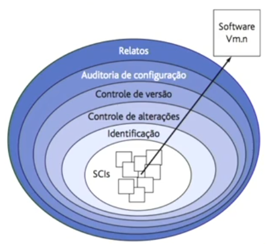

**O que temos dentro do Gerenciamento de Configuração**

Claro, vamos entender cada um desses itens no contexto do “Planejamento de Gerenciamento de Configuração” em Engenharia de Software:

1. **Definir o que será gerenciado e o esquema que será usado para identificar as entidades**: Isso se refere à identificação dos itens de configuração que serão gerenciados. Os itens de configuração podem ser especificações, projetos, programas, dados de teste, manuais de usuário, entre outros. Cada um desses documentos produzidos pode ser considerado um item de configuração de software. É importante definir um esquema de identificação para essas entidades para garantir a rastreabilidade e o controle efetivo.
2. **Estabelecer o responsável**: Este é o processo de designar uma pessoa ou equipe que será responsável pelo gerenciamento de configuração. Esta pessoa ou equipe será responsável por monitorar as mudanças, controlar as versões e garantir a consistência dos itens de configuração.
3. **Estabelecer políticas de gerenciamento de configuração**: As políticas de gerenciamento de configuração são as regras e diretrizes estabelecidas para controlar a criação e alteração dos itens de configuração. Estas políticas ajudam a garantir a integridade e consistência dos itens de configuração.
4. **Especificação de ferramentas**: As ferramentas de gerenciamento de configuração são essenciais para automatizar e facilitar o processo de gerenciamento de configuração. Estas ferramentas podem ajudar a rastrear e monitorar alterações, controlar versões, e gerenciar e monitorar atualizações dos dados de configuração.
5. **Descrever a estrutura do banco de dados**: Isso se refere à descrição da estrutura do banco de dados que será usado para armazenar e gerenciar os itens de configuração. A estrutura do banco de dados deve ser projetada de forma a facilitar o rastreamento e o gerenciamento efetivo dos itens de configuração.

**Item de Configuração**

Um “Item de Configuração” é um elemento unitário ou um grupo de elementos para efeito de controle de versão. Eles são os componentes individuais do sistema que são gerenciados no processo de Gerenciamento de Configuração. Aqui estão alguns exemplos:

1. **Código**: O código fonte de um software é um exemplo clássico de um item de configuração. Cada arquivo de código fonte pode ser considerado um item de configuração e é gerenciado individualmente.
2. **Documentação**: A documentação do software, como especificações de requisitos, manuais do usuário, documentação técnica, etc., também são considerados itens de configuração.
3. **Diagramas, planos, ferramentas; casos de teste e etc.**: Outros artefatos de software, como diagramas de design, planos de projeto, scripts de teste, ferramentas de construção e implantação, também podem ser considerados itens de configuração.

**Identificação de Item de Configuração**

Vamos entender cada um desses pontos no contexto da “Identificação de Item de Configuração” em Engenharia de Software:

1. **Manter a rastreabilidade**: A rastreabilidade é a capacidade de descrever e seguir o ciclo de vida de um item de configuração. Isso inclui sua origem, desenvolvimento, implementação e manutenção. Manter a rastreabilidade ajuda a entender as dependências e relações entre diferentes itens de configuração, o que é crucial para o gerenciamento eficaz de mudanças.
2. **Documentos que podem ser úteis devem ser controlados pelo gerenciamento de configuração**: Qualquer documento que seja útil para o desenvolvimento, manutenção e operação do software deve ser considerado um item de configuração e, portanto, deve ser controlado pelo gerenciamento de configuração. Isso pode incluir requisitos, especificações de design, planos de teste, manuais do usuário, documentação de operações, etc.
3. **Esquemas de nomes hierarquizados**: Um esquema de nomes hierarquizado é uma maneira de organizar e identificar itens de configuração. Isso pode envolver a categorização de itens de configuração em diferentes níveis de uma hierarquia, com base em suas características ou relacionamentos. Por exemplo, você pode ter um nível superior para o sistema como um todo, um nível intermediário para módulos ou componentes individuais e um nível inferior para itens individuais dentro desses componentes.

**Banco de Dados de Configuração**

Vamos falar sobre o “Banco de Dados de Configuração” (Configuration Database) no contexto do Planejamento de Gerenciamento de Configuração em Engenharia de Software.

O Banco de Dados de Configuração é uma parte essencial do gerenciamento de configuração. Ele serve como um repositório centralizado para informações sobre todos os itens de configuração em um sistema e suas configurações. Aqui estão alguns pontos importantes:

1. **Registrar todas as informações relevantes**: O banco de dados de configuração deve registrar todas as informações relevantes sobre as configurações do sistema e os itens de configuração. Isso inclui detalhes como a versão do item de configuração, quem o modificou, quando foi modificado, por que foi modificado e o status atual do item de configuração.
2. **Avaliar o impacto das mudanças**: Antes de fazer qualquer alteração em um item de configuração, é importante avaliar o impacto dessa alteração no sistema como um todo. O banco de dados de configuração pode ajudar a identificar quais outros itens de configuração podem ser afetados pela mudança.
3. **Registro e recuperação de informações de projeto**: O banco de dados de configuração também deve ser capaz de registrar e recuperar informações de projeto. Isso pode incluir documentos de projeto, requisitos, especificações, planos de teste e outros artefatos de projeto.

Em resumo, o Banco de Dados de Configuração é uma ferramenta vital para o gerenciamento eficaz de configuração em Engenharia de Software. Ele ajuda a manter a consistência e a integridade dos sistemas ao longo do tempo e facilita a coordenação e a comunicação entre as equipes de projeto.

**Gerenciamento de Versões e Releases**

Vamos falar sobre o “Gerenciamento de Versões e Releases” no contexto do “Banco de Dados de Configuração”.

O **gerenciamento de versões** é fundamental para manter o controle sobre as diferentes iterações de um sistema. Aqui estão alguns pontos importantes:

1. **Identificação e Rastreabilidade das Versões**:
   - Cada versão de um sistema é uma instância específica desse sistema.
   - Essas versões podem ser identificadas por números, datas ou outras convenções.
   - A rastreabilidade permite acompanhar as mudanças feitas em cada versão.
2. **Diferenças entre Versões**:
   - As versões podem diferir de outras instâncias do sistema de várias maneiras:
     - Correções de bugs.
     - Novos recursos ou funcionalidades.
     - Alterações na arquitetura ou design.
   - Essas diferenças podem ser pequenas ou significativas.
3. **Variantes**:
   - Quando as diferenças entre versões são sutis, podemos chamá-las de variantes.
   - Variantes podem surgir de diferentes configurações, personalizações ou ajustes específicos para determinados contextos.

Em resumo, o gerenciamento de versões e releases é essencial para manter a integridade e a evolução de um sistema ao longo do tempo. Ele permite que os desenvolvedores controlem as mudanças e garantam que as diferentes versões sejam rastreáveis e compreensíveis.

Vamos expandir um pouco mais sobre os **releases** no contexto do gerenciamento de versões:

1. Releases
   - **Definição**: Releases são versões específicas de um sistema que são distribuídas aos clientes ou usuários finais.
   - **Objetivo**: Essas versões são criadas para fornecer novas funcionalidades, correções de bugs ou melhorias.
   - **Incorporação de Funcionalidades**: Um release pode incorporar várias funcionalidades novas ou aprimoradas.
   - **Plataformas Diferentes**: Às vezes, um release é planejado para uma plataforma de hardware específica (por exemplo, Windows, Linux, Android, iOS).
   - **Versus Versões**: Geralmente, há muito mais versões intermediárias de um sistema do que releases finais.

Em resumo, os releases representam marcos importantes na evolução de um sistema, enquanto as versões intermediárias permitem o desenvolvimento contínuo e aprimoramentos graduais.

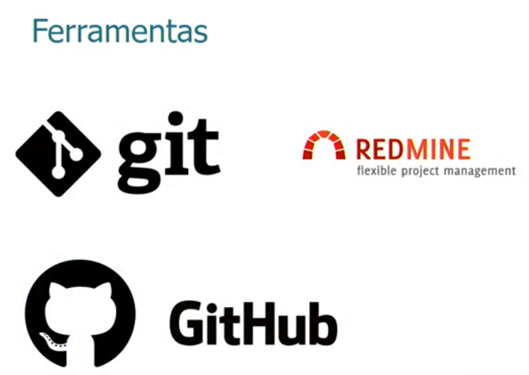

[Sumário](#sum%C3%A1rio "Sumário")

## Qualidade de Software

> ## Conceito
>
> A **Qualidade de Software** é uma área da Engenharia de Software que se concentra em garantir que o software atenda aos padrões de qualidade esperados. Isso envolve a aplicação de uma série de verificações e medidas durante o ciclo de vida do desenvolvimento de software para garantir a conformidade com os requisitos especificados.
>
> A qualidade de software pode ser avaliada em várias dimensões, incluindo, entre outras:
>
> 1. **Funcionalidade**: O software realiza as tarefas conforme o esperado?
> 2. **Confiabilidade**: O software é estável e funciona sem falhas?
> 3. **Usabilidade**: O software é fácil de usar e intuitivo?
> 4. **Eficiência**: O software utiliza recursos de maneira eficaz e eficiente?
> 5. **Manutenibilidade**: O software pode ser facilmente modificado para mudanças e melhorias?
> 6. **Portabilidade**: O software pode ser facilmente transferido de um ambiente para outro?
>
> A qualidade do software é assegurada através de várias atividades, como revisão de código, teste de software, integração contínua e controle de versão. Além disso, normas e modelos de qualidade, como ISO 9000 e CMMI, podem ser usados para padronizar e melhorar os processos de garantia de qualidade.

A qualidade de software pode ser aplicada em várias áreas, incluindo:

1. **Qualidade de Projeto**: A qualidade do projeto de software refere-se à eficácia do design do software em atender aos requisitos do usuário e às expectativas de desempenho. Isso pode envolver a arquitetura do software, a modularidade do código, a facilidade de manutenção e a eficiência do software. A qualidade do projeto é assegurada através de boas práticas de engenharia de software, como a utilização de padrões de projeto, a revisão de código e a refatoração regular.
2. **Qualidade de Conformidade**: A qualidade de conformidade refere-se ao grau em que o software adere a padrões, diretrizes e regulamentos específicos. Isso pode incluir conformidade com padrões de codificação, diretrizes de acessibilidade, regulamentos de privacidade e segurança, e muito mais. A qualidade de conformidade é assegurada através de auditorias regulares, testes de conformidade e revisões de código.

Além disso, a qualidade de software também pode ser aplicada em outras áreas, como **qualidade de processo** (a eficácia dos processos de desenvolvimento de software), **qualidade de produto** (a funcionalidade, confiabilidade e desempenho do software) e **qualidade de serviço** (a eficácia do suporte e serviços relacionados ao software).

**Definição**

Definição simplificada da qualidade de software. Aqui está o que cada componente significa:

1. **Produto Adequado**: O software deve atender às necessidades e expectativas do usuário. Isso inclui a funcionalidade correta, a interface do usuário intuitiva e a performance adequada.
2. **Máxima Qualidade**: O software deve ser livre de defeitos, ter alta disponibilidade e confiabilidade, e ser fácil de manter e atualizar.
3. **Entrega dentro do Orçamento e do Prazo**: O software deve ser entregue dentro do custo estimado e do cronograma definido. Atrasos e custos excessivos podem afetar a satisfação do usuário.

Portanto, a satisfação do usuário em relação à qualidade do software pode ser expressa pela seguinte fórmula:

\text{Satisfação do usuário} = \text{Produto adequado} + \text{Máxima qualidade} + \text{Entrega dentro do orçamento e do prazo}Satisfac¸a˜o do usuaˊrio=Produto adequado+Maˊxima qualidade+Entrega dentro do orc¸amento e do prazo

Essa fórmula destaca a importância de equilibrar as necessidades do produto, a qualidade e as restrições de tempo e custo para alcançar a satisfação do usuário. É importante notar que a “satisfação do usuário” é um objetivo contínuo que requer esforço constante para manter e melhorar a qualidade do software.

1. **Uma Gestão de Qualidade Efetiva**: A gestão de qualidade efetiva envolve a implementação de práticas e processos que garantem a qualidade do software. Isso pode incluir a definição de padrões de qualidade, a realização de revisões de código e testes de software, e a implementação de um processo de controle de mudanças. Além disso, a gestão de qualidade efetiva também envolve a melhoria contínua dos processos de qualidade para garantir que eles sejam eficazes e eficientes.
2. **Um Produto Útil**: Um produto útil é aquele que atende às necessidades e expectativas do usuário. Isso envolve a compreensão dos requisitos do usuário, o desenvolvimento de funcionalidades que atendam a esses requisitos e a garantia de que o software seja fácil de usar e intuitivo. Além disso, um produto útil também deve ser confiável e eficiente.
3. **Agregar Valor Tanto para o Fabricante Quanto para o Usuário**: Agregar valor para o fabricante e o usuário significa que o software deve não apenas atender às necessidades do usuário, mas também trazer benefícios para o fabricante. Para o usuário, isso pode significar melhorar a produtividade, reduzir custos ou proporcionar entretenimento. Para o fabricante, isso pode significar aumentar a receita, melhorar a reputação da marca ou obter uma vantagem competitiva.

Portanto, alcançar a qualidade do software envolve uma combinação de gestão de qualidade efetiva, desenvolvimento de um produto útil e agregação de valor para o fabricante e o usuário.

**Ferramentas de Control**

As ferramentas de controle são essenciais para garantir a qualidade do software. Aqui está uma breve descrição de cada uma:

1. **Inspeções**: As inspeções são uma forma de revisão de código em que um ou mais revisores examinam o código para identificar erros, violações de padrões de codificação e oportunidades de melhoria. As inspeções podem ser formais (com um processo definido e documentação) ou informais.
2. **Revisões**: As revisões são semelhantes às inspeções, mas geralmente são menos formais. Elas podem ser realizadas por qualquer membro da equipe de desenvolvimento e podem focar em qualquer aspecto do software, desde o design até o código e a documentação. As revisões são uma maneira eficaz de identificar e corrigir problemas no início do ciclo de vida do desenvolvimento de software.
3. **Testes**: Os testes são uma parte essencial do controle de qualidade do software. Eles envolvem a execução do software com o objetivo de encontrar e corrigir erros. Existem muitos tipos de testes, incluindo testes unitários, testes de integração, testes de sistema, testes de aceitação e testes de regressão. Cada tipo de teste tem um propósito específico e ajuda a garantir que o software funcione corretamente em diferentes cenários e condições.

Essas ferramentas de controle, quando usadas efetivamente, podem melhorar significativamente a qualidade do software e a satisfação do usuário.

> Na engenharia de software, a frase “Todos os produtos de trabalho têm especificações definidas e mensuráveis” destaca a importância da **qualidade** e da **precisão** na criação de produtos de software. Aqui estão alguns pontos para entender melhor:
>
> 1. **Especificação Definida**: Cada produto de trabalho, seja um código-fonte, um documento de design, um caso de teste ou um relatório de bug, deve ter uma especificação claramente definida. Isso significa que deve haver um entendimento claro do que o produto de trabalho é suposto fazer ou representar. Isso ajuda a garantir que todos na equipe de desenvolvimento estejam na mesma página e reduz a possibilidade de mal-entendidos ou erros.
> 2. **Mensurabilidade**: Além de ter uma especificação definida, é importante que os atributos do produto de trabalho sejam mensuráveis. Isso pode incluir coisas como o desempenho do código (por exemplo, tempo de execução), a cobertura do caso de teste ou a severidade de um bug. Ter atributos mensuráveis permite que a equipe de desenvolvimento rastreie o progresso, identifique problemas e faça melhorias de maneira mais eficaz.
> 3. **Importância para a Qualidade do Software**: Ao garantir que todos os produtos de trabalho tenham especificações definidas e mensuráveis, a equipe de desenvolvimento pode melhorar a qualidade do software. Eles podem garantir que o software atenda às expectativas do usuário, identificar e corrigir problemas mais rapidamente e fazer melhorias contínuas no produto.
>
> Portanto, essa prática é fundamental para a engenharia de software de alta qualidade, pois promove a clareza, a responsabilidade e a melhoria contínua.

[Sumário](#sum%C3%A1rio "Sumário")

### Custo da Qualidade

“Custo da Qualidade” é um conceito importante na engenharia de software e na gestão da qualidade em geral. Ele se refere ao custo total associado à prevenção, detecção e correção de defeitos em um produto ou serviço. Aqui estão os principais componentes:

1. **Custos de Prevenção**: São os custos associados à prevenção de defeitos antes que eles ocorram. Isso pode incluir atividades como treinamento de qualidade, planejamento da qualidade do produto, e revisão de requisitos e design.
2. **Custos de Avaliação**: São os custos associados à avaliação ou inspeção de produtos para garantir que eles atendam aos padrões de qualidade. Isso pode incluir atividades como inspeções de código, testes de software e auditorias de qualidade.
3. **Custos de Falhas Internas**: São os custos associados a defeitos encontrados antes da entrega do produto ao cliente. Isso pode incluir o tempo e os recursos necessários para corrigir os defeitos e retestar o produto.
4. **Custos de Falhas Externas**: São os custos associados a defeitos encontrados após a entrega do produto ao cliente. Isso pode incluir suporte ao cliente, reparos de garantia, e até mesmo perda de reputação ou negócios.

O objetivo da gestão da qualidade é minimizar o custo total da qualidade, equilibrando os custos de prevenção e avaliação com os custos de falhas internas e externas. Em geral, investir em prevenção e avaliação pode ajudar a reduzir os custos de falhas e, portanto, o custo total da qualidade. No entanto, é importante notar que o “custo ótimo da qualidade” não é necessariamente zero defeito, pois pode haver um ponto de diminuição dos retornos onde o custo de prevenção e avaliação supera os benefícios de redução de defeitos.

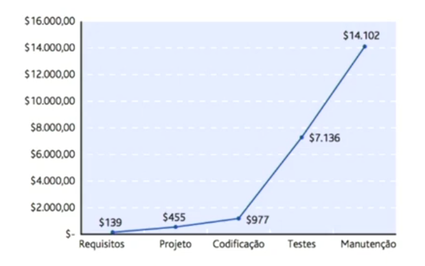

[Sumário](#sum%C3%A1rio "Sumário")

### Elementos que impactam na qualidade de um software

A imagem apresenta um diagrama que ilustra os elementos que impactam na qualidade de um software. O diagrama é composto por três círculos conectados por setas, representando uma sequência ou relação entre os elementos. Aqui está a explicação de cada elemento:

1. **Funcionais**: Este círculo representa os requisitos funcionais do software. Estes são os recursos e funções que o software deve realizar. Os ícones de pessoas podem indicar que esses requisitos são frequentemente determinados pelas necessidades e expectativas dos usuários.
2. **Levantamento de Requisitos**: Este círculo representa o processo de coleta e análise dos requisitos do software. Isso envolve entender o que os usuários precisam e querem do software, e traduzir essas necessidades e desejos em requisitos técnicos claros e mensuráveis.
3. **Não Funcionais**: Este círculo representa os requisitos não funcionais do software. Estes são os critérios que descrevem como o sistema deve funcionar, em vez do que ele deve fazer. Isso pode incluir aspectos como desempenho, segurança, usabilidade e confiabilidade.

As setas curvas indicam que esses três elementos estão interligados e influenciam uns aos outros. Por exemplo, os requisitos funcionais e não funcionais são identificados durante o levantamento de requisitos. Juntos, esses elementos desempenham um papel crucial na determinação da qualidade do software.

O Levantamento de Requisitos é uma etapa crucial no desenvolvimento de software por várias razões:

1. **Entendimento claro das necessidades do usuário**: O Levantamento de Requisitos permite que a equipe de desenvolvimento entenda o que os usuários esperam do software. Isso ajuda a garantir que o produto final atenda às necessidades e expectativas dos usuários.
2. **Redução de retrabalho**: Se os requisitos não forem claramente entendidos e documentados desde o início, a equipe de desenvolvimento pode acabar construindo algo que não atenda às necessidades do usuário. Isso pode resultar em retrabalho significativo, o que pode ser caro e demorado.
3. **Planejamento e agendamento eficazes**: Com um entendimento claro dos requisitos, a equipe de desenvolvimento pode planejar e agendar o projeto de maneira mais eficaz. Eles podem identificar as tarefas que precisam ser realizadas, estimar o tempo e os recursos necessários e identificar quaisquer riscos ou desafios potenciais.
4. **Facilita a comunicação**: O Levantamento de Requisitos também facilita a comunicação entre todas as partes interessadas do projeto, incluindo desenvolvedores, gerentes de projeto, usuários e qualquer outra pessoa envolvida no projeto.
5. **Base para testes**: Os requisitos coletados e documentados servem como base para a criação de casos de teste. Isso garante que o software seja testado contra os requisitos corretos, ajudando a garantir a qualidade do produto final.

Portanto, embora todas as etapas do desenvolvimento de software sejam importantes, o Levantamento de Requisitos é particularmente crítico devido ao seu impacto em todas as outras etapas do processo.

[Sumário](#sum%C3%A1rio "Sumário")

### Requisitos Funcionais

Aqui estão as explicações para cada um dos requisitos funcionais como exemplo:

1. **Incluir / Excluir / Alterar nome em uma tela de manutenção de funcionários**: Este requisito funcional está relacionado à gestão de informações dos funcionários em um sistema. Ele permite que os usuários (geralmente administradores ou gerentes) adicionem novos funcionários (Incluir), removam funcionários existentes (Excluir) ou modifiquem as informações dos funcionários, como o nome (Alterar), diretamente na tela de manutenção de funcionários.
2. **Geração de relatório de determinado período de vendas**: Este requisito funcional está relacionado à geração de relatórios em um sistema de vendas ou de gestão empresarial. Ele permite que os usuários gerem relatórios que mostram as vendas realizadas durante um período específico. Esses relatórios podem ajudar a empresa a entender melhor seu desempenho de vendas e a tomar decisões informadas.
3. **Efetuar pagamentos de compra através de crédito ou débito**: Este requisito funcional está relacionado ao processamento de pagamentos em um sistema de comércio eletrônico ou ponto de venda. Ele permite que os clientes façam pagamentos por suas compras usando cartões de crédito ou débito. Isso envolve a integração com um gateway de pagamento para processar essas transações.
4. **Consulta de saldo ou estoque**: Este requisito funcional está relacionado à gestão de estoque em um sistema de vendas ou de gestão empresarial. Ele permite que os usuários (geralmente gerentes de estoque ou de vendas) verifiquem a quantidade atual de um item específico em estoque. Isso pode ajudar a empresa a gerenciar melhor seu estoque e a evitar situações de excesso ou falta de estoque.

Cada um desses requisitos funcionais desempenha um papel importante no funcionamento eficaz do sistema de software e na entrega de valor aos seus usuários. Eles são chamados de “funcionais” porque estão diretamente relacionados às funções ou recursos que o sistema deve fornecer.

[Sumário](#sum%C3%A1rio "Sumário")

### Requisitos Não-funcionais

Os **Requisitos Não-funcionais** são uma parte crucial da Engenharia de Software e da Qualidade de Software. Eles descrevem as características do sistema que não estão diretamente relacionadas com o comportamento específico do sistema, mas sim com propriedades como confiabilidade, eficiência, segurança, portabilidade e usabilidade. Aqui estão algumas razões pelas quais os requisitos não-funcionais são importantes:

1. **Desempenho**: Requisitos não-funcionais ajudam a definir o desempenho do sistema, como a velocidade de processamento, tempo de resposta, utilização de recursos, taxa de transferência, etc.
2. **Segurança**: Eles são essenciais para definir o nível de segurança necessário para o sistema. Isso pode incluir autenticação, autorização, confidencialidade, integridade, auditoria, etc.
3. **Usabilidade**: Requisitos não-funcionais podem especificar a facilidade de uso do sistema, eficiência do usuário, estética, consistência da interface do usuário, etc.
4. **Confiabilidade**: Eles podem definir a capacidade do sistema de funcionar sob condições especificadas por um período de tempo específico sem falhas.
5. **Manutenibilidade**: Requisitos não-funcionais podem ajudar a determinar quão fácil é para modificar o sistema e atualizar suas funcionalidades.
6. **Portabilidade**: Eles podem especificar a facilidade com que o software pode ser transferido de um ambiente para outro.

Portanto, os requisitos não-funcionais são vitais para garantir que o software atenda às expectativas do usuário e do negócio em termos de qualidade, desempenho e confiabilidade. Sem requisitos não-funcionais adequados, um sistema pode não ser capaz de atender às necessidades do usuário final, independentemente de quão bem ele execute suas funções específicas.

Vamos analisar alguns requisitos não-funcionais no contexto:

1. **Alta disponibilidade**: Este requisito significa que o sistema deve estar acessível e operacional para os usuários a maior parte do tempo possível. Isso é especialmente importante para sistemas críticos onde o tempo de inatividade pode ter consequências significativas. Alta disponibilidade pode ser alcançada através de várias estratégias, como redundância de hardware, balanceamento de carga, failover automático, etc.
2. **Executar em qualquer plataforma**: Este requisito indica que o sistema deve ser capaz de operar em diferentes sistemas operacionais ou plataformas de hardware. Isso é muitas vezes referido como portabilidade. Isso pode ser alcançado através do uso de tecnologias e padrões abertos, evitando dependências específicas da plataforma e projetando o sistema para ser modular e configurável.
3. **Comunicação com o banco SQL Server**: Este requisito especifica que o sistema deve ser capaz de se comunicar e interagir com um banco de dados SQL Server. Isso pode envolver a leitura e escrita de dados, a execução de consultas SQL e a manipulação de esquemas de banco de dados. Isso requer que o sistema tenha os drivers e bibliotecas apropriados para se conectar ao SQL Server e que ele implemente a lógica de negócios necessária para interagir com o banco de dados.

Cada um desses requisitos não-funcionais desempenha um papel crucial na definição das características e capacidades do sistema, e é importante para garantir que o sistema atenda às expectativas dos usuários e às necessidades do negócio.

[Sumário](#sum%C3%A1rio "Sumário")

### Garantia da Qualidade

**Ciclo de desenvolvimento de Software**

A imagem mostra o “Ciclo de Desenvolvimento de Software”, que é um processo que os desenvolvedores seguem para produzir um software de alta qualidade. Aqui está uma explicação de cada etapa:

1. **Avaliação**: Esta é a primeira etapa do ciclo de desenvolvimento de software. Aqui, as necessidades e requisitos do software são avaliados. Isso pode envolver a compreensão das necessidades do usuário, a identificação dos problemas que o software precisa resolver, e a definição dos objetivos do software.
2. **Análise**: Nesta etapa, os requisitos identificados na fase de avaliação são analisados em detalhes. Isso pode envolver a decomposição dos requisitos em tarefas menores, a identificação de possíveis desafios na implementação dos requisitos, e a definição de critérios de sucesso para o software.
3. **Projeto**: Aqui, o sistema é projetado para atender aos requisitos identificados nas etapas anteriores. Isso pode envolver a criação de diagramas de arquitetura, a definição de interfaces de usuário, e a escolha de tecnologias para a implementação do software.
4. **Implementação**: Esta é a fase em que o software é realmente codificado. Os desenvolvedores usam as informações coletadas nas etapas anteriores para escrever o código que implementa os requisitos do software.
5. **Teste**: Depois que o software é implementado, ele passa por uma fase de teste. Aqui, o software é testado para garantir que ele atenda aos requisitos definidos e que ele não tenha bugs ou problemas.
6. **Manutenção**: Esta é a última etapa do ciclo de desenvolvimento de software. Aqui, o software é mantido e atualizado conforme necessário. Isso pode envolver a correção de bugs, a adição de novas funcionalidades, e a atualização do software para se manter atualizado com as mudanças tecnológicas.

**Garantia da Qualidade de Software (SQA)**. A SQA é um processo que ajuda a garantir que o software desenvolvido atenda aos padrões de qualidade estabelecidos. Aqui estão alguns pontos importantes sobre a SQA:

1. **Padrão Planejado e Sistemático de Ações**: A SQA envolve a implementação de um conjunto planejado e sistemático de atividades que são projetadas para garantir a qualidade. Isso pode incluir atividades como revisões de código, testes de unidade, testes de integração, testes de sistema, testes de aceitação do usuário, entre outros.
2. **Garantia da Qualidade de Software**: A principal finalidade da SQA é garantir que o software atenda aos padrões de qualidade estabelecidos. Isso é feito através da identificação e correção de defeitos, bem como da prevenção de defeitos através do uso de boas práticas de engenharia de software.
3. **Abrangência em Todo o Ciclo de Vida do Projeto**: A SQA não se limita a uma única fase do ciclo de vida do desenvolvimento de software. Ela se estende por todo o ciclo de vida do projeto, desde a fase de concepção e definição de requisitos até a fase de manutenção após a implantação do software. Isso garante que a qualidade seja mantida em todas as fases do desenvolvimento.
4. **Melhoria Contínua**: A SQA também envolve a melhoria contínua do processo de desenvolvimento de software. Isso é feito através da coleta e análise de métricas, realização de auditorias de processo, e implementação de ações corretivas e preventivas com base nos resultados dessas atividades.

Portanto, a Garantia da Qualidade de Software é uma parte essencial do desenvolvimento de software que ajuda a garantir que o software atenda às expectativas dos usuários e às necessidades do negócio em termos de funcionalidade, desempenho, segurança e outros atributos de qualidade. Espero que isso ajude a esclarecer! Se você tiver mais perguntas, sinta-se à vontade para perguntar.

**O que deve ser feito para possuir esse SQA (Garantia da Qualidade)?**

1. **Possuir ferramentas e/ou métodos que permitam a análise dos desenvolvimentos e dos testes**: Isso se refere ao uso de ferramentas e métodos que permitem aos desenvolvedores analisar o código e os resultados dos testes. Isso pode incluir ferramentas de análise estática de código, ferramentas de teste automatizado, ferramentas de integração contínua, entre outros. Essas ferramentas ajudam a identificar e corrigir problemas no código e garantir que o software atenda aos requisitos definidos.
2. **Efetuar revisões técnicas nos componentes e na funcionalidade**: As revisões técnicas são uma parte importante do processo de garantia da qualidade do software. Elas envolvem a revisão do código e do design do software por pares ou especialistas para identificar possíveis problemas ou melhorias. Isso pode ajudar a garantir que o software seja de alta qualidade e atenda aos padrões de codificação e design.
3. **Controlar a documentação por meio de versionamento**: O controle de versão é uma prática importante na engenharia de software que permite rastrear e gerenciar mudanças no código e na documentação do software. Isso pode incluir o uso de sistemas de controle de versão como Git, que permitem aos desenvolvedores trabalhar em diferentes versões do software simultaneamente, sem interferir no trabalho uns dos outros.

> ***Versionamento de software***
>
> O versionamento de software é um processo fundamental para gerenciar  as diferentes versões de um programa ou aplicativo. Vamos explorar os  números de versão e suas implicações:
>
> 1. **Versão Major (X):** O primeiro número indica a **versão principal** do software. Quando esse número muda, significa que houve mudanças  incompatíveis com versões anteriores. Por exemplo, se um software passa  da versão 1.0.0 para 2.0.0, isso indica uma grande atualização com  alterações significativas.
> 2. **Versão Minor (Y):** O segundo número representa a **versão menor**. Mudanças nesse número indicam novas funcionalidades ou melhorias, mas  ainda são compatíveis com a versão anterior. Por exemplo, se o software  vai de 1.0.0 para 1.1.0, isso significa que foram adicionadas  funcionalidades sem quebrar a compatibilidade.
> 3. **Versão Patch (Z):** O terceiro número refere-se a **correções de bugs** e pequenas melhorias. Essas mudanças não afetam a compatibilidade com  versões anteriores. Por exemplo, se o software passa de 1.1.0 para  1.1.1, isso indica uma correção de bug ou ajuste menor.
> 4. **Número de Release (opcional):** Além dos três números principais, algumas abordagens de versionamento incluem um quarto número chamado de **release**. Esse número representa o **número atual do build** dentro de um escopo de modificações. No entanto, nem todos os sistemas utilizam esse quarto número.
>
> Em resumo, o versionamento de software segue essas convenções para  facilitar o controle das mudanças e garantir a compatibilidade entre as  diferentes versões. Além disso, existem outras abordagens, como o **Semantic Versioning** (SemVer), que é amplamente adotado na comunidade de desenvolvimento de software.

4. **Atribuir métodos para se garantir padrões de desenvolvimento e das boas práticas**: Isso se refere ao uso de padrões de codificação e melhores práticas na engenharia de software. Isso pode incluir coisas como seguir convenções de nomenclatura, escrever código limpo e legível, usar padrões de design, escrever testes unitários, entre outros. Seguir esses padrões e práticas pode ajudar a garantir que o software seja de alta qualidade e fácil de manter.
5. **Obter mecanismos de aferição**: Isso se refere ao uso de métricas e indicadores para medir a qualidade do software. Isso pode incluir coisas como a taxa de defeitos, a cobertura de código pelos testes, o tempo de resposta do sistema, entre outros. Essas métricas podem ajudar a identificar áreas de melhoria e garantir que o software atenda aos padrões de qualidade.

**Pontos importantes para a Qualidade de um produto**

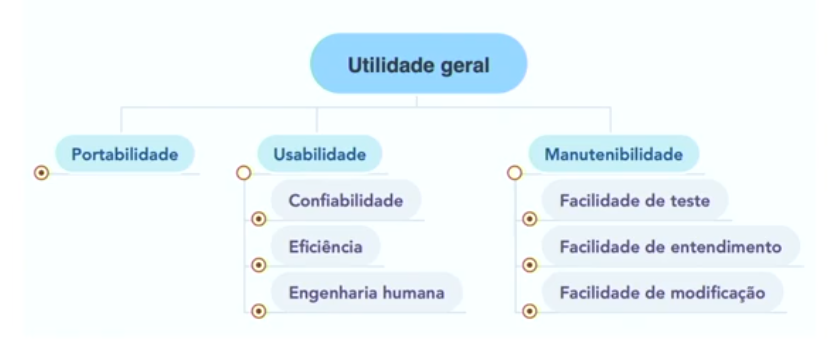

A qualidade do software é crucial para garantir a eficiência, eficácia e satisfação do usuário final. Os pontos importantes para a qualidade de um produto de software incluem:

1. **Portabilidade**: A capacidade do software ser transferido facilmente de um ambiente para outro. Isso significa que o software pode ser usado em diferentes sistemas operacionais, dispositivos ou navegadores com pouco ou nenhum esforço de modificação.
2. **Usabilidade**: Refere-se à facilidade com que os usuários podem aprender e usar o software. Isso inclui a intuitividade da interface do usuário, a clareza das instruções fornecidas, e a eficácia com que o software ajuda os usuários a alcançar seus objetivos.
   - **Confiabilidade**: A consistência do desempenho do software e sua capacidade de funcionar sem falhas. Isso é crucial para manter a confiança dos usuários no software.
   - **Eficiência**: O desempenho ótimo do software com o uso mínimo de recursos. Isso se refere à velocidade e à eficiência com que o software realiza suas tarefas.
   - **Engenharia Humana**: O design intuitivo e a experiência do usuário otimizada. Isso se refere à forma como o software é projetado para ser fácil de usar e agradável para o usuário.
3. **Manutenibilidade**: A capacidade de adaptar o software às mudanças nas necessidades dos usuários ou no ambiente operacional.
   - **Facilidade de Teste**: A capacidade de testar eficientemente o software para garantir que está livre de bugs e outros problemas. Isso é crucial para manter a qualidade do software ao longo do tempo.
   - **Facilidade de Entendimento**: A clareza do código e da arquitetura, facilitando as modificações e manutenção. Isso é importante para permitir que os desenvolvedores compreendam e modifiquem o software de forma eficaz.
   - **Facilidade de Modificação**: A capacidade de adaptar o software às mudanças nas necessidades dos usuários ou no ambiente operacional. Isso é crucial para garantir que o software continue a atender às necessidades dos usuários à medida que essas necessidades evoluem.

Esses pontos são todos conectados a uma utilidade geral, que é a capacidade do software de atender efetivamente às necessidades dos usuários e fornecer valor. A qualidade do software é, portanto, uma consideração crucial em todas as fases do ciclo de vida do desenvolvimento de software, desde o design inicial até a manutenção e atualização contínuos.

[Sumário](#sum%C3%A1rio "Sumário")

### Qualidade do Produto

Na Engenharia de Software, a qualidade do produto é um conceito fundamental que se refere à medida em que um produto de software atende às necessidades e expectativas dos usuários. Aqui estão alguns conceitos-chave relacionados à qualidade do produto de software:

1. **Funcionalidade**: Refere-se à capacidade do software de fornecer funções que atendam às necessidades declaradas e implícitas quando usado sob condições especificadas.
2. **Usabilidade**: Refere-se à eficácia, eficiência e satisfação com que os usuários podem alcançar seus objetivos em um determinado ambiente de uso do produto.
3. **Confiabilidade**: Refere-se à capacidade do software de manter seu nível de desempenho quando usado sob condições especificadas.
4. **Eficiência**: Refere-se à capacidade do software de fornecer o desempenho apropriado em relação à quantidade de recursos usados.
5. **Segurança**: Refere-se à capacidade do software de proteger informações e dados para que pessoas ou sistemas não tenham acesso ou possam destruir essas informações e dados.
6. **Manutenibilidade**: Refere-se à facilidade com que um produto de software pode ser modificado para mudanças nos requisitos, correções de defeitos, adaptações a novos ambientes ou melhorias no desempenho.
7. **Portabilidade**: Refere-se à capacidade do software de ser transferido de um ambiente para outro.

Esses conceitos formam a base para a avaliação da qualidade do produto de software. Eles ajudam as organizações a desenvolver software que atenda às necessidades dos usuários, melhore a satisfação do usuário, reduza o retrabalho e os custos de manutenção, e, em última análise, melhore a competitividade e a produtividade.

As normas ISO para a qualidade do software fornecem um quadro para avaliar a qualidade de um produto de software. Aqui estão alguns dos conceitos-chave:

1. **Corretude**: Esta é a capacidade do software de fornecer os resultados corretos conforme especificado nos requisitos do software. A corretude é geralmente verificada através de testes e validação.
2. **Eficiência**: A norma ISO/IEC 25010:2011 define a eficiência como a capacidade do software de fornecer o desempenho apropriado em relação à quantidade de recursos usados.
3. **Usabilidade**: A norma ISO/IEC 25010:2011 define a usabilidade como a eficácia, eficiência e satisfação com que os usuários podem alcançar seus objetivos em um determinado ambiente de uso do produto.
4. **Portabilidade**: A norma ISO/IEC 25010:2011 define a portabilidade como a capacidade do software de ser transferido de um ambiente para outro.
5. **Interoperabilidade**: Embora não seja explicitamente mencionada na norma ISO/IEC 25010:2011, a interoperabilidade é um aspecto importante da qualidade do software. Refere-se à capacidade do software de interagir e operar com outros sistemas ou componentes de software.

Essas normas ISO ajudam a garantir que o software atenda a um padrão mínimo de qualidade e fornece uma estrutura para a avaliação contínua da qualidade do software.

**Normas ISO 9126 (NBR 13596)**

São padrões internacionais para a qualidade do software. Aqui está um resumo:

1. **ISO 9126-1 de 2001**: Esta parte da norma trata das características, subcaracterísticas e métricas da qualidade de um produto de software. Isso inclui aspectos como funcionalidade, confiabilidade, usabilidade, eficiência, manutenibilidade e portabilidade.
2. **ISO 9126-2 de 2003**: Esta parte da norma trata das métricas externas e do controle de falhas. As métricas externas são aquelas que podem ser medidas apenas com relação ao comportamento do software, e o controle de falhas se refere à capacidade do software de manter sua operação mesmo na presença de falhas.
3. **ISO 9126-3 de 2003**: O objetivo desta parte da norma é verificar a quantidade de ocorrências de falhas e estimar o tempo de recuperação. Isso ajuda a avaliar a confiabilidade do software.
4. **ISO 9126-4 de 2004**: Esta parte da norma lida com User Experience, produtividade, eficácia e segurança. Estes são aspectos importantes da usabilidade e eficiência do software.

Essas normas fornecem um quadro para avaliar a qualidade de um produto de software e são amplamente utilizadas na indústria de software. Elas ajudam a garantir que o software atenda a um padrão mínimo de qualidade e fornece uma estrutura para a avaliação contínua da qualidade do software.

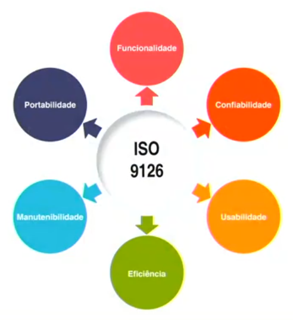

A imagem ilustra as seis características principais da qualidade do software conforme definido pela norma ISO 9126. Aqui está uma explicação de cada uma:

1. **Funcionalidade**: Refere-se à capacidade do software de fornecer funções que atendam às necessidades declaradas e implícitas quando usado sob condições especificadas.
2. **Confiabilidade**: Esta é a capacidade do software de manter seu nível de desempenho sob condições especificadas. Em outras palavras, o software deve ser capaz de operar sem falhas durante um período de tempo específico.
3. **Usabilidade**: Refere-se à eficácia, eficiência e satisfação com que os usuários podem alcançar seus objetivos em um determinado ambiente de uso do produto.
4. **Eficiência**: Esta é a capacidade do software de fornecer o desempenho apropriado em relação à quantidade de recursos usados. Isso se refere à velocidade e à eficiência com que o software realiza suas tarefas.
5. **Manutenibilidade**: Esta é a facilidade com que um produto de software pode ser modificado para corrigir defeitos, melhorar o desempenho ou adaptar-se a um novo ambiente.
6. **Portabilidade**: Esta é a capacidade do software de ser transferido de um ambiente para outro. Isso significa que o software pode ser usado em diferentes sistemas operacionais, dispositivos ou navegadores com pouco ou nenhum esforço de modificação.

Essas características são fundamentais para avaliar a qualidade de um produto de software e são amplamente utilizadas na indústria de software para garantir que o software atenda a um padrão mínimo de qualidade. Elas fornecem uma estrutura para a avaliação contínua da qualidade do software.

[Sumário](#sum%C3%A1rio "Sumário")

### Indicadores de Qualidade

A norma ISO/IEC 25010:2011 (ISO 9126). Ela lista quatro indicadores de qualidade:

1. **Medidas de qualidade do processo**: Essas são avaliações e métricas relacionadas à eficiência, eficácia e adaptabilidade dos processos envolvidos na criação do software. Isso pode incluir coisas como o tempo necessário para completar certas tarefas, a quantidade de recursos usados, e quão bem o processo pode ser ajustado para atender a diferentes necessidades.
2. **Medidas de qualidade internas**: Estes são critérios para avaliar a qualidade do software durante as fases de desenvolvimento. Isso pode incluir coisas como a legibilidade do código, a complexidade da arquitetura, e a facilidade de manutenção do software.
3. **Medidas de qualidade externas**: Estas são avaliações baseadas na interação do usuário com o software. Isso pode incluir coisas como usabilidade, desempenho e confiabilidade. Por exemplo, quão intuitiva é a interface do usuário, quão rápido o software responde a entradas do usuário, e quão frequentemente o software falha ou produz erros.
4. **Medidas de qualidade do software em uso**: Estas são métricas relacionadas à experiência real dos usuários ao utilizar o software em um ambiente operacional. Isso pode incluir coisas como a satisfação do usuário, a eficácia do software em ajudar os usuários a alcançar seus objetivos, e a eficiência do software em termos de recursos utilizados versus resultados produzidos.

A imagem mostra um modelo de como diferentes aspectos da qualidade estão inter-relacionados na engenharia de software:

1. **Qualidade do processo**: Este é o ponto de partida no diagrama. A qualidade do processo se refere à eficácia, eficiência e adaptabilidade dos processos usados para desenvolver o software. A qualidade do processo influencia e é influenciada pelas propriedades internas do software.
2. **Propriedades internas**: Estas são características do software que podem ser medidas sem executar o sistema, como a complexidade do código ou a modularidade da arquitetura. As propriedades internas são influenciadas pela qualidade do processo e, por sua vez, influenciam as propriedades externas.
3. **Propriedades externas**: Estas são características do software que são evidentes quando o sistema está em execução, como desempenho, confiabilidade e usabilidade. As propriedades externas são influenciadas pelas propriedades internas e, por sua vez, influenciam a qualidade do software em uso.
4. **Qualidade do software em uso**: Esta é a percepção do usuário sobre a qualidade do software quando ele é usado em um ambiente operacional. A qualidade do software em uso é influenciada pelas propriedades externas.

Em resumo, a qualidade do processo leva a boas propriedades internas, que por sua vez levam a boas propriedades externas, resultando em alta qualidade do software em uso. Este é um ciclo contínuo de melhoria e adaptação. Espero que isso ajude a esclarecer o relacionamento mostrado na imagem!

[Sumário](#sum%C3%A1rio "Sumário")

### ISO 9000

Claro, a ISO 9000 é uma série de normas que estabelecem diretrizes sobre a gestão da qualidade para qualquer tipo de organização. Ela é composta por vários padrões, cada um com um propósito específico.

1. **Fundamentos e princípios da gestão da qualidade**: A ISO 9000:2015 descreve os fundamentos e princípios da gestão da qualidade. Ela fornece os conceitos fundamentais, princípios e vocabulário para sistemas de gestão da qualidade (SGQ) e serve como base para outros padrões de SGQ. Os sete princípios de gestão da qualidade incluem foco no cliente, liderança, envolvimento das pessoas, abordagem de processo, melhoria, tomada de decisão baseada em evidências e gestão de relacionamentos.
2. **Processos de implementação da gestão da qualidade**: A implementação da ISO 9000 envolve várias etapas, incluindo o desenvolvimento de uma política de qualidade interna, a identificação de processos, a identificação e aquisição dos recursos necessários, a identificação e preenchimento das necessidades de treinamento, a implementação do SGQ, o desenvolvimento de um sistema de auditoria interna, entre outros. A abordagem de processo é um dos princípios fundamentais da ISO 9000, que envolve entender e gerenciar processos inter-relacionados como um sistema para melhorar a eficácia e eficiência da organização no alcance de seus objetivos.
3. **Avaliação da conformidade dos produtos de software**: A avaliação da conformidade é o processo de demonstração de que um produto, serviço, processo, sistema ou pessoa atende aos requisitos relevantes. No contexto de produtos de software, isso pode envolver a inspeção da documentação do produto de software em todas as etapas de seu ciclo de vida, a observação de testes e a funcionalidade de produtos de software concluídos.

Espero que isso ajude a esclarecer a ISO 9000 e sua aplicação na gestão da qualidade e na avaliação da conformidade dos produtos de software.

**Princípios da gestão da qualidade do ISO 9000**

Os princípios da gestão da qualidade do ISO 9000 são fundamentais para qualquer sistema de gestão da qualidade. Aqui estão eles explicados:

1. **Foco no cliente**: O objetivo principal da gestão da qualidade é atender aos requisitos do cliente e se esforçar para superar as expectativas do cliente. Isso é alcançado quando uma organização atrai e retém a confiança dos clientes e outras partes interessadas. Cada aspecto da interação com o cliente fornece uma oportunidade para criar mais valor para o cliente.
2. **Liderança**: Líderes bem-sucedidos estabelecem um sentido unificado de propósito e direção. Eles continuamente criam as condições ideais nas quais os funcionários prosperam, ganhando motivação e satisfação profissional na busca de objetivos de qualidade.
3. **Engajamento de pessoas**: Inspirar e capacitar pessoas em todos os níveis é essencial para o processo de entrega de valor. As habilidades das pessoas são usadas e valorizadas, o que é crucial para o sucesso da organização.
4. **Abordagem de processo**: A gestão de atividades como processos é fundamental para a eficácia e eficiência da organização. Isso envolve entender e gerenciar processos inter-relacionados como um sistema.
5. **Melhoria**: A melhoria contínua é um princípio fundamental da ISO 9000. Isso envolve a busca constante por melhorias no desempenho organizacional e nas capacidades.
6. **Tomada de decisão baseada em evidências**: Tomar decisões informadas contribui para a eficácia da gestão da qualidade. Isso envolve a análise de dados e informações para fornecer evidências que suportem as decisões.
7. **Gestão de relacionamentos**: A gestão eficaz de relacionamentos permite que a organização crie valor a longo prazo para todas as partes interessadas, incluindo fornecedores. Isso envolve gerenciar ativamente os relacionamentos com os clientes para alcançar o sucesso sustentado.

Esses princípios não estão listados em ordem de prioridade. A importância relativa de cada princípio varia de organização para organização e pode ser esperado que mude ao longo do tempo. Espero que isso ajude a esclarecer os princípios da gestão da qualidade do ISO 9000!

[Sumário](#sum%C3%A1rio "Sumário")

### ISO 9001

Claro, aqui está uma explicação detalhada dos pontos que você mencionou sobre a ISO 9001:

1. **Controle documental**: A ISO 9001 exige que as organizações controlem os documentos necessários para o sistema de gestão da qualidade. Isso inclui a identificação única de todos os documentos, controle de versão e identificação de revisões. O controle de documentos garante que a versão correta dos documentos esteja disponível nos locais de uso e que os documentos obsoletos sejam removidos.
2. **Controle de registro da qualidade**: Os registros são uma forma especial de informação documentada. Ao contrário dos documentos, que são revisados e mantidos atualizados, os registros são estáticos. Eles mostram resultados alcançados ou fornecem evidência de atividades que foram realizadas. O controle de registros é necessário, por exemplo, para garantir que eles permaneçam disponíveis por um período de tempo especificado e sejam descartados posteriormente.
3. **Normatização da auditoria interna**: A ISO 19011 fornece diretrizes para a realização de auditorias de sistemas de gestão, incluindo sistemas de gestão da qualidade (ISO 9001) e sistemas de gestão ambiental (ISO 14001). Ela descreve os princípios da auditoria, a gestão de programas de auditoria e a condução de auditorias de sistemas de gestão.
4. **Controle de produtos que não atendam às conformidades**: A cláusula 8.7 da ISO 9001 exige que uma organização identifique as saídas que não estejam em conformidade com os requisitos do cliente e controle essas para evitar seu uso ou entrega não intencionais.
5. **Ações corretivas**: As ações corretivas eliminam as causas de situações indesejáveis, falhas no sistema ou não conformidades em seu sistema de gestão. As ações corretivas são reativas a um problema depois que ele ocorre, onde as ações preventivas são proativas a um problema potencial antes que ele possa ocorrer.
6. **Ações preventivas**: A ação preventiva é realizada para eliminar um evento potencial que pode criar não conformidade. Embora a ISO 9001:2015 tenha substituído o termo ‘ação preventiva’ pelo conceito de ‘pensamento baseado em risco’, o conceito de ações corretivas e preventivas (CAPA) ainda é uma estratégia crítica para a maioria dos sistemas de gestão.

Espero que isso ajude a esclarecer os pontos que você mencionou sobre a ISO 9001!

**Vantagens**

Vamos falar sobre a ISO 9001 e suas vantagens na Engenharia de Software.

A **ISO 9001** é uma norma de sistemas de gestão da qualidade reconhecida internacionalmente. Ela é baseada em uma série de princípios de gestão da qualidade, incluindo um forte foco no cliente, a abordagem de processo, a melhoria contínua e a tomada de decisão baseada em evidências.

Aqui estão as vantagens que você mencionou, explicadas:

- **Padronização**: A ISO 9001 ajuda a padronizar os processos dentro de uma organização. Isso significa que todas as tarefas são realizadas de maneira consistente, o que leva a menos erros e maior eficiência.
- **Aumento de produtividade**: Ao padronizar os processos e melhorar a eficiência, a produtividade geralmente aumenta. Isso pode levar a um aumento na produção ou na capacidade de realizar mais trabalho.
- **Satisfação do cliente**: A ISO 9001 coloca um forte foco na satisfação do cliente. Ao garantir que os produtos ou serviços atendam às necessidades e expectativas dos clientes, a satisfação do cliente geralmente aumenta.
- **Economia de recursos**: Ao melhorar a eficiência e a produtividade, os recursos podem ser economizados. Isso pode incluir tempo, dinheiro ou materiais.
- **Retrabalho**: A ISO 9001 ajuda a reduzir o retrabalho, pois os processos são padronizados e a qualidade é monitorada de perto. Isso significa que os erros são menos prováveis de ocorrer, reduzindo a necessidade de retrabalho.

Espero que isso ajude a esclarecer as vantagens da ISO 9001 na Engenharia de Software!

[Sumário](#sum%C3%A1rio "Sumário")

### Qualidade do Processo

**Qualidade de Software** é um conceito fundamental na **Engenharia de Software**, e está diretamente relacionada ao processo de desenvolvimento. Vamos explorar os aspectos essenciais dessa área:

1. **Definição de Qualidade de Software**:
   - A qualidade de software pode ser vista como um **método gerencial** que busca garantir um produto final que satisfaça às expectativas do cliente, dentro do que foi acordado inicialmente.
   - No contexto de desenvolvimento de software, a qualidade envolve um conjunto de **características** que o produto deve satisfazer para atender às necessidades dos usuários.

2. **Importância dos Requisitos**:
   - A qualidade começa com a definição clara dos **requisitos** do software. É crucial entender o que o cliente espera para que o produto final atenda às suas necessidades.

3. **Métricas e Controle**:
   - A qualidade de um produto de software está intimamente relacionada ao **processo** que o produziu.
   - **Métricas** são ferramentas que nos auxiliam a manter o que é desenvolvido sob controle. Elas permitem avaliar a qualidade do software e identificar áreas de melhoria.

4. **Perspectivas de Qualidade**:
   - A qualidade depende do ponto de vista do **usuário**, do **desenvolvedor** e do **gerente**.
   - Para o usuário, a qualidade está relacionada à **facilidade de uso** e se os requisitos foram atendidos.
   - Para o desenvolvedor, a qualidade envolve a **manutenção do código** e a **ausência de defeitos**.
   - Para o gerente, a qualidade está ligada ao **cumprimento de prazos e orçamento**⁵.

Em resumo, a qualidade de software é um objetivo essencial no desenvolvimento de produtos, e sua busca envolve a definição clara de requisitos, métricas adequadas e um processo bem estruturado. Afinal, um software de qualidade é aquele que atende às necessidades dos usuários de forma eficaz e confiável.

[Sumário](#sum%C3%A1rio "Sumário")

### CMMI

Vamos falar sobre o **CMMI** (Capability Maturity Model Integration), que é um modelo de referência para **melhoria de processos**. Ele foi desenvolvido para ajudar organizações a aprimorar seus processos de desenvolvimento e manutenção de software. Aqui estão os principais pontos:

1. **Níveis de Maturidade**:
   - O CMMI é dividido em **cinco níveis de maturidade**, que representam diferentes estágios de evolução dos processos de uma organização.
   - Esses níveis são:
     - **Inicial**: Processos ad hoc, sem controle ou padronização.
     - **Gerenciado**: Processos controlados e documentados.
     - **Definido**: Processos padronizados e bem definidos.
     - **Quantitativamente Gerenciado**: Processos medidos e controlados quantitativamente.
     - **Otimizado**: Processos em constante melhoria com base em dados e feedback.

2. **Modelos do CMMI**:
   - Existem três modelos principais:
     - **CMMI-DEV**: Focado no desenvolvimento de produtos e serviços.
     - **CMMI-ACQ**: Voltado para aquisição de produtos e serviços.
     - **CMMI-SVC**: Destinado a organizações de serviços.

3. **Benefícios do CMMI**:
   - O CMMI ajuda as organizações a:
     - **Aumentar a eficiência** dos processos.
     - **Reduzir defeitos** e retrabalho.
     - **Melhorar a qualidade** dos produtos e serviços.
     - **Aumentar a satisfação do cliente**.

4. **Implementação**:
   - A implementação do CMMI envolve:
     - **Avaliação inicial**: Determinar o nível de maturidade atual.
     - **Planejamento de melhorias**: Identificar áreas para aprimoramento.
     - **Implementação gradual**: Adotar práticas e medir resultados.
     - **Avaliação contínua**: Monitorar e ajustar os processos.

Lembre-se de que o CMMI é uma ferramenta poderosa para melhorar a qualidade e a eficiência dos processos, mas requer comprometimento e esforço contínuo por parte da organização.

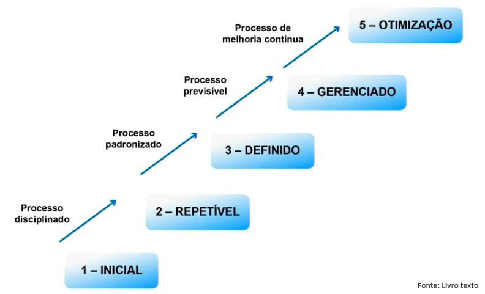

O **CMMI** (Integração de Modelos de Maturidade de Capacidade) é um modelo de referência que visa melhorar os processos organizacionais. Vamos analisar os elementos presentes na imagem:

1. **Níveis de Maturidade**:
   - O CMMI define **cinco níveis de maturidade**, representando diferentes estágios de melhoria de processos:
     - **Inicial**: Processos ad hoc, sem controle ou padronização.
     - **Gerenciado**: Processos controlados e documentados.
     - **Definido**: Processos padronizados e bem definidos.
     - **Quantitativamente Gerenciado**: Processos medidos e controlados quantitativamente.
     - **Otimizado**: Processos em constante melhoria com base em dados e feedback.
2. **Áreas de Processo**:
   - As áreas de processo são os **blocos de construção** do CMMI. Elas representam áreas específicas de foco, como **planejamento de projeto**, **gerenciamento de requisitos** ou **gerenciamento de riscos**.
   - Na imagem, essas áreas não estão explicitamente listadas, mas são essenciais para a implementação bem-sucedida do CMMI.
3. **Representação em Estágios**:
   - O CMMI pode ser representado em **estágios** ou **capacidades**. Na representação em estágios, cada nível de maturidade é alcançado gradualmente, enquanto na representação por capacidades, os processos são avaliados separadamente.
   - A imagem não especifica qual representação está sendo mostrada, mas ambos os conceitos são relevantes para o CMMI.

Em resumo, o CMMI é uma ferramenta poderosa para melhorar a qualidade e a eficiência dos processos organizacionais.

O **CMMI** é um modelo de referência criado pelo **SEI** (Software Engineering Institute) para melhorar os processos organizacionais e a habilidade das empresas em gerenciar o desenvolvimento, a aquisição e a manutenção de produtos e serviços. Ele tem como objetivo principal funcionar como um guia para a melhoria contínua dos processos da organização, considerando atividades como o gerenciamento do desenvolvimento de software, prazos e custos previamente estabelecidos.

Aqui estão alguns pontos importantes sobre o **CMMI**:

1. **Definição**:
   - O **CMMI** é um modelo que avalia a capacidade de maturidade dos processos de software em uma organização.
   - Ele fornece diretrizes para o desenvolvimento de processos de software, buscando a melhoria contínua.
   - O foco está na produção de software com maior qualidade e menos propenso a erros.

2. **Níveis de Maturidade**:
   - O **CMMI** está dividido em **cinco níveis de maturidade** que atestam o grau de evolução em que uma organização se encontra:
     - **Nível 1 - Inicial**: Os processos normalmente estão envoltos em caos decorrente da não-obediência ou inexistência de padrões.
     - **Nível 2 - Gerenciado**: Os projetos têm seus requisitos gerenciados. Além disso, há o planejamento, a medição e o controle dos diferentes processos.
     - **Nível 3 - Definido**: Os processos são padronizados e documentados. A organização possui um conjunto de processos bem definidos.
     - **Nível 4 - Gerenciado Quantitativamente**: Os processos são medidos e controlados quantitativamente.
     - **Nível 5 - Em Otimização**: A organização busca melhorias contínuas nos processos cotidianos.

3. **Benefícios da Implantação do CMMI**:
   - Maior confiabilidade no cumprimento de prazos e custos acordados com o cliente.
   - Aumento da qualidade nos softwares criados.
   - Menor dependência da empresa de desenvolvimento em relação a especialistas.
   - Busca por melhorias contínuas nos processos.

Em resumo, o **CMMI** é uma ferramenta valiosa para organizações que desejam melhorar seus processos de desenvolvimento de software e alcançar maior qualidade e eficiência.

O **CMMI** define várias áreas de processos que ajudam as organizações a melhorar seus processos e alcançar maior eficiência. Essas áreas de processos são agrupadas em quatro categorias principais:

1. **Gerenciamento de Processos**:
   - Essa categoria aborda a gestão geral dos processos organizacionais. Ela inclui práticas relacionadas ao planejamento, monitoramento e controle dos processos.
   - Alguns exemplos de áreas de processos nessa categoria são:
     - **Gerenciamento Integrado de Projetos (IPM)**: Foca na integração de processos de gerenciamento de projetos.
     - **Monitoramento e Controle de Projetos (PMC)**: Lida com o acompanhamento e controle do progresso dos projetos.
     - **Planejamento de Projetos (PP)**: Envolve o desenvolvimento de planos detalhados para os projetos.
     - **Gerenciamento Quantitativo de Projetos (QPM)**: Concentra-se na medição quantitativa dos processos.

2. **Gerenciamento de Projetos**:
   - Essa categoria se concentra especificamente no gerenciamento de projetos de desenvolvimento de software.
   - Exemplos de áreas de processos nessa categoria incluem:
     - **Gerenciamento de Requisitos (REQM)**: Trata da gestão dos requisitos do projeto.
     - **Gerenciamento de Configuração (CM)**: Lida com a configuração e controle de mudanças.
     - **Gerenciamento de Medição e Análise (MA)**: Envolve a coleta e análise de dados para melhorar os processos.

3. **Engenharia**:
   - Essa categoria abrange as atividades técnicas envolvidas no desenvolvimento de software.
   - Exemplos de áreas de processos nessa categoria são:
     - **Desenvolvimento de Requisitos (RD)**: Foca na elicitação e gerenciamento de requisitos.
     - **Solução Técnica (TS)**: Trata da concepção e implementação da solução técnica.
     - **Integração de Produto (PI)**: Lida com a integração de componentes de software.

4. **Apoio**:
   - Essa categoria engloba processos que dão suporte às atividades principais.
   - Exemplos de áreas de processos nessa categoria incluem:
     - **Treinamento (TR)**: Envolve o treinamento dos membros da equipe.
     - **Gerenciamento de Configuração (CM)**: Lida com a configuração e controle de mudanças (também presente na categoria de Gerenciamento de Projetos).
     - **Garantia da Qualidade de Processo e Produto (PPQA)**: Foca na avaliação da qualidade dos processos e produtos.

Essas categorias ajudam as organizações a estruturar seus esforços de melhoria de processos e a alcançar melhores resultados em seus projetos de desenvolvimento de software.

[Sumário](#sum%C3%A1rio "Sumário")

